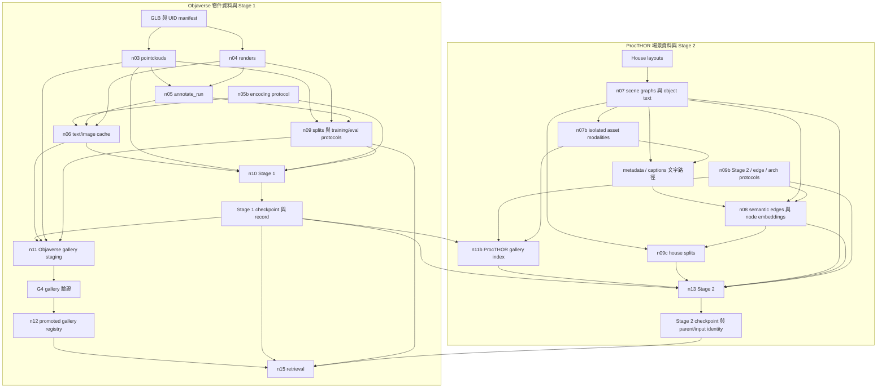
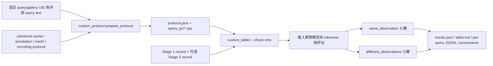
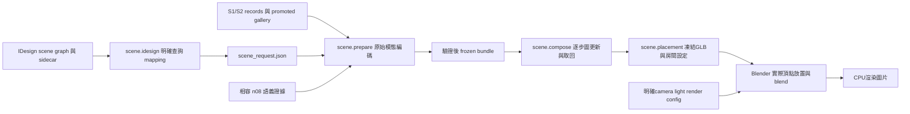

# 資料流與產物交接

本頁整理目前程式的 **producer → artifact → consumer**，協助定位資料從哪裡來、哪個步驟會讀它，以及修改後哪些產物需要重新驗證。讀碼日期：2026-09-07。資料數量、執行狀態與分數以各次 run 的紀錄為準。

## 1. 論文要求與實作選擇

| 證據分類 | 本頁採用的範圍 | 來源 |
|---|---|---|
| **PAPER FACT** | 物件資料採 Objaverse-LVIS、11 個視角與 GPT-4o 結構化標註；ProcTHOR 房間資料提供位置、語義及關係圖。 | [MetaFind §2.3](paper/metafind_source/2methdology.tex) |
| **PAPER FACT** | Stage 1 使用完整 T/I/P gallery 與可缺模態 query；Stage 2 加入 layout、更新 query fusion 與 ESSGNN、凍結 gallery；推論預先計算 gallery。 | [MetaFind §2.4、§2.6、§2.7](paper/metafind_source/2methdology.tex) |
| **PAPER FACT** | Table 1 報七種 query 組合的 R@1／R@5；baseline 額外加 mean pooling；Objaverse 評估關閉 layout。 | [MetaFind §3.1–3.2、Table 1](paper/metafind_source/3experiments.tex) |
| **OBSERVED IMPLEMENTATION** | 以下模組、檔名、資料形狀與檢查是本 repo 的實際路徑。 | 各列連結的 producer／consumer |
| **IMPLEMENTATION CHOICE** | 本地標註模型、文字序列化、視角平均、實際訓練範圍、ProcTHOR 可用模態、切分／選模規則與自訂觀測分離。 | encoding/training protocols、checkpoint 與 run provenance |
| **UNKNOWN** | 作者 Table 1 使用的具體 query 觀測、候選 UID 清單，以及 baseline 融合的完整細節。 | 現有 paper source 未完整指定；不能由本地分數反推補成事實。 |

[paper source](paper/metafind_source/) 是內容權威；[graph specifications](graph/README.md)、[audit](audit/A_FORMULA_INVENTORY.md)、[決策紀錄](../workflow/DECISION_LEDGER.md) 是衍生規格／工作紀錄。程式、測試及歷史報告各自提供實作或驗證證據，不能改寫論文。

## 2. 先確定是哪一份資料

[metafind.paths](../metafind/paths.py) 以 `METAFIND_DATA` 決定資料根目錄，未設定時使用 `<repo>/data`。多個 corpus 可以共存；相同 UID 或檔名不代表相同 bytes、模板或 renderer。

```text
<METAFIND_DATA>/
  datasets/
    objaverse-lvis/glbs/<shard>/<uid>.glb
    procthor-10k/...
  models/                         預訓練權重與模型 cache
  outputs/
    pointclouds/<uid>.npz + .json
    renders/<uid>/...
    annotations/<uid>.json
    embeddings/<uid>.npz + .json
    scene_graphs/<house_id>.json
    procthor_modalities/<assetId>.json + <assetId>/...
    checkpoints/...
    logs/...
```

外部權重、ProcTHOR metadata 與工具所需的 upstream 路徑，仍須按實際設定核對。`python -m metafind.paths` 可列出目前 process 使用的根目錄。

三種身分不能混用：Objaverse 以 **UID** 對應 asset；ProcTHOR 以 **assetId** 對應可重用物件，以 **house_id／節點索引** 對應場景中的 instance。Stage 2 使用自己的 ProcTHOR gallery，沒有把 assetId 當成 Objaverse UID 的隱含 join。

## 3. 整體交接圖



箭頭表示資料依賴；不表示所有更新會自動傳遞。特別是 metadata text、modality sidecar、node embedding 與 gallery index 都是不同的持久化產物。

## 4. 物件資料：GLB 到 Stage 1

以下產物路徑除另有註明外，都相對於 `outputs/`。

| Producer／入口 | 讀取與轉換 | 主要產物 | Consumer／交接檢查 |
|---|---|---|---|
| [download](../metafind/data/download.py) | 取得資料 manifest、Objaverse GLB 與 ProcTHOR layouts。 | `datasets/` 下的原始資料 | n03／n04／n07；下載數、可解析數與最終 admitted 數分開計算。 |
| [pointclouds](../metafind/data/pointclouds.py)（n03） | `sample_mesh` 做面積加權表面採樣與 RGB；`pc_norm` 中心化並縮放。 | `pointclouds/<uid>.npz`：`xyz (10000,3)`、`rgb (10000,3)`；sidecar、`logs/pointclouds_index.jsonl` | n05 的幾何資訊、Stage1Dataset、gallery builder。sampler version 與現存 sidecar 是不同層次，不能拿目前 source 版本替舊檔改標。 |
| [renders](../metafind/data/renders.py)（n04） | [meshload](../metafind/data/meshload.py) 與 [render_blender](../metafind/data/render_blender.py) 處理模型／視角；[view_io](../metafind/data/view_io.py) 定義影像輸入與 identity。 | `renders/<uid>/`、render sidecar、`logs/renders_index.jsonl` | n05 與 n06。11／12-view corpus 必須依 producer record 區分。 |
| [annotate_run](../metafind/data/annotate_run.py)（n05） | 讀 render index、幾何與類別資料；`--prompt-mode` 選 v9 或 [figure2_v10](../metafind/data/annotate_v10.py)，`--model` 選本地模型。 | `annotations/<uid>.json`、`logs/annotations_index.jsonl`、annotation provenance／quarantine | n06 的文字來源。`figure2_v10` 是標註 prompt/schema 名，不等於文字塔使用 `figure2_json`。 |
| [resolve_stage1](../metafind/models/resolve_stage1.py)（n05b） | 固定文字 serializer、view aggregation、CLIP scope、超參數與模型 variant。 | `stage1_encoding_protocol.json`、`stage1_hyperparameters.json`、`variant_registry.json` | n06、n09、n10。`paper_clip_train_scope` 是專案判讀；`actual_clip_train_scope` 才是執行設定。 |
| [encode_text_image](../metafind/data/encode_text_image.py)（n06） | 按 protocol 序列化 annotation，用 frozen CLIP 編碼 text 與每 view，再產 image aggregate。 | `embeddings/<uid>.npz`：`text (D,)`、`image (D,)`、`views (N,D)`；JSON sidecar 記全文、token/truncation、views、序列化與 encoder 身分。 | Stage1Dataset、Objaverse gallery builder。失敗回非零並退役不能沿用的 cache；不把失敗的新輸入配到舊 embedding。 |
| [splits](../metafind/data/splits.py)（n09） | 交集 pointcloud/render/annotation indexes，再套 exclusion ledger。**不是以 embedding 目錄存在與否認證 n06。** | `splits.json`、`split_lists/`、`stage1_protocol.json`、`eval_protocols.json` | n10／n11／n15；目前 code 為 80/10/10，保留 holdout 及 dev aliases。實際選模集合看 checkpoint/run record。 |
| [stage1](../metafind/train/stage1.py)（n10） | `Stage1Dataset` 讀 cached text/image 與 raw PC；PC 經當次 backbone。套 query observation、masking、fusion、contrastive loss。 | run `--out-dir` 下的 checkpoint、`stage1_best_ckpt.json` 等 records、metrics | n11／n11b／n13／retrieval。載入須還原 checkpoint 綁定的 model inputs、初始化、tower state；不能以目前預設配置代替歷史配置。 |

目前 n10 預設路徑訓練 point encoder 與 fusion，另有 `fuser_only` 等設定；不能以「Stage 1」三個字推定某個 checkpoint 究竟訓練了哪些參數。現有 trainer 對 `train_scope=full` 明確拒絕，不能把設定欄位存在寫成已支援全 CLIP 訓練。

文字模板也是實驗身分：例如 `v3_fit` 將描述裁到 context budget，`figure2_json` 保存結構化全文但 n06 記錄 CLIP 截斷。全文不同不保證送進 tokenizer 後不同；模板或 annotation 改變，必須核對 n06 cache 與後續 checkpoint 的相容性。

## 5. Gallery 與既有 retrieval

[gallery_index](../metafind/train/gallery_index.py) 有三個入口：

| 入口 | 產物與用途 |
|---|---|
| `python -m metafind.train.gallery_index stage1 --stage1-ckpt-record ...` | 以已還原並凍結的 gallery tower 編碼 Objaverse，產生 `gallery_index_<checkpoint-prefix>.npz` 與 `gallery_index_staging.json`。 |
| `python -m metafind.gates.g4_gallery_freeze` → `python -m metafind.train.gallery_index promote` | G4 record 位於 `logs/gates/G4_gallery_freeze.yaml`；promotion 核對 checkpoint、staging、index bytes 與 gate record，寫 `gallery_index.json`。 |
| `python -m metafind.train.gallery_index stage2 --stage1-ckpt-record ...` | 另建 `stage2_gallery_<checkpoint-prefix>.npz` 與 `stage2_gallery_index.json`，以 ProcTHOR assetId 排列；同時存 fused gallery 與宣告模態的 raw vectors，供 n13 查表。 |

[run_retrieval](../metafind/eval/run_retrieval.py)（n15）讀 `eval_protocols.json` 決定 query/gallery pool。已訓練模型的 `reported` protocol 使用 promoted index；development／untrained 分支可直接編碼，結果以 `gallery_source` 區分。Stage 2 head 的載入需核父 Stage 1、權重 hash 與允許覆寫的 query state。

輸出由 `--out-dir` 決定，包含 `table1.json` 與分開的 diagnostics／provenance。計分使用 [retrieval](../metafind/eval/retrieval.py) 與 `score_streaming` 的 cosine、UID target mapping、tie 處理。名稱包含 `holdout` 或用了 `--unseal`，均不能證明資料未曾被用來選模。

**G4 的界線：**[實作](../metafind/gates/g4_gallery_freeze.py) 核查 index 身分、集合／數量與 self-match；它不認證作者的 query 定義，不保證 index 沒有 collapse，也不能替代 corpus 或 checkpoint 選擇獨立性的驗證。遵循 MANY TESTS, FEW GATES，不把所有 diagnostics 當 promotion gate。

## 6. 場景資料：ProcTHOR 到 Stage 2

| Producer／入口 | 主要產物 | 實際 consumer 與界線 |
|---|---|---|
| [scene_graphs](../metafind/data/scene_graphs.py)（n07） | `scene_graphs/<house_id>.json`、`logs/scene_graphs_index.jsonl`、初始 `procthor_object_text.json` | graph 含 instance 的 assetId、位置、房間及 physical／semantic-candidate edges。檔案單位是 house；room context 在 graph metadata 與下游裁切中表達。 |
| [procthor_modalities](../metafind/data/procthor_modalities.py)（n07b） | `procthor_modalities/<assetId>.json` 與 view PNG；可用時有 depth-shell PC。 | n11b 讀 `view_paths` 與宣告的 PC；新 v2 index 不再編碼 sidecar 中可能過期的 `text`。缺 depth 明記缺模態；depth shell 與完整 mesh surface sample 不同。 |
| [procthor_captions](../tools/procthor_captions.py)、[procthor_metadata_text](../tools/procthor_metadata_text.py) | captions、`procthor_asset_annotations.json`、更新的 `procthor_object_text.json` | `text` 同時供 node encoder 與新 n11b query/gallery raw text vectors，`relation_text` 供關係句生成。metadata 工具不會自動重建已存在的向量／index。 |
| [resolve_stage2](../metafind/models/resolve_stage2.py)（n09b） | `stage2_protocol.json`、`stage2_positive_map.json`、`essgnn_edge_protocol.json`、`essgnn_arch_protocol.json` | 明確記錄 graph scope、positive identity、模態、架構與 dropout 選擇。當前 code 宣告 ProcTHOR **text + image**；已有 depth PC 不代表這次會編碼它。 |
| [semantic_edges_run](../metafind/data/semantic_edges_run.py)（n08） | `sem_edge_sentences.jsonl`、`sem_edge_embeddings.npz`、`sem_edge_cache.json`、`procthor_node_embeddings.npz/.json` | `relation_text_for()` 共用非空 relation_text／text fallback 規則；node embedding 仍用獨立的 `rec['text']`。cache key、NPZ row key 與 producer 版本必須一致。 |
| [scene_splits](../metafind/data/scene_splits.py)（n09c） | `scene_splits.json`：train/test houses、seed、semantic-edge coverage | 以 house 切分；同一 assetId 可在不同 house 出現。它驗的是 house 分離，不是 assetId 分離。 |
| [stage2](../metafind/train/stage2.py)（n13） | `checkpoints/stage2_<variant>.pt`、`variant_ckpts.json`、variant status／training logs | 讀 n11b raw modality vectors 與 fused positives，建立移除 target 的 room context；batch 內 positive assetId 去重。依宣告模態建 query，凍結 backbone/gallery，訓 query fusion、ESSGNN 與相關可學參數。 |

**更新順序要看實際讀取欄位。** 已修正「n08 讀新 canonical text，n11b 卻讀渲染時的舊 sidecar text」的交接錯誤。新 n11b 直接使用 canonical map，保留 n07b sidecar 原內容；更新 metadata 後仍須重建 n08 與 n11b，不會自動使舊向量變新。

Stage 2 checkpoint 記錄 parent Stage 1、gallery index、protocol、graph scope、samples、輸入 hashes 與 layout dimensions。Objaverse 的 Stage 2 layout-off 評估僅衡量 fusion 更新後的物件檢索，不衡量 ESSGNN 對場景品質的效果。

2026-09-07 n11b 新寫 `source_identity.version=2`：`procthor_object_text.json` 的 `text` 必須逐筆等於 `serialize_fitted(procthor_asset_annotations[asset_id])`，並具備目前 metadata producer 的來源欄位；此入口限定既定 `v3_fit` 主線，其他文字來源明確拒絕。identity 綁兩個 canonical JSON 的精確 bytes、每 asset 的實際句子、modality sidecars、view bytes／順序及宣告 PC bytes，NPZ 內嵌 digest。producer 直接編碼核驗 snapshot 的句子，發布前與 n13／ProcTHOR probe consumer 都重新核對來源。

v1 identity 綁的是舊 sidecar 文字選擇，必須重建 n11b，不能補 hash 或加 legacy flag 將舊向量重新詮釋為 v2。完全沒有 source identity 的歷史 index，仍只可透過 `--allow-legacy-gallery-index` 明確接受，輸出 `gallery_source_status=legacy_unbound`。相同內容移到另一資料 root 目前仍拒絕，未提供移轉政策。程式修補未改 renderer／annotation bytes，也未自動重建真實 index。

接續修補 n08：同一個實際 text encoder 產生 node／edge，兩者的 record 與 NPZ 內嵌摘要綁定精確文字／句子、ID／key 順序及 weights／tokenizer／forward 身分。[semantic_provenance](../metafind/data/semantic_provenance.py) 讓 Stage2Data 能拒絕「text 更新、relation_text 不變、仍讀舊 node vectors」。`--allow-legacy-semantic-inputs` 只明確接納完全沒有 binding 的舊產物，記 `legacy_unbound`；部分補填的新 record 仍拒絕。新來源證據不能追溯證明舊權重曾用正確資料訓練。

Stage2Data 對 node／modern edge NPZ 直接消費 `verified_source_bytes()` 回傳的同一份 bytes；不再驗 hash 後重開原路徑。legacy edge 一次讀取但仍保留未驗來源標記；「只讀一次」不會把舊產物升級成來源已驗證。

Stage 2 還原時也分開父 loss 與子 loss：fixed tau 使用自身 recipe；learnable tau 保留父 raw scale 初始化選擇。checkpoint `temperature_init` 記 requested／raw／effective／source，訓練 log 使用該次 forward 的有效 tau，包含 clamp。真 `no_layout` checkpoint 可進 retrieval／probe／composition，但不假列 layout-on 結果。

## 7. 新自訂評估是獨立分支

完整操作規格見 [CUSTOM_TABLE1_EVALUATION.md](CUSTOM_TABLE1_EVALUATION.md)。它讀 canonical sources 與已選 checkpoint，另建新目錄，不覆寫訓練 protocol 或 promoted index。



- [custom_protocol](../metafind/eval/custom_protocol.py) CPU 重採樣 query PC，完整核對 UID coverage、10,000 點、共用 view count、canonical text／sidecar 與檔案 hashes。新目錄排他建立；manifest 完整驗證並原子發布，失敗不發布完整 protocol。
- [custom_table1](../metafind/eval/custom_table1.py) 固定兩個版本、所有方法與七欄的 query/gallery 清單。same 兩側使用同一觀測；different 使用外部描述、單一 UID-fixed view、resampled PC；gallery 排除每個 asset 自己的固定 query view。
- 兩版本的 image 都從相同 cached `views` 轉 float32 後求平均；不直接沿用另經量化的 cached `image`。11 views 分成 1／10，12 views 分成 1／11。gallery 規則固定於各 asset，仍可預先編碼。
- [custom_models](../metafind/eval/custom_models.py) 還原 mean／Stage 1／Stage 2-off。mean 使用官方 ULIP-2 與逐可用模態 normalize→mean→normalize；Stage 1 保留 checkpoint 融合設定；Stage 2 overlay 核對 parent 並要求 gallery 不變。
- `--check-only` 只驗輸入、配置與身分；**有效 token 不同須等實際 backbone tokenizer 載入才能確認**。執行時 canonical/query 文字重新編碼，image 使用核對過 bytes 的 per-view cache。歷史 image cache 若缺 OpenCLIP 權重 bytes，限制保留在結果中。

此分支是 **自訂 same-UID 檢索的 development comparison**。高分、低分或比 mean 好，都不能單獨證明作者 Table 1 已復現；相同 UID／相同觀測也不能單獨證明 train/test contamination，或推導「增加模態必然提高分數」。

### Algorithm 1 的新場景分支

[scene/compose.py](../metafind/scene/compose.py) 接受明確 G0、順序固定的 query／I-Design slots、gallery、asset node vectors 及 n08 語義 cache。每次取回後加入 selected asset 的 node semantics，再更新 physical/semantic graph，供下次 ESSGNN。`parallel` 固定使用 G0；`use_layout=False` 關閉 residual。完整格式與 query model 匯出見 [SCENE_COMPOSITION.md](SCENE_COMPOSITION.md)。

目前場景交接已擴充為以下鏈；正式 200-scene manifest 與 judge 仍未完成，不能稱為已重現 Table 2。ProcTHOR node cache 不能按位置或同維度直接套給 Objaverse UID。



[IDesign adapter](IDesign_INPUTS.md) 分離六個 room priors、保留真 slot 順序，fresh scene 的 G0 明確為空；[raw prepare](RAW_SCENE_INPUTS.md) 使用正確 query point path、raw text／mean images，嚴格驗 node／edge text encoder 身分，缺關係輸出實際 UID pairs；[placement](SCENE_PLACEMENT.md) 按 raw GLB frame、實際 evaluated mesh 頂點與已指定 slot 放置。render config 缺省時只存 `.blend`，不猜相機或燈光。小型 CPU 測試與另外的真 ULIP／Gemma 三 slot 執行均已穿過真 Blender，見 [場景驗證](REPRODUCTION_SCENE_REVIEW_20260908.md)；真 planner 輸入與正式場景品質仍未完成。

[scene.semantics](SCENE_SEMANTICS.md) 接缺少的 pairs，重用 n08 SG2，先釋放 LLM 才載 text encoder，另建相容 cache；用新 cache 重播 prepare，直到當前 trajectory 完整。cache 命中不再載入模型；未知 key 不能視為既有 degraded。這是明確的分步命令交接；2026-09-08 真模型診斷曾走過兩次補關係再重播，尚無自動循環命令。

## 8. 修改後如何追查影響

| 改動來源 | 需要重新核對的下游 |
|---|---|
| GLB、mesh frame、sampler／上色 | pointcloud source/sidecar；raw PC consumer、checkpoint 訓練輸入與兩種 gallery。舊權重不會因 source 修正而自動變成重訓結果。 |
| render/view preprocessing | render identity → annotation（若依圖生成）→ n06 per-view cache → Stage 1／Objaverse index／評估。 |
| annotation／serializer／CLIP 權重 | n06 全文、有效 tokens、cache identity → Stage 1 與 gallery；不得混用不同模板的同名 cache。 |
| split／排除清單／選模集合 | `splits.json`、eval pool、checkpoint selection provenance、gallery membership。不能只更新報表的分母。 |
| Stage 1 權重或 fusion forward configuration | checkpoint record → Objaverse staging/G4/promotion；另核 ProcTHOR index 與 Stage 2 parent。 |
| ProcTHOR metadata／關係文字／graph scope | canonical object text／metadata annotations、n08 node/edge cache、n09c coverage、n11b index、n13 input identity；n07b sidecar text 僅保留歷史來源。 |

重用既有產物前，至少核對以下身分；這份清單是追查入口，不是新增 promotion gates。

| 要重用的 artifact | 最小 stale 檢查 |
|---|---|
| canonical PC／render | 對應 UID、原始 mesh 與 producer sidecar 的 source identity；採樣／frame／view 版本與本次要求。舊 sidecar 缺證據標 **UNKNOWN**，不要用當前 constant 補成已驗證。 |
| n06 embedding NPZ／sidecar | 目前 annotation 序列化全文、有效 tokens／截斷規則、實際 view 數與 image identity、encoding protocol、encoder 權重身分；只看 NPZ 已存在不夠。 |
| Stage 1 checkpoint／Objaverse index | checkpoint bytes 與綁定的 forward configuration、初始化與 tower state；index 的 encoder hash、UID pool、staging／promotion record。資料改變不會自動更新既有權重或 index。 |
| ProcTHOR node／edge cache 與 gallery | canonical `object_text.text`／`relation_text`、metadata annotations 的序列化、關係 key 與 row mapping、宣告模態及 source hashes；不得以 renderer 舊 text 取代新 canonical query/gallery text。 |
| Stage 2 checkpoint | parent Stage 1 與 ProcTHOR index 身分、protocol、graph scope、samples 與輸入 hashes；換 parent 或 corpus 後不得只換 record 路徑。 |
| 自訂 `protocol.json` | `load_protocol(..., verify=True)` 全量驗來源與輸出 hashes；runner 再核 checkpoint／cache 相容性與有效 token。檔名相同或 `--check-only` 成功不代表正式模型評估完成。 |

實作／CPU 測試的近期範圍見 [CODE_REPAIR_REPORT_20260907.md](CODE_REPAIR_REPORT_20260907.md) 與 [自訂評估驗證](CUSTOM_TABLE1_EVALUATION.md#產物與可驗證範圍)。歷史 `TABLE1_REPORT_*`、`NOTE_*` 與 handoff 記錄當時的觀測或推論；引用前需核對其原始 artifact、設定及後續更正。

測試依 [tests/README.md](../tests/README.md) 分成七組；一般 CPU suite 排除 `tests/gpu` 與 `tests/hooks`。通過 fixture／mock 測試，不代表上述真實 corpus 產物已逐一查驗。

2026-09-07 整理時未对正式 corpus 啟動 producer、修改 annotation 或執行訓練；當時的 producer 小型隔離 CPU 接縫與真 Blender smoke 另有記錄。2026-09-08 接續增加隔離資料下的真實模型訓練與 checkpoint 驗證，見 [本輪訓練審查](REPRODUCTION_TRAINING_REVIEW_20260908.md)。annotation process 維持原狀；各入口的存在、某次 exit code 或測試數量，不等於所有圖中步驟已跑完。
