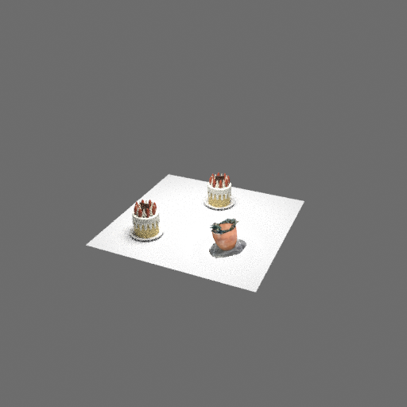

# 真實場景執行與整理交付（2026-09-08）

**Verdict: PARTIALLY VERIFIED。** 使用前輪真正訓練一步的 Stage 1／Stage 2，完成六筆 Objaverse gallery 的 staging／G4／promotion、原始三模態查詢編碼、Gemma 關係生成、逐步檢索、真 GLB 放置與 CPU Blender 渲染。另修正 slot 數值驗證的 producer／consumer 不一致。完整 CPU suite **1,599 passed**。這些結果證明本次有限資料的實際執行，沒有完成正式 Table 1–3 復現。

本系列的測試搬移、刪除依據與較早修補，分別見 [整理紀錄](CLEANUP_REPORT_20260907.md)、[初輪審查](REPRODUCTION_REVIEW_20260907.md)、[執行路徑審查](REPRODUCTION_RUNTIME_REVIEW_20260907.md) 與 [真實訓練審查](REPRODUCTION_TRAINING_REVIEW_20260908.md)。本文件是這輪接續工作的交接入口，可供 Claude 核對，沒有透過外部工具發送訊息。

## 1. Audit Scope

先依 `paper-audit`／`reproduction-audit` 唯讀核對 §2.7、Algorithm 1 與實際 producer→consumer；再在使用者已授權的非標註範圍修補、執行隔離診斷與整理 Git 交付。使用本機模型、CPU、離線模式、限制執行緒，不覆寫正式 corpus、checkpoint 或 annotation。

## 2. Authority and Evidence Ledger

| 分類 | 證據 | 支持範圍 |
|---|---|---|
| PAPER FACT | [§2.7](paper/metafind_source/2methdology.tex:109)、[Algorithm 1](paper/metafind_source/2methdology.tex:117) | gallery 預先編碼；使用當前已放置圖，逐次檢索／放置／更新。 |
| PAPER FACT | [實驗設定及 Table 1 說明](paper/metafind_source/3experiments.tex:15) | baseline mean fusion；Stage 2 在 Objaverse 評估停用 ESSGNN，保留更新後 fusion。原文仍不足以唯一重建 query 觀測。 |
| UPSTREAM FACT | 原始 IDesign commit `7bc891c72e45f36f6461f5848c3c052723faede4` 的 slot／placement 實作 | 僅在既有 U-18／U-21 繼承範圍使用；本次 slots 並非 planner 生成。 |
| IMPLEMENTATION CHOICE | 既有 slot、n07 adjacency、n08 SG2、raw GLB frame 契約 | 已選工程交接；不能回頭定義作者未公開的場景與鏡頭。 |
| OBSERVED DATA | 下列命令、來源 hashes、完整 trace、獨立幾何 oracle | 支持有限真模型流程、來源一致性及幾何結果。 |

## 3. Paper → Specification → Implementation → Validation Matrix

| 需求 | 規格／實作 | 驗證 | 狀態／影響 |
|---|---|---|---|
| 預先計算固定 gallery | n11→G4→n12→promoted loader | 六筆真 PC 重編、真 gate／promotion／consumer 驗證 | PARTIAL，限宣告的小型 corpus |
| 原始模態與正確 checkpoint | `scene.prepare` 還原真 ULIP／S1／S2 | T、T+I、T+PC 各一 query；hash-bound bundle | PARTIAL，限三 query |
| 每次更新已放置圖 | `scene.compose` 的 iterative 分支 | context 大小 0→1→2；與固定 G0 對照 | MATCHED，限本次 execution trace |
| 缺關係不能假裝已知 | prepare 拒絕→`scene.semantics` 重用 SG2 | 兩次 exit 1 均無 manifest；兩次真 Gemma 生成後完成 | MATCHED，限本次遇到的 pairs |
| 可放置的 slot | compose 與 placement 共用 finite numeric 驗證 | 41 個新增參數化案例；合法數值原樣交接 | MATCHED，工程修補 |
| 保存實際幾何與圖片 | placement→獨立 Blender | 三 instance、136,925 頂點的獨立雙向 oracle | PARTIAL，幾何已核對，品質未評分 |
| Table 2／3 正式比較 | 正式場景、judge、各 ablation | 本次未取得完整實驗結果 | UNKNOWN／PARTIAL |

## 4. Runtime Trace

沿用前輪固定六 UID 清單 → 新 Stage 1 的真 Objaverse index → G4／promotion → 三個手動宣告 slots 與空 G0 → `scene.prepare` 真 raw text／單張 PNG／10,000-point NPZ 編碼 → 缺少 cake↔pot 關係而拒絕 → 真 Gemma＋相同 frozen CLIP 延伸 cache → 再次 prepare，最終圖缺少兩個 cake instance 的關係而拒絕 → 第二次真 Gemma 延伸 cache → 新目錄 prepare 成功 → 公開 compose CLI 重播 → 真 GLB placement → CPU render → 另一程序重新開啟 `.blend`，獨立核对頂點。

三次 request 都保留，僅更新 semantic cache 路徑。第一次停止是在組成中途，第二次是在建立最後完整圖時；最後新增的 pair 不再影響本次排名，仍須有來源證據。沒有把未知 key 轉成 `None`，也沒有禁止重複 asset 來避開缺口。三個不同 slot 最終取回 **cake、pot、cake**。

新增修補：[compose._slot](../metafind/scene/compose.py:49) 原先用 `float()` 檢查，接受 `"1.0"`、`True` 等輸入，却把原值保留到 completed composition，隨後遭 placement 拒絕。現在重用 [placement._number](../metafind/scene/placement.py:40)，在編碼／檢索前拒絕字串、布林與非有限數值；合法 int／float 原樣保存，尺寸需正值。不修改座標、slot 或論文公式。

## 5. Validation Evidence

完整 CPU：**1,599 passed、71 warnings、26.42 秒，exit 0，0 failed／0 skipped**；[log](audit/reproduction_scene_real_20260908_cpu.log)、[命令／環境／249 個來源 SHA](audit/reproduction_scene_real_20260908_cpu_execution.json)。CUDA／HIP 隱藏，HF offline，Mesa llvmpipe；排除 GPU／Claude hook tests。64 個測試檔、1,110 個頂層 test 函式。測試後的來源再核對亦相同；新增 slot 案例見 [測試](../tests/eval/test_scene_composition.py:176)。

Graph：**2,347 checks，all pass**，[log](audit/reproduction_scene_real_20260908_graph.log)。另一次唯讀審查重查 custom evaluator、checkpoint ancestry／overlay、Stage 1／2 訓練防護與語意來源，未找到新的確證缺陷。以上各項只支持所查範圍，沒有新增或放寬 gate。

最後 staged `git diff --check` 回傳 2：僅既有原始失敗 log 的行尾空白，以及 IDesign patch 必須保留的空白 context 行。兩檔原 bytes 保留；明確排除這兩份原始格式產物後，其餘 staged source／tests／docs 檢查回傳 0。完整失敗輸出與精確排除清單記於 [final checks](audit/reproduction_scene_real_20260908_final_checks.json)，不把未加排除的檢查寫成通過。

真實執行紀錄集中於 [場景證據封存](audit/scene_real_20260908_artifacts/README.md)，所有 phase 使用原 production entry：

| Phase | 結果 | 秒 |
|---|---|---:|
| n11 Objaverse staging | 六筆真 PC／gallery fuser；無 `--limit` | 23.64 |
| G4／n12 promotion | 預設 gate PASS／consumer 驗證通過 | 1.13／0.071 |
| prepare_00 | exit 1，缺 cake↔pot，無完成 manifest | 32.99 |
| semantics_01 | 真 Gemma 生成 1，degraded 0 | 195.12 |
| prepare_01 | exit 1，最終圖缺 cake↔cake，無完成 manifest | 34.43 |
| semantics_02 | 真 Gemma 生成 1，degraded 0 | 107.82 |
| prepare_02／compose_02 | 完成，另程序 replay JSON 完全相同 | 37.47／0.98 |
| placement prepare／run | 真原始 GLB、`.blend`、512×512 PNG | 0.056／2.38 |
| parallel／layout-off controls | 使用同一 frozen tensors 與模型，均完成 | 0.98／1.03 |

G4 實作預設取 `min(1000,N)`，本次 N=6 全數取樣，沒有改 gate 設定；這不代表規格字面上的 1,000 筆取樣已做。G3 仍未實作，不能宣稱 formal G3→G4 promotion。[gallery 診斷](audit/scene_real_20260908_artifacts/GALLERY_DIAGNOSTIC.md) 記錄完整界線。

[獨立幾何](audit/scene_real_20260908_artifacts/independent_geometry/verified_geometry.json) 從原 GLB hierarchy 另算 Y-up→Z-up、實際頂點 bbox fit、yaw+180° 與 slot center，再與保存的 evaluated vertices 双向比較；沒有 import production bounds helper。三個 instance 共 **136,925 頂點**，最大誤差約 **4.00×10⁻⁷ m**。此結果驗證座標／尺寸／instance 隔離，不能驗證模型真正的語意 front 或美觀。

[三種模式核對](audit/scene_real_20260908_artifacts/verification.json) 另用 NumPy float64 重算所有 top5，與記錄一致。iterative 的 context 是 0／1／2；parallel 為 0／0／0。後兩步的 iterative residual norm 約 2.341527，關閉 layout 或使用空 G0 的 parallel 後變成 0。查詢向量確實改變，**本次三個 top1 沒有改變**，不能宣稱 layout 改善取回結果。

保留兩個診斷工具自身的失敗：gallery 外層 driver 在三個 production CLI 成功後因 import path 失敗，修正 driver 後另跑唯讀 consumer 驗證；本輪彙總 verifier 第一次錯寫 tensor key `gallery_embeddings`，改成實際 `gallery` 後通過。原始失敗 logs／SHA 均保留，沒有修改 production 來配合工具，也沒有把失敗紀錄改成成功。

## 6. Implementation Choices

- 兩階段 checkpoint 各只訓練一步；Stage 1 使用舊 attrs_v1／12 views，小型 Stage 2 使用 8 個 ProcTHOR 資產。沿用身分與訓練限制，沒有偽裝正式 recipe。
- 本次 scene 是三個預先宣告 slots、六個既定候選、空 G0；查詢分別為 T、T+I、T+PC。尚未使用真 IDesign planner 產生本次輸入。
- asset node text 用精確 attrs 序列化；relation text 來自既有描述，新句子由已設定 Gemma 真正生成，向量由核驗的同一 CLIP 編碼。
- 4×4×3 房間、0.8 m slot 尺寸、相機、燈光、512²／8 samples 均為事先明示診斷設定；不是作者 Table 2 設定。

## 7. Deviations

沒有新增正式研究決策。既有 Gemma 代替 GPT-4o、frozen CLIP 範圍、split／觀測與語料差異繼續明記。小型診斷 corpus 包含 parent selection 用過的資產，不能作獨立泛化測試。關係句格式有效及流程成功，也不能證明 LLM 語意品質符合論文。

## 8. Missing or Unreachable Implementation

正式 Table 1–3 完整結果、真 planner→200 scenes→judge 流程仍未完成；GAT 架構仍 UNKNOWN／明確拒絕，G3 仍未實作。現有功能、已執行小型分支與正式數值復現分開列示，不因本次 render 成功改成「全部完成」。

## 9. Unknowns and Conflicts

作者 Table 1 的 query／candidate／觀測細節仍不足，不能唯一歸因原本 T+I、T+PC 的高分；新的自訂同／不同觀測評估保留這個未知。正式場景與 judge 協定、真 asset front 及歷史 LLM 權重 bytes 相等性也未證明。

發布核對另發現既有可攜性缺口：[SOURCE_MANIFEST](paper/metafind_source/SOURCE_MANIFEST.json) 宣告 `docs/paper/MetaFind.gz`，但檔案本機缺失且未追蹤；六張原論文 PNG 仍在本機、hash 未改，卻被 Git 忽略。不能宣稱 fresh clone 可依該 archive 重建圖片。本輪保留原文／manifest，只修正 `.gitignore` 內「所有 archive 都已追蹤、圖片可重建」的錯誤註解；忽略規則不變。

## 10. Reproducibility Provenance

實際來源仍位於 `output/validation/scene_cpu_real_20260908/`。CPU phase runner 每次保存命令、開始／結束、環境、exit code、production hashes；所有 phase 的已快照來源未變。Stage 1 SHA=`df4e81fee9da89bcd802ddadb2a4048d2411bf169ca48b2077727b691da1d532`，Stage 2 SHA=`c4347b8c09ec28f2d932749498be04dde04cf3b8769f953bf4f51d4461e0e5ad`；本次 Objaverse index SHA=`7e2f94854aa533b20a8b04f580a13a8e318af4ee542e1c10fe12e7e3ef3ec90a`。

為使 Git 讀者能檢查，前輪四組訓練／评估的 **123 份小型證據**另存 [封存](audit/validation_artifacts_20260907_08/README.md)，本輪場景證據另存 [scene 封存](audit/scene_real_20260908_artifacts/README.md)。每份都有原來源與 copy SHA，內容逐 byte 保留，不改寫實際執行路徑。大模型、checkpoint、資料集、真 GLB／23.6 MB `.blend` 留在外部目錄；封存是 inspection evidence，不能當成無外部依賴的重跑套件。前輪封存包含一個經檢查的 38,198-byte query parity NPZ；這是明列的小型數值證據，不批量加入被忽略的訓練產物。

前輪 runtime／training Markdown 連結改指 Git 內封存；training report 另更正不存在的 `compose --mode` 旗標，實際切換在 request／frozen inputs 的 `mode`。因此這些 Markdown 的當前 SHA 不再等於歷史檢查當時 SHA。舊 checks JSON 保留原貌，不回填歷史證據。

[發布核對](audit/reproduction_scene_real_20260908_publication_checks.json) 包含 580 檔基線：579 相同，唯一差異仍是前輪已授權的 `semantic_edges_run.py`；11 份 MetaFind TeX／PNG 與 manifest 均一致，原始 upstream IDesign pinned／clean。本輪 [程序快照](audit/reproduction_scene_real_20260908_status.json) 記錄 annotation PID `2043427` 與兩條原等待鏈；沒有重啟或改動它們。該核對早於本輪新報告／場景封存，最終交付核對另記 [final checks](audit/reproduction_scene_real_20260908_final_checks.json)。

## 11. Reproduction Impact

此次把「tiny 接縫測試可通」推進到真模型、真關係、真資產的完整有限場景執行，也修正合法完成產物卻不能被下游放置的數值驗證漏洞。沒有證據支持將三 slot 的結果外推到正式場景品質，更不能靠降低自訂分數去宣稱 Table 1 對齊。

## 12. Verdict

**PARTIALLY VERIFIED。** 本系列整理、修補、新評估與實際執行證據可提交；完整論文數值與所有變體尚未復現。

## 13. Required User Decision

本輪修補、驗證及 Git push 已獲使用者授權，不另要求確認。後續若要為作者未公開的 GAT／正式評分細節加入新的研究選擇，仍需明確決策；本輪沒有默默補定。
