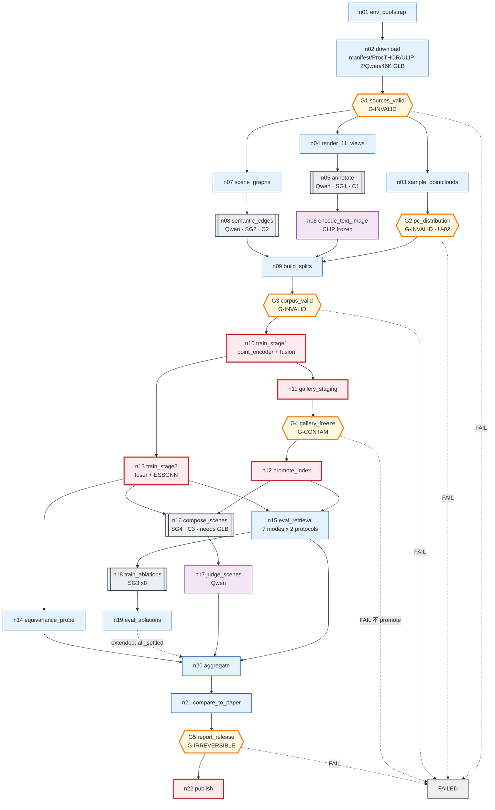

# MetaFind 復現 — Graph Specification

> **2026-08-15 全面改寫。** 先前的草稿有六個會實際改變實驗結果的錯誤，逐條見 §16。
> 每一項都用論文原文核對過，不依記憶。
>
> **三類內容全程分開標示，不得混淆：**
> **[論文]** 原文明確規定 ｜ **[未定]** 論文沒說、我們選了一個並記錄 ｜ **[偏離]** 與論文不同、須在報告聲明
>
> 逐步執行見 [`02_BUILD_STEPS.md`](02_BUILD_STEPS.md)。前置事實見 [`00_FINDINGS.md`](00_FINDINGS.md)。

---

## 1. Graph type classification

**Shapes**：`hierarchical` + `dag`（主線）+ `stateful` + `parallel` + `conditional`，
cycle 僅存在於 subgraph 內。

| 欄位 | 值 | 判定理由 |
|---|---|---|
| `control_authority` | **A1** | 全圖沒有任何決策點由模型決定去向。Qwen 出現三次（資產標註、語意邊、場景評分），三次都只產生 payload 寫進 state；路由一律由 state 上的確定性 predicate 決定 |
| `execution_mode` | **probabilistic** | ≤A1 但節點輸出不可重現：Qwen 取樣、GPU atomics（`scatter_add_`）、訓練隨機性 |
| `topology_class` | **workflow** | 所有 fan-out 的 destination 集合都是靜態列舉（11 視角、7 模態組合、2 gallery 協定、10 ablation 變體） |

### 不可重現來源與凍結方式

| 來源 | 凍結方式 |
|---|---|
| Qwen 資產標註 | 寫成 `write_once` 的版本化 artifact，下游只讀這份 |
| Qwen 語意邊 | 同上，另以描述雜湊為 key 快取 |
| Qwen 場景評分 | 貪婪解碼 + 固定 prompt 版本 + 記錄模型 revision |
| GPU atomics | 固定 seed；等變性測試用數值容差 |
| ANN 近似 | **消除** —— 46,052 × 1280 × 4B ≈ 236 MB，用精確內積 |

---

## 2. Goal / Boundary

### Goal

> 在單張 RTX 4090 上復現 MetaFind，產出可與論文 Table 1／2／3 逐格對照的結果，
> 每一格給出「復現 / 未復現 / 證據不足」三者之一。

### Success criteria

| id | 判準 | 量測者 |
|---|---|---|
| SC-1 | Table 1 的 14 個格子全部產出（**兩種 gallery 協定各一組**）；與論文的差距**如實報告，不設門檻**（見 D-2） | `n21` |
| SC-2 | Table 1 的 PC-Only **反向**現象重現：MetaFind 低於 baseline 公佈值 | `n21` |
| SC-3 | Table 2 四維度上 `w/ESSGNN` > `w/o ESSGNN`（**僅方向性**，見偏離 D-2） | `n21` |
| SC-4 | **層內座標等變**：`‖x^{l+1}(Rx+T) − (R·x^{l+1}(x)+T)‖∞ < 1e-4` | `n14` |
| SC-5 | **層內特徵不變**：`h^{l+1}(Rx+T) = h^{l+1}(x)` | `n14` |
| SC-6 | **layout 輸出不變**：`e_layout(Rx+T) = e_layout(x)` | `n14` |
| SC-7 | Table 3 四個 takeaway 方向重現 | `n21` |
| SC-8 | Resume 等價性：中斷重跑產物一致 | L2-RESUME |

> **SC-4/5/6 是先前草稿的錯誤所在。** 先前寫成 `‖ESSGNN(Rx+T) − (R·ESSGNN(x)+T)‖`，
> 但 `e_layout = Pooling({h_i^(L)})` 是從 `h` 來的、是**不變量**，
> 對它做 `R·(...)+T` 沒有幾何意義。必須拆成三個層級分別斷言。

### Boundary

**In scope**：ULIP-2 接入、雙塔 + fusion、ESSGNN、兩階段訓練、
Objaverse-LVIS 與 ProcTHOR 資料管線、Table 1/2/3、SE(3) 驗證、復現報告。

**Out of scope**：
- ULIP-2 本身的預訓練（用官方 checkpoint）
- **6 個 baseline 的重跑** —— 只復現 MetaFind，baseline 引用論文公佈值並註明協定不同
- **人工評分** —— Table 2 人工欄判 `INSUFFICIENT_EVIDENCE`
- I-Design 本身的復現（外部呼叫）

### 偏離清單

| id | 偏離 | 理由 | 影響 |
|---|---|---|---|
| **D-1** | ViT-bigG-14 保持凍結 | 2.5B 參數在 24GB 上無法訓練 | 「entire encoder」在我們的設定下指 3D encoder + fusion |
| **D-2** | Qwen2.5-VL 取代 GPT-4o | 專案決定 | **Table 1 與 Table 2 都受影響** —— Qwen 不只換掉裁判，也換掉 46,052 筆資產標註（文字塔的訓練資料）。所以 SC-1 只報告差距、不設門檻 |
| **D-3** | 不重跑 baseline | 只復現 MetaFind | SC-2 只能與論文公佈值比較 |
| **D-4** | 不做人工評分 | 無標註人力 | Table 2 人工欄 `INSUFFICIENT_EVIDENCE` |

---

## 3. State schema

完整 39 個 channel 見 [`graph_spec.yaml`](graph_spec.yaml)。關鍵者：

| channel | merge | 為什麼 |
|---|---|---|
| `asset_manifest` | `write_once` | 論文說「約 48,000」，實際 46,052。**一律 `len(manifest)`，不得寫死** |
| `splits` / `split_seed` | `write_once` | 洩漏是 G-INVALID，定案後不得改 |
| `eval_protocols` | `write_once` | **取代先前的 `gallery_size_locked` 單一整數**，見 §7 |
| `asset_glb` | `upsert_by_key` | **保留不刪** —— Algorithm 1 需要真實幾何 |
| `pointclouds` | `upsert_by_key` | 從 mesh 取樣；U-02 需先驗證分布一致性 |
| `renders` | `upsert_by_key` | 11 視角 × 46,052 |
| `objaverse_annotations` | `upsert_by_key` | **以 Objaverse uid 為 key**。ProcTHOR 物件屬於另一個命名空間，不得讀這條 |
| `procthor_object_text` | `upsert_by_key` | **新增**。ProcTHOR 場景圖的 `t_i` 與語意邊的輸入，來自 ProcTHOR 自己的 metadata |
| `procthor_dataset` | `write_once` | **新增**。先前 ProcTHOR 根本沒進 graph state，導致 G1 無從檢查它 |
| `stage2_protocol` | `replace` | **新增**。決定本身，未決前保持可改 |
| `stage2_pairing` | `write_once` | **U-08a**。只有在協定 `resolved` 之後才寫入，避免用空值把 channel 鎖死 |
| `sem_edge_cache` | `upsert_by_key` | **key = `sha256(desc_i, desc_j, prompt_ver, llm, encoder_ver)`**，非 category pair |
| `text_image_embeddings` | `upsert_by_key` | CLIP 凍結 → 可快取 |
| `pc_embeddings` | **不存在** | **point encoder 可訓練 → 不可預先快取**，見 §4 |
| `cost_ledger` | `numeric_add` | 唯一的多 writer 數值歸約 |
| `run_progress` | `upsert_by_key` | durable，stdout 只是鏡像 |
| `degraded_flags` | `set_union` | 任何降級都必須對下游可見 |

### 刻意不放進 state

組好的 prompt 字串（可重算）、渲染圖與 mesh 本體（只存 `{uri, sha256, bytes}`）、
SG4 每輪的 scene graph（可由初始圖 + placed_assets 重建）、model client（不可序列化）。

---

## 4. Node registry（摘要）

完整見 [`node_registry.yaml`](node_registry.yaml)。

### Phase 0 — 環境與取得

| id | role | 說明 |
|---|---|---|
| `n01_env_bootstrap` | compute | 修 `torch._six`、stub 兩個 CUDA extension、純 torch FPS、驗 ULIP-2 建模 |
| `n02_download` | retrieve | manifest / **`procthor_dataset`** / ULIP-2 / ViT-bigG-14 / Qwen / **46,052 個 GLB（保留）** |
| **`G1_sources_valid`** | evaluate | **G-INVALID**。manifest 完整、GLB 覆蓋率、checkpoint 行為驗證、**ProcTHOR 三個 split 齊全** |

### Phase 1 — 資料處理

| id | role | 說明 |
|---|---|---|
| `n03_sample_pointclouds` | compute | 從 mesh 取樣 10,000 點 xyz+rgb，複製 ULIP 的 `pc_norm` |
| **`G2_pc_distribution`** | evaluate | **G-INVALID**。U-02：自行取樣 vs ULIP 官方點雲的 embedding 一致性 |
| `n04_render_views` | compute | 11 個視角、224px；**投影方式為設定值，預設正交（U-03a，不是論文明文）** |
| `n05_annotate` | model | Qwen2.5-VL → category / dimensions / materials / placement_constraints |
| `n06_encode_text_image` | model | CLIP 凍結 → 可快取；**PC 不在此列** |
| `n07_scene_graphs` | compute | ProcTHOR → 節點（位置 + `t_i`）、物理邊（support 讀自 children 樹）。**`t_i` 來自 ProcTHOR metadata，不是 Objaverse 標註** |
| `n08_semantic_edges` | model | Qwen 對 **ProcTHOR 物件描述**產生關係句 → frozen text encoder → `e_ij` |
| `n09_build_splits` | compute | 物件 80/20、房屋 80/20 |
| `n09b_resolve_stage2_protocol` | **human** | **決定 U-08a／U-08b** —— 正樣本對應與模態來源。論文沒說，只能由人決定 |
| **`G6_stage2_protocol`** | evaluate | **G-INVALID**。未決 → `BLOCKED_EVIDENCE`(rc=3)，**不是 FAIL** |
| **`G3_corpus_valid`** | evaluate | **G-INVALID**。零洩漏、集合完整性、協定已定義 |

### Phase 2 — 訓練

| id | role | 說明 |
|---|---|---|
| `n10_train_stage1` | mutate | **訓練 point encoder + fusion**（Eq.5，單向），30% 模態遮罩 |
| `n11_gallery_index_staging` | mutate | 凍結 gallery 塔，編碼全部 admitted 資產 → staging |
| **`G4_gallery_freeze`** | evaluate | **G-CONTAM**。維度、數量、無 NaN、自我檢索 recall@1 = 1.0 |
| `n12_promote_index` | mutate | late commit，`write_once` |
| `n13_train_stage2` | mutate | 訓練 fuser + ESSGNN，gallery 凍結；Eq.6 殘差、30% scene dropout、Eq.7/8 雙向 |
| `n14_equivariance_probe` | evaluate | SC-4/5/6 三層級 + RA-1/RA-2 |

### Phase 3 — 評估與報告

| id | role | 說明 |
|---|---|---|
| `n15_eval_retrieval` | evaluate | 7 模態組合 × **2 gallery 協定** × 2 變體 |
| `n16_compose_scenes` | subgraph | Algorithm 1，需 I-Design + 真實 GLB 幾何 |
| `n17_judge_scenes` | model | Qwen2.5-VL 四維度評分 |
| `n18_train_ablations` | subgraph | Table 3 的 8 個變體（含 `fuser_only`） |
| `n19_eval_ablations` | evaluate | Table 3 指標 |
| `n20_aggregate` | compute | 組 Table 1/2/3 |
| `n21_compare_to_paper` | evaluate | 逐格三選一判定 |
| **`G5_report_release`** | evaluate | **G-IRREVERSIBLE** |
| `n22_publish_report` | mutate | 唯一對外動作 |

**5 個 `mutate`**：n10、n11、n12、n13、n22。全部有 idempotency 機制與 rollback，且排在相關 gate 之後。

### Subgraph

| id | 內容 | cycle |
|---|---|---|
| **SG1** `annotate_asset` | Qwen 標註 + schema 驗證 + 修復迴圈 | **C1**（bound 2） |
| **SG2** `semantic_edge` | 快取查詢 → LLM → 驗證 → 編碼 | **C2**（bound 2） |
| **SG3** `train_variant` | 一個變體的訓練（依 `train_scope` 決定訓練範圍） | 無 |
| **SG4** `iterative_composition` | Algorithm 1 | **C3**（bound 25） |

---

## 5. Dependency DAG

```
n01_env_bootstrap
 └→ n02_download
     └→ G1_sources_valid
         ├→ n03_sample_pointclouds → G2_pc_distribution ─┐
         ├→ n04_render_views ──→ n05_annotate ───────────┤   (Objaverse 標註)
         └→ n07_scene_graphs ──→ n08_semantic_edges ─────┤   (ProcTHOR 描述，與上面互不相干)
                                                          ↓
                        n06_encode_text_image ←───────────┤
                                    ↓                     │
                              n09_build_splits ←──────────┘
                                    ↓
                            G3_corpus_valid
                                    ↓
                            n10_train_stage1
                        ┌───────────┴───────────┐
              n11_gallery_staging        n13_train_stage2
                        ↓                       ↓
                G4_gallery_freeze      n14_equivariance_probe
                        ↓                       │
                n12_promote_index               │
                        ├───────────────────────┤
                        ↓                       ↓
              n15_eval_retrieval        n16_compose_scenes
                        │                       ↓
                        │               n17_judge_scenes
                        │                       │
                        └────→ n18_train_ablations → n19_eval_ablations
                                        ↓
                                  n20_aggregate
                                        ↓
                              n21_compare_to_paper
                                        ↓
                               G5_report_release
                                        ↓
                              n22_publish_report
```

**主線零回邊。** Cycle 全在 subgraph 內（C1 標註修復、C2 語意邊修復、C3 Algorithm 1）。

> **先前草稿的 dependency bug**：baseline 節點被排成與資料準備平行。
> 即使保留 baseline，它仍依賴 admitted 資產、前處理、split 與 gallery 協定，
> 只能與 `n10` 平行、不能與 `n03` 平行。本版已移除該節點（D-3）。

---

## 6. Join policy（全部顯式宣告）

| 節點 | group | policy | 理由 |
|---|---|---|---|
| `n09_build_splits` | default | **`all`** | 物件與場景目錄都要齊，否則算出的 split 是錯的 |
| `SG1/SG2 reduce` | default | **`all_settled`** | 必須知道**誰**失敗 —— gallery 分母改變會使 R@k 失去意義 |
| `G3_corpus_valid` | default | **`all`** | gate 需要完整證據 |
| `n15_eval_retrieval` | default | **`all`** | 需要索引 + 兩個變體 |
| `n20_aggregate` | `core {n15, n17}` | **`all`** | Table 1 與 Table 2 的模型評分欄必要 |
| | `extended {n19}` | **`all_settled`** | Table 3 可部分缺，缺了只縮小 claim |
| | trigger | `all_groups_satisfied` | |
| `SG4 s4_fuse` | default | **`all`** | 融合需要 layout 與 query 兩邊 |
| `SG4 s4_encode` | `init` / **`loop_back`** | 各 `any`，`any_group_satisfied` | **E4：回邊自成 group，否則 deadlock** |

---

## 7. Routing rules

全部 A0 / A1，無 >A1 決策點。

| 決策點 | 輸入 | destinations | 預設 |
|---|---|---|---|
| `G1/G2/G3/G4/G5` | 各自判準 | `{下一階段, HALT}` | **`HALT`**（fail closed） |
| `SG1 admit_or_repair` | schema 結果、attempt | `{admit, repair, quarantine}` | `quarantine` |
| `SG2 cache_lookup` | `sem_edge_cache.contains(hash)` | `{use_cache, call_llm}` | `call_llm` |
| `SG3 train_scope` | `variant.train_scope` | `{fuser_only, point_encoder+fuser, full}` | `point_encoder+fuser` |
| `SG4 advance` | `placed_count`, `N`, wallclock | `{loop_back, DONE, EXHAUSTED}` | `EXHAUSTED` |
| `SG4 mode` | `variant.composition_mode` | `{iterative, parallel, region}` | `iterative` |

### 評估協定 —— 先前草稿這裡錯了

**[論文 §2.1]** > retrieves the asset from a **pre-encoded asset database** $\mathcal{A}$
**[論文 §3.1]** > 80% training / 20% testing

論文沒說檢索時 gallery 是全部 46,052 還是只有 20% 測試集，差別是隨機命中率 5 倍。

**先前草稿打算「用 baseline PC-Only ≈98–99% 反推分母」—— 那不可能成立。**
PC-Only 的 query embedding 就等於它自己的 gallery 條目，
**無論分母是 46,052 還是 9,210，自我檢索都趨近 100%**，完全無法區分。

**改為兩個協定都跑、都報**：

```yaml
eval_protocols:
  A_test_gallery:  {query: test, gallery: test}    # ~9,210
  B_full_gallery:  {query: test, gallery: full}    # 46,052
```

產出 `R@1_A / R@5_A / R@1_B / R@5_B`。**[未定 U-09]**

---

## 8. Loop / termination

| cycle | progress measure | semantic exit | hard bound | **exhaustion outcome** |
|---|---|---|---|---|
| **C1** 標註修復 | `attempt` | schema 通過 | 2 次 | **quarantine**，帶 `terminated_by: repair_budget`，不得當成標註成功 |
| **C2** 語意邊修復 | `attempt` | 關係句可編碼 | 2 次 | 該邊標 `semantic_edge_missing` 退化為純幾何邊，**不得補零** |
| **C3** Algorithm 1 | `placed_count`（merge=`max`，重試不重複計數） | `placed_count == N` | 25 物件 / 600s | 場景標 `incomplete`，**排除在 Table 2 平均外並另行報告** |

`iteration` lifetime channel 每輪清空：`layout_embedding`、`query_modality_embeds`（SG4）；
`item_attempt`、`annotation_error_feedback`（SG1）。

**全圖終止**：`SUCCESS`（SC 全達成且 G5 PASS）／`FAILED`（gate FAIL 且確認不可恢復）／
`EXHAUSTED`（預算用盡，帶 `terminated_by: budget`）／`BLOCKED`（等外部輸入，**可恢復，非失敗**）。

---

## 9. Failure policy

| 節點 | failure class | policy |
|---|---|---|
| `n01_env_bootstrap` | `DETERMINISTIC_INPUT` | **不重試** —— 版本衝突重試一萬次還是同一個錯 |
| `n02_download` | `TRANSIENT`, `CONTRACT_VIOLATION` | 指數退避 + jitter，5 次；sha256 不符 → fail closed |
| `n03/n04` | `DETERMINISTIC_INPUT`, `RESOURCE` | 壞 mesh 直接 quarantine 不重試；OOM 降 batch 並**記錄** |
| `n05/n08` Qwen | `MODEL_RECOVERABLE`, `TRANSIENT` | schema 錯 → 修復迴圈（錯誤訊息餵回）；限流 → 退避 |
| `n10/n13/n18` 訓練 | `RESOURCE`, `CATASTROPHIC` | OOM 降 batch 並寫 `degraded_flags`（**batch size 直接影響 Eq.5 的 in-batch negatives**）；NaN → fail closed |
| 所有 gate | `CONTRACT_VIOLATION` | fail closed；**缺 record 一律視為未通過** |

### 部分失敗語意（寫死，不臨場決定）

| 情境 | 語意 |
|---|---|
| 46,052 資產中 M 個失敗 | `proceed_with_admitted`；gallery 分母改為 `len(manifest) − M`；`M/len > 2%` → G3 FAIL |
| ablation 某個變體失敗 | `proceed_with_admitted`；該列標 `N/A (reproduction failed)`，縮小 SC-7 |
| SG4 某場景 EXHAUSTED | 排除在平均外並報告 incomplete 率；>10% → G4 FAIL |

### Rollback

| 節點 | 方式 |
|---|---|
| `n10/n13/n18` 訓練 | `checkpoint_restore`（內容定址路徑，天然不覆蓋） |
| `n11 → n12` 索引 | `quarantine_forward` —— 已 promote 的索引**不刪**，標 `INVALIDATED`；刪掉會讓引用它的紀錄變孤兒 |
| `n22_publish` | `compensating_action`（發勘誤 + 標記 tag）。**已被讀取的內容撤不回**，這是 G5 存在的理由 |

---

## 10. Validation plan

完整見 [`validation_plan.yaml`](validation_plan.yaml)。

### 關鍵 L1

| id | 斷言 |
|---|---|
| L1-MANIFEST | 任何模組都不得出現字面值 `48000`；資產數一律取自 `len(manifest)` |
| L1-EGNN-FX-SCALAR | `f_x` 輸出為純量；改成 ℝ³ 必須被擋（RA-2） |
| L1-EGNN-H0 | `h⁰ = t_i`，不含座標；`Concat(x,t)` 版另行 audit（RA-1） |
| L1-SEMEDGE-KEY | cache key 含兩個**描述**與版本；同類別但不同描述**不得**命中同一筆 |
| L1-MASK-NOTZERO | 遮罩用學習到的 mask token，非零向量 |
| L1-PC-NORM | 複製 ULIP 的 `pc_norm`：質心置中、最大半徑為 1 |
| L1-ITER-RESET | `iteration` channel 每輪清空 |
| L1-EXHAUST-MARK | hard bound 觸發後狀態為 `EXHAUSTED`，被標成成功則測試失敗 |
| L1-GATE-NORECORD | **缺 gate record 必須視為未通過**，不得 pass-by-default |

### 關鍵 L2

| id | 斷言 |
|---|---|
| **L2-PC-DISTRIBUTION** | **U-02**：自行取樣的點雲與 ULIP 官方點雲，經同一 encoder 後餘弦相似度須顯著高於「不同資產」的基準線 |
| **L2-EQUIVAR-COORD** | 層內座標等變（SC-4） |
| **L2-EQUIVAR-FEAT** | 層內特徵不變（SC-5） |
| **L2-EQUIVAR-LAYOUT** | `e_layout` 不變（SC-6） |
| L2-LEAK | `train_ids ∩ test_ids = ∅`（物件）、`train_houses ∩ test_houses = ∅`（房屋）。**不再要求資產集合 disjoint** |
| L2-RESUME | 中途 `kill -9` 重跑，產物逐位元組相同，且外部呼叫次數不增加 |
| L2-COMPLETE | `admitted + quarantined == len(manifest)`，無重複、無非預期成員 |
| L2-GALLERY-SELF | 抽 1000 筆自我檢索 recall@1 = 1.0 |
| L2-DUAL-PROTOCOL | 兩種 gallery 協定各自產出完整的 R@1/R@5，且分母正確 |

**每條檢查都有負向注入**，`verified_blocks` 預設 `false`，
**只有實際觀察到注入導致失敗後才可改為 `true`**。

---

## 11. Promotion gates（5 個）

| gate | class | 判準 | on_fail |
|---|---|---|---|
| **G1_sources_valid** | G-INVALID | manifest 完整；GLB 覆蓋率 ≥98%；ULIP-2 checkpoint 行為驗證通過（非僅 sha256） | 停，補下載 |
| **G2_pc_distribution** | G-INVALID | U-02 通過：自取樣點雲的 embedding 與官方點雲一致性達標 | 停，調整取樣方式。**不得放寬門檻** |
| **G3_corpus_valid** | G-INVALID | 零洩漏；集合完整性等式；兩個評估協定已定義；quarantine 率 ≤2% | 停，修資料管線 |
| **G4_gallery_freeze** | G-CONTAM | 索引維度／數量正確、無 NaN、自我檢索 recall@1 = 1.0 | **不 promote**，staging 作廢重建 |
| **G5_report_release** | G-IRREVERSIBLE | 每格有明確判定；gate record 齊全且 `is_terminal`；RA-1/2/3 紀錄齊全；D-1~D-4 已在報告聲明 | 停，補齊 |

**Exit code**：`0` PASS｜`2` FAIL｜`3` BLOCKED_EVIDENCE｜`4` INVALIDATED｜`1` 保留給「檢查腳本自己壞了」

### Required Audit（必跑、必留紀錄、**永不阻斷**）

| id | 判準 | 界定哪個 claim | 失敗時 |
|---|---|---|---|
| **RA-1** | `h⁰ = Concat(x,t)` 版本的等變性 | 「我們復現了 §2.5 的字面寫法」 | **預期失敗** —— §2.5 與 Appendix C 的前提互相矛盾 |
| **RA-2** | `f_x → ℝ³` 版本的等變性 | 同上 | **預期失敗** —— 證明要求 `φ_x` 為純量才能提出 `Q` |
| **RA-3** | `train_scope=full`（含 CLIP）的可行性 | 「我們驗證了論文關於訓練範圍的結論」 | 單卡不可行 → claim 縮小為「3D encoder + fusion 範圍內」 |

---

## 12. Observability

| Layer | 措施 |
|---|---|
| **O1 Structural** | build 時檢查無孤立/不可達節點、主線無 cycle、**每個 fan-in 的 join policy 已顯式宣告**、回邊自成 group |
| **O2 Execution** | 逐節點 start/end/duration/attempt/rc/failure_class → `run_progress`（**durable**） |
| **O3 State diff** | 每步改動的 channel；大 artifact 只記 sha256 |
| **O4 Decision log** | 每個 gate 的 `observed`；SG1 逐資產 admit/quarantine 理由；**SG4 每步的 top-5 候選、分數、`λ·‖e_layout‖`** |
| **O5 Cost** | 逐節點 GPU 秒 / wallclock / Qwen token / 外部呼叫 |

**B1**：進度真相是原子寫入的 checkpoint，stdout 只是鏡像；stdout 失效不得讓工作失敗。
**B2**：46,052 資產與 12,000 房屋逐項 sidecar（含來源 sha256、seed、失敗原因）。

---

## 13. Diagram



---

## 14. Execution order

| Layer | 節點 | Gate | 估時 |
|---|---|---|---|
| 1 | `n01` | | 2–4 h |
| 2 | `n02`（46K GLB 為主導） | | **1–2 天** |
| 3 | | **G1** | — |
| 4 | `n03` ∥ `n04` ∥ `n07` | | 1–3 h |
| 5 | | **G2** | — |
| 6 | `n05` ∥ `n08`（Qwen 推論） | | 1–2 天 |
| 7 | `n06` | | 2–4 h |
| 8 | `n09` | | <1 h |
| 9 | | **G3** | — |
| 10 | `n10_train_stage1` | | **數小時–1 天**（比先前的草稿久，因為要訓 point encoder） |
| 11 | `n11` ∥ `n13` | | 3–8 h |
| 12 | | **G4** | — |
| 13 | `n12` ∥ `n14` | | <1 h |
| 14 | `n15` ∥ `n16` | | 6–17 h |
| 15 | `n17` | | 2–4 h |
| 16 | `n18` → `n19` | | 6–12 h |
| 17 | `n20` → `n21` | | <1 h |
| 18 | | **G5** | — |
| 19 | `n22` | | <1 h |

**關鍵路徑**：Layer 2（GLB 下載）與 Layer 6（Qwen 標註 46,052 資產）。

---

## 15. Risks / Unknowns

| id | 標記 | 內容 | 如何解除 |
|---|---|---|---|
| **U-01** | UNKNOWN | 資產數：論文「約 48,000」vs manifest 46,052 | 用 `len(manifest)`，報告記錄 sha256 |
| **U-02** | UNKNOWN | 自行取樣點雲與 ULIP-2 訓練分布是否一致 | **G2 擋住，必須先驗證** |
| **U-03** | UNKNOWN | 11 視角的相機擺位 | 預設 Fibonacci，記錄選擇 |
| **U-04** | UNKNOWN | 渲染解析度 | 224px 對齊 ULIP-2 慣例 |
| **U-05** | UNKNOWN | adjacency 判準 | 預設 kNN k=8，參數記入產物 |
| **U-06** | UNKNOWN | 語意邊要對哪些物件對 | 選一個並記錄；列入報告未定項 |
| **U-07** | UNKNOWN | ProcTHOR 官方 split vs 論文 80/20 | 主線用論文 80/20，兩者都記錄 |
| **U-08** | UNKNOWN | **Stage 2 訓練樣本如何建構** | 論文完全未定義；明列我們採用的協定 |
| **U-09** | UNKNOWN | Table 1 的 gallery 範圍 | **兩個協定都跑、都報** |
| **U-10** | UNKNOWN | Table 2 的 Scene Coherence 對應 IDesign 哪個面向 | 記錄對應假設 |
| **U-08a** | **UNKNOWN・阻斷** | **Stage 2 的正樣本是哪一個 gallery 條目**。實測 ProcTHOR assetId 與 Objaverse uid **交集為 0**（995 vs 46,052），論文完全沒有提及這個對應 | 必須先決定並記入 `stage2_pairing`，否則 Eq.7a/7b 無正樣本 |
| **U-08b** | **UNKNOWN・阻斷** | ProcTHOR 目標物件的 text / image / point cloud 從哪來。ProcTHOR 只提供 metadata 與座標，沒有渲染圖也沒有點雲 | 同上，Eq.6 的三個模態沒有來源 |
| **U-11** | UNKNOWN | 缺席模態怎麼表示。論文只排除 zero-padding，沒說是 learned mask token 還是 fusion 層遮罩 | 記錄我們的選擇 |
| **U-12** | UNKNOWN | ProcTHOR metadata 怎麼變成 `t_i` 的句子 | 記錄我們的做法 |
| **U-03a** | UNKNOWN | 11 視角用正交投影還是透視投影。論文只寫 "orthogonal viewpoints"，沒指定投影方式 | 兩種都保留，記錄選擇 |
| **R-01** | RISK | **I-Design 尚未驗證能否執行** | Table 2/3 全靠它，**查它很便宜，應盡早做** |
| **R-02** | RISK | 單卡 24GB 限制訓練範圍 | D-1 已聲明 |
| **R-03** | RISK | Qwen 標註品質未知 | pilot 後人工抽查 |

---

## 16. 修正紀錄

| # | 先前的草稿 | 現在 | 嚴重度 |
|---|---|---|---|
| 1 | Stage 1 凍結 backbone、只訓 head 當**主線** | 主線訓 point encoder + fusion；凍結版降為 Table 3 的 `fuser_only` ablation | 🔴 **跑錯實驗** |
| 2 | `gallery_size_locked` 單一整數，用 PC-Only 反推 | 雙協定並行；PC-Only **無法**反推分母 | 🔴 |
| 3 | `e_layout` 寫成等變、可加 `R·(...)+T` | 拆成層內座標等變 / 層內特徵不變 / `e_layout` 不變三個斷言 | 🔴 **數學錯誤** |
| 4 | 語意邊 cache key = category pair | key = 兩個 object **description** 的 hash | 🔴 |
| 5 | baseline 與資料準備平行 | 移除 baseline 節點（D-3）；即使保留也只能與 `n10` 平行 | 🔴 **dependency 錯** |
| 6 | Stage 2 訓練樣本建構**完全未提** | U-08，並明列採用的協定 | 🔴 **最大缺口** |
| 7 | 強制 train/test 房屋不共用 asset | 移除 —— 論文沒這要求，且會改變 ProcTHOR 分布 | 🟠 |
| 8 | 渲染後**刪除 GLB** | 保留 —— Algorithm 1 需要真實幾何 | 🟠 |
| 9 | GPT-4o 可 fallback 成 ULIP captions（且為預設） | 移除 fallback；真要用整份標 `DEGRADED` | 🟠 |
| 10 | 多處寫死 `48000` | `len(manifest)`，並加 L1 測試禁止字面值 | 🟠 |
| 11 | `1280/128/64` 當論文真值並設 L1 | **論文全文無任何維度數字**；改為 checkpoint 推導值與超參數 | 🟠 |
| 12 | 語意邊強制投影到 64 維 | 論文無此層，預設不投影；投影保留為可量測的對照 | 🟠 |

### 2026-08-15 第二輪（外部審查後）

| # | 問題 | 現在 | 嚴重度 |
|---|---|---|---|
| 13 | `00_FINDINGS` 的 D1/D2 還是舊的凍結+全快取設計，而 README 叫人先讀它、稱它「硬事實」 | D1/D2 重寫；文件頂端加上**權威順序**，並註明 D 系列是決策、會改變 | 🔴 **會讓 agent 寫回舊版** |
| 14 | `n07`/`n08` 讀 `annotations`（Objaverse 標註），但 `n07` 不是它的 writer，且 ProcTHOR assetId 與 Objaverse uid **交集為 0** | 拆成 `objaverse_annotations` 與 `procthor_object_text` 兩條 channel | 🔴 **provenance 與概念雙重錯誤** |
| 15 | Stage 2 的**正樣本身分沒有閉合** —— 目標是 ProcTHOR 物件、gallery 是 Objaverse，沒有對應關係；`n13` 的 reads 甚至湊不出 Eq.6 的輸入 | 新增 `stage2_pairing` channel、U-08a／U-08b 標為**阻斷級**、補齊 `n13` 的 reads | 🔴 **Stage 2 建不起來** |
| 16 | `learned mask token` 被寫成論文要求 | 論文只排除 zero-padding → U-11，斷言改成「必須與 zero-padding 不同」 | 🔴 |
| 17 | 「orthogonal = 正交投影」標成已解決 | 降為 U-03a，兩種投影都保留 | 🟠 |
| 18 | 「size dimensions 只能是類別先驗」當成論文性質 | 那是**我們**加了 unit-sphere 正規化的後果，改成描述本實作 | 🟠 |
| 19 | 「正規化座標會破壞等變性」 | 數學上不對。改成：**為忠實保留論文的 unnormalized 設定**而不做置中 | 🟠 |
| 20 | SC-1 用 ±3pp 當門檻 | Qwen 也換掉了 46,052 筆標註（文字塔的訓練資料），Table 1 同樣受影響 → 改為如實報告差距 | 🟠 |
| 21 | `00_FINDINGS` 寫「以論文的 L=4」 | 論文只寫 "After $L$ layers"，沒給值 | 🟠 |
