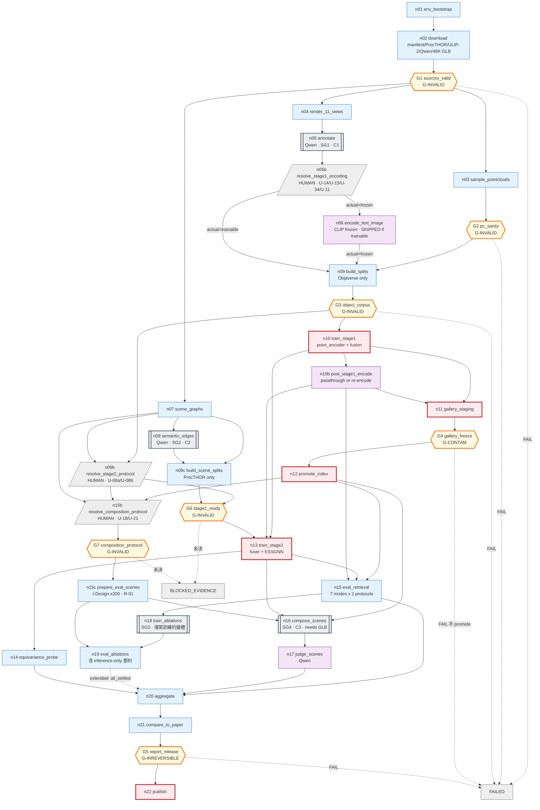

# MetaFind 復現 — Graph Specification

> **2026-08-15 全面改寫。** 先前的草稿有六個會實際改變實驗結果的錯誤，逐條見 §16。
> 每一項都用論文原文核對過，不依記憶。
>
> **三類內容全程分開標示，不得混淆：**
> **[論文]** 原文明確規定 ｜ **[未定]** 論文沒說、我們選了一個並記錄 ｜ **[偏離]** 與論文不同、須在報告聲明
>
> 逐步執行見 [`02_BUILD_STEPS.md`](02_BUILD_STEPS.md)。前置事實見 [`00_FINDINGS.md`](00_FINDINGS.md)。

---

## 1. Graph type classification

**Shapes**：`hierarchical` + `dag`（主線）+ `stateful` + `parallel` + `conditional`，
cycle 僅存在於 subgraph 內。

| 欄位 | 值 | 判定理由 |
|---|---|---|
| `control_authority` | **A1** | 全圖沒有任何決策點由模型決定去向。Qwen 出現四次（資產標註、語意邊、場景評分、I-Design 規劃／D-5），四次都只產生 payload 寫進 state；路由一律由 state 上的確定性 predicate 決定 |
| `execution_mode` | **probabilistic** | ≤A1 但節點輸出不可重現：Qwen 取樣、GPU atomics（`scatter_add_`）、訓練隨機性 |
| `topology_class` | **workflow** | 所有 fan-out 的 destination 集合都是靜態列舉（11 視角、7 模態組合、2 gallery 協定、Table 3 的 10 列中 8 個需訓練的變體） |

### 不可重現來源與凍結方式

| 來源 | 凍結方式 |
|---|---|
| Qwen 資產標註 | 寫成 `write_once` 的版本化 artifact，下游只讀這份 |
| Qwen 語意邊 | 同上，另以描述雜湊為 key 快取 |
| Qwen 場景評分 | 貪婪解碼 + 固定 prompt 版本 + 記錄模型 revision |
| GPU atomics | 固定 seed；等變性測試用數值容差 |
| ANN 近似 | **消除** —— 46,052 × 1280 × 4B ≈ 236 MB，用精確內積 |

---

## 2. Goal / Boundary

### Goal

> 在單張 RTX 4090 上復現 MetaFind，產出可與論文 Table 1／2／3 逐格對照的結果，
> 每一格給出「復現 / 未復現 / 證據不足」三者之一。

### Success criteria

| id | 判準 | 量測者 |
|---|---|---|
| SC-1 | Table 1 的 14 個格子全部產出（**兩種 gallery 協定各一組**）；與論文的差距**如實報告，不設門檻**（見 D-2） | `n21` |
| SC-2 | Table 1 的 PC-Only **反向**現象重現：MetaFind 低於 baseline 公佈值 | `n21` |
| SC-3 | Table 2 四維度上 `w/ESSGNN` > `w/o ESSGNN`（**僅方向性**，見偏離 D-2） | `n21` |
| SC-4 | **層內座標等變**：`‖x^{l+1}(Rx+T) − (R·x^{l+1}(x)+T)‖∞ < 1e-4` | `n14` |
| SC-5 | **層內特徵不變**：`h^{l+1}(Rx+T) = h^{l+1}(x)` | `n14` |
| SC-6 | **layout 輸出不變**：`e_layout(Rx+T) = e_layout(x)` | `n14` |
| SC-7 | Table 3 四個 takeaway 方向重現 | `n21` |
| SC-8 | Resume 等價性：中斷重跑產物一致 | L2-RESUME |

> **SC-4/5/6 是先前草稿的錯誤所在。** 先前寫成 `‖ESSGNN(Rx+T) − (R·ESSGNN(x)+T)‖`，
> 但 `e_layout = Pooling({h_i^(L)})` 是從 `h` 來的、是**不變量**，
> 對它做 `R·(...)+T` 沒有幾何意義。必須拆成三個層級分別斷言。

### Boundary

**In scope**：ULIP-2 接入、雙塔 + fusion、ESSGNN、兩階段訓練、
Objaverse-LVIS 與 ProcTHOR 資料管線、Table 1/2/3、SE(3) 驗證、復現報告。

**Out of scope**：
- ULIP-2 本身的預訓練（用官方 checkpoint）
- **6 個 baseline 的重跑** —— 只復現 MetaFind，baseline 引用論文公佈值並註明協定不同
- **人工評分** —— Table 2 人工欄判 `INSUFFICIENT_EVIDENCE`
- I-Design 本身的復現（外部呼叫）

### 偏離清單

| id | 偏離 | 理由 | 影響 |
|---|---|---|---|
| **D-1** | ViT-bigG-14 保持凍結 | 2.5B 參數在 24GB 上無法訓練 | **狀態：取決於 U-34，目前尚未確立為偏離**。先前的理由是「ULIP-2 公開程式沒有凍 CLIP」——那對**程式**的觀察正確，但拿來論證**設計**是錯的：ULIP-2 §3.3 明文凍結，而同檔的 ULIP-1 factory 都有明確凍結、只有 ULIP-2 的沒有，比較像疏漏。U-34 若解為 `frozen`，這根本不是偏離；若解為 `trainable`，才是偏離，且 RA-3 是「另一條路跑不動」的證據 |
| **D-2** | Qwen2.5-VL 取代 GPT-4o | 專案決定 | **Table 1 與 Table 2 都受影響** —— Qwen 不只換掉裁判，也換掉 46,052 筆資產標註（文字塔的訓練資料）。所以 SC-1 只報告差距、不設門檻 |
| **D-3** | 不重跑 baseline | 只復現 MetaFind | SC-2 只能與論文公佈值比較 |
| **D-4** | 不做人工評分 | 無標註人力 | Table 2 人工欄 `INSUFFICIENT_EVIDENCE` |
| **D-5** | I-Design 中**所有**設為 `gpt-4`／`gpt-4-1106-preview` 的 LLM 路徑改導向 `qwen2.5-7b-instruct` | 無專有 API | **與 D-2 不同**：D-2 換的是標註與評分用的 GPT-4o。規劃器換掉會**改變場景本身**，Table 2 全部與 Table 3 場景欄一起位移；**Table 1 完全不受影響**（它不跑規劃器） |
| **D-6** | 對 I-Design 的**行為性**修改（patch 02／03）：佈局引用正規化、丟棄懸空引用、合併重複 id、修正迴圈上限、重試換 seed、耗盡放棄場景 | 不改就 5 次 0 完成 | 改的是管線**產出什麼**。**偏離的是公開實作** —— 作者的整合程式從未公開，不能斷言他們沒做類似修改 |

---

## 3. State schema

完整 48 個 state channel 見 [`graph_spec.yaml`](graph_spec.yaml)。關鍵者：

| channel | merge | 為什麼 |
|---|---|---|
| `asset_manifest` | `write_once` | 論文說「約 48,000」，實際 46,052。**一律 `len(manifest)`，不得寫死** |
| `splits` / `split_seed` | `write_once` | **物件級**。洩漏是 G-INVALID，定案後不得改 |
| `scene_splits` | `write_once` | **新增**。ProcTHOR 房屋 split 從 `splits` 拆出來，讓 Stage 1 不再等 ProcTHOR 分支 |
| `composition_protocol` | `replace` | **新增**。U-18／U-21，未決前保持可改 |
| `evaluation_scene_inputs` | `write_once` | **新增**。Table 2 的 200 個評估場景（`G_0` + query list），先前根本沒有這條 channel |
| `eval_protocols` | `write_once` | **取代先前的 `gallery_size_locked` 單一整數**，見 §7 |
| `asset_glb` | `upsert_by_key` | **保留不刪** —— Algorithm 1 需要真實幾何 |
| `pointclouds` | `upsert_by_key` | 從 mesh 取樣；`G2_pc_sanity` 檢查結構有效性，U-02 降為診斷 |
| `renders` | `upsert_by_key` | 11 視角 × 46,052 |
| `objaverse_annotations` | `upsert_by_key` | **以 Objaverse uid 為 key**。ProcTHOR 物件屬於另一個命名空間，不得讀這條 |
| `procthor_object_text` | `upsert_by_key` | **新增**。ProcTHOR 場景圖的 `t_i` 與語意邊的輸入，來自 ProcTHOR 自己的 metadata |
| `procthor_dataset` | `write_once` | **新增**。先前 ProcTHOR 根本沒進 graph state，導致 G1 無從檢查它 |
| `stage1_encoding_protocol` | `replace` | **決定 `n06` 該編碼什麼，由 `n05b`（層 6b）產出，早於 `n06`**。U-15（`text_serialization`）／U-14（`image_aggregation`）／**U-34 拆成 `paper_clip_train_scope` 與 `actual_clip_train_scope`**／U-11（`missing_modality_representation`）。<br>**U-34 為什麼要兩個欄位**：D-1 的內容是「論文要訓 CLIP 而我們凍了」——那是**兩者之間的落差**，一個欄位寫不出來。單欄位時把它設成 `trainable` 反而在 run **沒有偏離**的時候標記 D-1 為 active，而 D-1 真正描述的狀態根本無法表示。只有 `actual` 會分支 graph |
| `stage1_hyperparameters` | `replace` | **U-22 的實體 artifact**（`uri` / `sha256` / `values`），由 `n05b` 產出。先前只有 `stage1_protocol` 裡的一個 hash，而**沒有任何 channel 存放被它指涉的東西** —— constructor 從 graph 外收一個 dict，G3 宣稱要 dereference 卻沒有可讀的來源。`sha256` 必須等於 `hyperparameter_config_hash` |
| `stage1_protocol` | `replace` | **訓練期才用到的那一半**：U-13（`fusion`）／U-16（`tower_sharing`）／U-23（`allow_all_masked`）／U-24（`similarity`）／U-22（`hyperparameter_config_hash`）。原本 U-13…U-24 只寫在散文裡，`n10` 仍可用程式預設開跑。**發現 UNKNOWN 不等於把它放進 graph。** 由 `G3` 檢查記錄完整，**`G6` 另外檢查 `tower_sharing != fully_shared`** |
| `post_stage1_embeddings` | `replace` | **新增**。`n11`／`n13`／`n15`／`n18` 原本無條件讀 `text_image_embeddings`，但 `actual=trainable` 時 `n06` 根本不跑 —— **那條路訓得完卻無處可去**。改由 `n10b`（層 10c）在 Stage 1 之後產出，且 **query／gallery 分開存**，因為 `fully_separate + trainable` 時兩塔握有不同的 CLIP 權重 |
| `essgnn_arch_protocol` | `replace` | **新增**。U-33／U-17／U-26／U-31／U-22。**`use_io_projections: bool = True` 這種預設不是決定，是官方 EGNN 的慣例靠繼承勝出**，而且改的是**架構**不是超參數。由 `G6` 強制 |
| `essgnn_edge_protocol` | `replace` | **新增**。U-29／U-30／U-19。登記成 UNKNOWN 還不夠 —— `essgnn.py` **已經替它們做了決定**（假定每條邊都有固定寬度的語意嵌入），而 G6 沒擋。由 `G6` 強制 |
| `stage2_protocol` | `replace` | **新增**。決定本身，未決前保持可改 |
| `stage2_pairing` | `write_once` | **U-08a**。只有在協定 `resolved` 之後才寫入，避免用空值把 channel 鎖死 |
| `sem_edge_cache` | `upsert_by_key` | **key = `sha256(desc_i, desc_j, prompt_ver, llm, encoder_ver)`**，非 category pair |
| `text_image_embeddings` | `upsert_by_key` | CLIP 凍結 → 可快取 |
| `pc_embeddings` | **不存在** | **point encoder 可訓練 → 不可預先快取**，見 §4 |
| `cost_ledger` | `numeric_add` | 唯一的多 writer 數值歸約 |
| `run_progress` | `upsert_by_key` | durable，stdout 只是鏡像 |
| `degraded_flags` | `set_union` | 任何降級都必須對下游可見 |

### 刻意不放進 state

組好的 prompt 字串（可重算）、渲染圖與 mesh 本體（只存 `{uri, sha256, bytes}`）、
SG4 每輪的 scene graph（可由初始圖 + placed_assets 重建）、model client（不可序列化）。

---

## 4. Node registry（摘要）

完整見 [`node_registry.yaml`](node_registry.yaml)。

### Phase 0 — 環境與取得

| id | role | 說明 |
|---|---|---|
| `n01_env_bootstrap` | compute | 修 `torch._six`、stub 兩個 CUDA extension、純 torch FPS、驗 ULIP-2 建模 |
| `n02_download` | retrieve | manifest / **`procthor_dataset`** / ULIP-2 / ViT-bigG-14 / Qwen / **46,052 個 GLB（保留）** |
| **`G1_sources_valid`** | evaluate | **G-INVALID**。manifest 完整、GLB 覆蓋率、checkpoint 行為驗證、**ProcTHOR 三個 split 齊全** |

### Phase 1 — 資料處理

| id | role | 說明 |
|---|---|---|
| `n03_sample_pointclouds` | compute | 從 mesh 取樣 10,000 點 xyz+rgb，複製 ULIP 的 `pc_norm` |
| **`G2_pc_sanity`** | evaluate | **G-INVALID**。形狀／有限／`pc_norm`／非退化／自我可辨識。**與 ULIP 官方點雲的比較降為 L2 診斷** |
| `n04_render_views` | compute | 11 個視角、224px；**投影方式為設定值，預設正交（U-03a，不是論文明文）** |
| `n05_annotate` | model | Qwen2.5-VL → category / dimensions / materials / placement_constraints |
| `n05b_resolve_stage1_encoding` | **human** | **決定 `n06` 該編碼什麼**（層 6b，早於 `n06`）：U-15 序列化／U-14 視圖聚合／U-34 的 `paper_`＋`actual_clip_train_scope`／U-11 缺席模態表示；並產出 `stage1_hyperparameters` 與 `variant_registry` |
| `n06_encode_text_image` | model | CLIP 凍結 → 可快取；**PC 不在此列**。**`actual=trainable` 時整個不執行**（`e09` 的 guard），此時 `n09` 改由 `e11b` 取得原始 renders／annotations |
| `n07_scene_graphs` | compute | ProcTHOR → 節點（位置 + `t_i`）、物理邊（support 讀自 children 樹）。**`t_i` 來自 ProcTHOR metadata，不是 Objaverse 標註** |
| `n08_semantic_edges` | model | Qwen 對 **ProcTHOR 物件描述**產生關係句 → frozen text encoder → `e_ij` |
| `n09_build_splits` | compute | **物件 80/20，只讀 Objaverse** |
| `n09c_build_scene_splits` | compute | **新增**。房屋 80/20，只讀 ProcTHOR |
| `n09b_resolve_stage2_protocol` | **human** | **決定 U-08a／U-08b** —— 正樣本對應與模態來源。論文沒說，只能由人決定 |
| **`G6_stage2_ready`** | evaluate | **G-INVALID**。協定未決 → `BLOCKED_EVIDENCE`(rc=3)；`scene_splits` 洩漏 → `FAIL`(rc=2) |
| **`G3_object_corpus`** | evaluate | **G-INVALID**。**物件語料**零洩漏、集合完整性、協定已定義 |

### Phase 2 — 訓練

| id | role | 說明 |
|---|---|---|
| `n10_train_stage1` | mutate | **訓練 point encoder + fusion**（Eq.5，單向），30% 模態遮罩 |
| `n10b_post_stage1_encode` | model | **Stage 1 之後**用最終 encoder 產出 `post_stage1_embeddings`（`frozen` 走 passthrough、`trainable` 重編）。**query／gallery 分開存** —— `fully_separate + trainable` 下兩塔權重不同 |
| `n11_gallery_index_staging` | mutate | 凍結 gallery 塔，編碼全部 admitted 資產 → staging |
| **`G4_gallery_freeze`** | evaluate | **G-CONTAM**。維度、數量、無 NaN、**目標相似度 == 最大相似度且在 argmax tie set 內** |
| `n12_promote_index` | mutate | late commit，`write_once` |
| `n13_train_stage2` | mutate | 訓練 fuser + ESSGNN，gallery 凍結；Eq.6 殘差、30% scene dropout、Eq.7/8 雙向 |
| `n14_equivariance_probe` | evaluate | SC-4/5/6 三層級 + RA-1/RA-2 |

### Phase 3 — 評估與報告

| id | role | 說明 |
|---|---|---|
| `n15_eval_retrieval` | evaluate | 7 模態組合 × **2 gallery 協定** × 2 變體 |
| `n15b_resolve_composition_protocol` | **human** | **決定 U-18／U-21** —— `G_0` 來源與放置後的圖更新規則 |
| **`G7_composition_protocol`** | evaluate | **G-INVALID**。未決 → `BLOCKED_EVIDENCE`(rc=3)。Table 1 不經過它 |
| `n15c_prepare_eval_scenes` | compute | **新增**。→ 200 個評估場景。來源由 `composition_protocol.source` 決定；**Reading A 目前不是合法值**（無 ProcTHOR→I-Design adapter） |
| `n16_compose_scenes` | subgraph | Algorithm 1，讀 `evaluation_scene_inputs`（**不是** ProcTHOR 房屋）+ 真實 GLB 幾何 |
| `n17_judge_scenes` | model | Qwen2.5-VL 四維度評分 |
| `n18_train_ablations` | subgraph | Table 3 中**真的是不同模型**的變體。`w/o iterative retrieval` 不在此列 |
| `n19_eval_ablations` | evaluate | Table 3 指標，**含 inference-only 那列**（Full checkpoint + `composition_mode: parallel`） |
| `n20_aggregate` | compute | 組 Table 1/2/3 |
| `n21_compare_to_paper` | evaluate | 逐格三選一判定 |
| **`G5_report_release`** | evaluate | **G-IRREVERSIBLE** |
| `n22_publish_report` | mutate | 唯一對外動作 |

**5 個 `mutate`**：n10、n11、n12、n13、n22。全部有 idempotency 機制與 rollback，且排在相關 gate 之後。

### Subgraph

| id | 內容 | cycle |
|---|---|---|
| **SG1** `annotate_asset` | Qwen 標註 + schema 驗證 + 修復迴圈 | **C1**（bound 2） |
| **SG2** `semantic_edge` | 快取查詢 → LLM → 驗證 → 編碼 | **C2**（bound 2） |
| **SG3** `train_variant` | 一個變體的訓練（依 `train_scope` 決定訓練範圍） | 無 |
| **SG4** `iterative_composition` | Algorithm 1 | **C3**（bound 25） |

---

## 5. Dependency DAG

```
n01_env_bootstrap → n02_download → G1_sources_valid
                                        │
        ┌───────────── Objaverse 分支 ──┴── ProcTHOR 分支 ─────────────┐
        │                                                              │
  n03_sample_pointclouds → G2_pc_sanity ─┐                  n07_scene_graphs
  n04_render_views → n05_annotate ───────┤                        ↓
                          ↓              │                  n08_semantic_edges
              n06_encode_text_image ─────┤                        ↓
                                         ↓                  n09c_build_scene_splits
                              n09_build_splits                    │
                                         ↓                        │
                              G3_object_corpus                    │
                          ┌──────────────┴───────┐                │
                          ↓                      ↓                │
                 n10_train_stage1    n09b_resolve_stage2_protocol │
                          │                      ↓                │
                          │              G6_stage2_ready ←─────────┘
              ┌───────────┴───────────┐          │
    n11_gallery_staging        n13_train_stage2 ←┘
              ↓                       ↓
      G4_gallery_freeze      n14_equivariance_probe
              ↓                       │
      n12_promote_index               │
              ├───────────────────────┼──────────────┐
              ↓                       │              ↓
    n15_eval_retrieval                │   n15b_resolve_composition_protocol
              │                       │              ↓
              │                       │   G7_composition_protocol
              │                       │              ↓
              │                       │   n15c_prepare_eval_scenes
              │                       ↓              │
              │              n16_compose_scenes ←────┤
              │                       ↓              │
              │              n17_judge_scenes        │
              │                                      │
              └──→ n18_train_ablations → n19_eval_ablations
                                        ↓
                                  n20_aggregate
                                        ↓
                              n21_compare_to_paper
                                        ↓
                               G5_report_release
                                        ↓
                              n22_publish_report
```

**主線零回邊。** Cycle 全在 subgraph 內（C1 標註修復、C2 語意邊修復、C3 Algorithm 1）。

> **先前草稿的 dependency bug（一）**：baseline 節點被排成與資料準備平行。
> 即使保留 baseline，它仍依賴 admitted 資產、前處理、split 與 gallery 協定，
> 只能與 `n10` 平行、不能與 `n03` 平行。本版已移除該節點（D-3）。
>
> **先前草稿的 dependency bug（二）**：`n09_build_splits` 同時讀 Objaverse 與
> ProcTHOR，於是 `n08`（Qwen 對 ProcTHOR 產語意邊）進了 Stage 1 的關鍵路徑。
> §2.6 的 Stage 1 是 Objaverse-LVIS 上的物件級預訓練，**完全不需要 ProcTHOR**，
> 卻會因為 ProcTHOR 分支的任何故障而停擺。兩條分支現在直到 `G6` 才匯流。

---

## 6. Join policy（全部顯式宣告）

| 節點 | group | policy | 理由 |
|---|---|---|---|
| `n09_build_splits` | `pointclouds` | **`all`** | 點雲無條件必須齊 |
| `n09_build_splits` | `stage1_text_image` | **`any`** | text/image 側由兩條**互斥且都有 guard** 的路徑之一送達：`e11`（`actual=frozen`，帶 cache）或 `e11b`（`actual=trainable`，帶原始 renders／annotations）。<br>**先前這裡是單一 `all` 群組**，於是 `trainable` 讀法在結構上不可達 —— 它要求一份那條路不會產生的 cache。trigger 仍是 `all_groups_satisfied` |
| `n09c_build_scene_splits` | default | **`all`** | 場景圖與語意邊都要齊，理由同上 |
| `SG1/SG2 reduce` | default | **`all_settled`** | 必須知道**誰**失敗 —— gallery 分母改變會使 R@k 失去意義 |
| `G3_object_corpus` | default | **`all`** | gate 需要完整證據 |
| `G6_stage2_ready` | `default {n09b}` | **`all`** | 協定決定 |
| | `corpus {n09c}` | **`all`** | 場景語料 |
| | trigger | `all_groups_satisfied` | 分成兩組，才分得出 `BLOCKED_EVIDENCE` 與 `FAIL` |
| `n16_compose_scenes` | `default` / `protocol` | 各 **`all`** | 協定與 200 個場景是硬前置，不是 SG4 跑到一半才發現缺 |
| `n19_eval_ablations` | `default` | **`all`** | R@1 欄只需要 checkpoint |
| | `protocol {n15c}` | **`all_settled`** | I-Design 不可用時（R-01），R@1 欄照出，場景欄記 `INSUFFICIENT_EVIDENCE` |
| `n15_eval_retrieval` | default | **`all`** | 需要索引 + 兩個變體 |
| `n20_aggregate` | `core {n15, n17}` | **`all`** | Table 1 與 Table 2 的模型評分欄必要 |
| | `extended {n19}` | **`all_settled`** | Table 3 可部分缺，缺了只縮小 claim |
| | trigger | `all_groups_satisfied` | |
| `SG4 s4_fuse` | default | **`all`** | 融合需要 layout 與 query 兩邊 |
| `SG4 s4_encode` | `init` / **`loop_back`** | 各 `any`，`any_group_satisfied` | **E4：回邊自成 group，否則 deadlock** |

---

## 7. Routing rules

全部 A0 / A1，無 >A1 決策點。

| 決策點 | 輸入 | destinations | 預設 |
|---|---|---|---|
| `G1/G2/G3/G4/G5` | 各自判準 | `{下一階段, HALT_FAILED}` | **`HALT_FAILED`**（fail closed） |
| `G6/G7` | 協定 `status` + 語料 | `{下一階段, HALT_BLOCKED}` | **`HALT_BLOCKED`** —— 未決是**等決定**，不是失敗 |
| `SG1 admit_or_repair` | schema 結果、attempt | `{admit, repair, quarantine}` | `quarantine` |
| `SG2 cache_lookup` | `sem_edge_cache.contains(hash)` | `{use_cache, call_llm}` | `call_llm` |
| `SG3 train_scope` | `variant.train_scope` | `{fuser_only, point_encoder+fuser, full}` | `point_encoder+fuser` |
| `SG4 advance` | `placed_count`, `N`, wallclock | `{loop_back, DONE, EXHAUSTED}` | `EXHAUSTED` |
| `SG4 mode` | `variant.composition_mode` | `{iterative, parallel, region}` | `iterative` |

### 評估協定 —— 先前草稿這裡錯了

**[論文 §2.1]** > retrieves the asset from a **pre-encoded asset database** $\mathcal{A}$
**[論文 §3.1]** > 80% training / 20% testing

論文沒說檢索時 gallery 是全部 46,052 還是只有 20% 測試集，差別是隨機命中率 5 倍。

**先前草稿打算「用 baseline PC-Only ≈98–99% 反推分母」—— 那不可能成立。**
PC-Only 的 query embedding 就等於它自己的 gallery 條目，
**無論分母是 46,052 還是 9,210，自我檢索都趨近 100%**，完全無法區分。

**改為兩個協定都跑、都報**：

```yaml
eval_protocols:
  A_test_gallery:  {query: test, gallery: test}    # ~9,210
  B_full_gallery:  {query: test, gallery: full}    # 46,052
```

產出 `R@1_A / R@5_A / R@1_B / R@5_B`。**[未定 U-09]**

---

## 8. Loop / termination

| cycle | progress measure | semantic exit | hard bound | **exhaustion outcome** |
|---|---|---|---|---|
| **C1** 標註修復 | `attempt` | schema 通過 | 2 次 | **quarantine**，帶 `terminated_by: repair_budget`，不得當成標註成功 |
| **C2** 語意邊修復 | `attempt` | 關係句可編碼 | 2 次 | 該邊標 `semantic_edge_missing` 退化為純幾何邊，**不得補零** |
| **C3** Algorithm 1 | `placed_count`（merge=`max`，重試不重複計數） | `placed_count == N` | 25 物件 / 600s | 場景標 `incomplete`，**排除在 Table 2 平均外並另行報告** |

`iteration` lifetime channel 每輪清空：`layout_embedding`、`query_modality_embeds`（SG4）；
`item_attempt`、`annotation_error_feedback`（SG1）。

**全圖終止**：`SUCCESS`（SC 全達成且 G5 PASS）／`FAILED`（gate FAIL 且確認不可恢復）／
`EXHAUSTED`（預算用盡，帶 `terminated_by: budget`）／`BLOCKED`（等外部輸入，**可恢復，非失敗**）。

---

## 9. Failure policy

| 節點 | failure class | policy |
|---|---|---|
| `n01_env_bootstrap` | `DETERMINISTIC_INPUT` | **不重試** —— 版本衝突重試一萬次還是同一個錯 |
| `n02_download` | `TRANSIENT`, `CONTRACT_VIOLATION` | 指數退避 + jitter，5 次；sha256 不符 → fail closed |
| `n03/n04` | `DETERMINISTIC_INPUT`, `RESOURCE` | 壞 mesh 直接 quarantine 不重試；OOM 降 batch 並**記錄** |
| `n05/n08` Qwen | `MODEL_RECOVERABLE`, `TRANSIENT` | schema 錯 → 修復迴圈（錯誤訊息餵回）；限流 → 退避 |
| `n10/n13/n18` 訓練 | `RESOURCE`, `CATASTROPHIC` | OOM 降 batch 並寫 `degraded_flags`（**batch size 直接影響 Eq.5 的 in-batch negatives**）；NaN → fail closed |
| 所有 gate | `CONTRACT_VIOLATION` | fail closed；**缺 record 一律視為未通過** |

### 部分失敗語意（寫死，不臨場決定）

| 情境 | 語意 |
|---|---|
| 46,052 資產中 M 個失敗 | `proceed_with_admitted`；gallery 分母改為 `len(manifest) − M`；`M/len > 2%` → G3 FAIL |
| ablation 某個變體失敗 | `proceed_with_admitted`；該列標 `N/A (reproduction failed)`，縮小 SC-7 |
| SG4 某場景 EXHAUSTED | 排除在平均外並報告 incomplete 率；>10% → **`n16` 失敗並記 `degraded_flags`，Table 2 判 `INSUFFICIENT_EVIDENCE`**（先前寫「G4 FAIL」是錯的 —— G4 是 gallery 凍結，在 `n16` 上游且早已通過，不可能因場景合成而失敗） |

### Rollback

| 節點 | 方式 |
|---|---|
| `n10/n13/n18` 訓練 | `checkpoint_restore`（內容定址路徑，天然不覆蓋） |
| `n11 → n12` 索引 | `quarantine_forward` —— 已 promote 的索引**不刪**，標 `INVALIDATED`；刪掉會讓引用它的紀錄變孤兒 |
| `n22_publish` | `compensating_action`（發勘誤 + 標記 tag）。**已被讀取的內容撤不回**，這是 G5 存在的理由 |

---

## 10. Validation plan

完整見 [`validation_plan.yaml`](validation_plan.yaml)。

### 關鍵 L1

| id | 斷言 |
|---|---|
| L1-MANIFEST | 任何模組都不得出現字面值 `48000`；資產數一律取自 `len(manifest)` |
| L1-EGNN-FX-SCALAR | `f_x` 輸出為純量；改成 ℝ³ 必須被擋（RA-2） |
| L1-EGNN-H0 | `h⁰ = t_i`，不含座標；`Concat(x,t)` 版另行 audit（RA-1） |
| L1-SEMEDGE-KEY | cache key 含兩個**描述**與版本；同類別但不同描述**不得**命中同一筆 |
| L1-MASK-NOTZERO | 缺席模態的融合輸出**必須與 zero-padding 不同**。論文只排除 zero-padding，沒說用什麼取代（U-11）—— learned mask token 是**我們的選擇**，不是斷言 |
| L1-PC-NORM | 複製 ULIP 的 `pc_norm`：質心置中、最大半徑為 1 |
| L1-ITER-RESET | `iteration` channel 每輪清空 |
| L1-EXHAUST-MARK | hard bound 觸發後狀態為 `EXHAUSTED`，被標成成功則測試失敗 |
| L1-GATE-NORECORD | **缺 gate record 必須視為未通過**，不得 pass-by-default |

### 關鍵 L2

| id | 斷言 |
|---|---|
| **L2-PC-SELF-CONSISTENT** | 同一 mesh 兩次獨立取樣的 embedding，須顯著近於「不同資產」的基準線。**不需要外部參考，所以它能當 gate 證據** |
| **L2-PC-ULIP-REF** | **U-02**：與 ULIP 官方點雲比較。**診斷，不擋** |
| **L2-EQUIVAR-COORD** | 層內座標等變（SC-4） |
| **L2-EQUIVAR-FEAT** | 層內特徵不變（SC-5） |
| **L2-EQUIVAR-LAYOUT** | `e_layout` 不變（SC-6） |
| L2-LEAK-OBJECT | `train_ids ∩ test_ids = ∅`，**G3 引用** |
| L2-LEAK-SCENE | `train_houses ∩ test_houses = ∅`，**G6 引用**。分支拆開後兩者由不同 gate 守，合成一條會讓房屋洩漏無人擋 |
| L2-RESUME | 中途 `kill -9` 重跑：**前處理產物**逐位元組相同且外部呼叫次數不增加；**訓練**改為 optimizer／RNG 狀態續跑（NS-4／NS-5 已聲明不宣稱精確重現） |
| L2-COMPLETE | `admitted + quarantined == len(manifest)`，無重複、無非預期成員 |
| L2-GALLERY-SELF | 抽 1000 筆自我檢索，**目標相似度 == 最大相似度且目標在 argmax tie set 內**（`recall@1 = 1.0` 不是 tie-safe） |
| L2-DUAL-PROTOCOL | 兩種 gallery 協定各自產出完整的 R@1/R@5，且分母正確 |

**每條檢查都有負向注入**，`verified_blocks` 預設 `false`，
**只有實際觀察到注入導致失敗後才可改為 `true`**。

---

## 11. Promotion gates（7 個）

| gate | class | 判準 | on_fail |
|---|---|---|---|
| **G1_sources_valid** | G-INVALID | manifest 完整；GLB 覆蓋率 ≥98%；ULIP-2 checkpoint 行為驗證通過（非僅 sha256）；**`procthor_dataset` 三個 split 齊全** | 停，補下載 |
| **G2_pc_sanity** | G-INVALID | 每朵雲 `(10000, 6)`、有限、`pc_norm` 後質心≈0 半徑≈1、非退化；且自取樣雲能在 1,000 資產的探針集中檢索回自己 | 停，修取樣器。**不得放寬門檻** |
| **G3_object_corpus** | G-INVALID | **物件語料**零洩漏；集合完整性等式；兩個評估協定已定義；quarantine 率 ≤2% | 停，修資料管線 |
| **G6_stage2_ready** | G-INVALID | `stage2_protocol.status == resolved`（U-08a／U-08b）**且** `scene_splits` 房屋不重疊 | 未決 → `BLOCKED_EVIDENCE`；洩漏 → `FAIL` |
| **G4_gallery_freeze** | G-CONTAM | 索引維度／數量正確、無 NaN、**目標相似度 == 最大相似度且在 argmax tie set 內** | **不 promote**，staging 作廢重建 |
| **G7_composition_protocol** | G-INVALID | `composition_protocol.status == resolved`（U-18／U-21）：`G_0` 來源、query list 來源、放置規則、新節點的 `t_i`／物理邊／語意邊 | 未決 → `BLOCKED_EVIDENCE`。Table 1 不受影響 |
| **G5_report_release** | G-IRREVERSIBLE | 每格有明確判定；gate record 齊全且 `is_terminal`；**RA-1～RA-4** 紀錄齊全；**`boundary.deviations` 逐項**已在報告聲明（不得用區間 —— D-5 就是被 `D-1..D-4` 漏掉的）；**`risks_unknowns` 逐項有處置** | 停，補齊 |

**G2 為什麼縮小判準。** 舊判準要求自取樣點雲必須與 **ULIP 官方釋出的點雲**一致，
否則整條線停掉。那在檢驗一個論文從未主張的命題 —— MetaFind 沒說它沿用 ULIP 預取樣的點雲，
而且 §2.6 的 Stage 1 會 fine-tune point encoder，encoder 本來就能適應我們的取樣。
「和官方雲不一樣」推不出「復現無效」。這項比較仍有價值，降為 `L2-PC-ULIP-REF` 診斷。
**它不是因為過不了才被降級 —— 它從來沒跑過**，參考點雲也不在磁碟上；它是因為測錯命題才被降級。
若日後找到作者明確說 MetaFind 沿用 ULIP 的前處理，它就變回 gate。

**Exit code**：`0` PASS｜`2` FAIL｜`3` BLOCKED_EVIDENCE｜`4` INVALIDATED｜`1` 保留給「檢查腳本自己壞了」

### Required Audit（必跑、必留紀錄、**永不阻斷**）

| id | 判準 | 界定哪個 claim | 失敗時 |
|---|---|---|---|
| **RA-1** | `h⁰ = Concat(x,t)` 版本的等變性 | 「我們復現了 §2.5 的字面寫法」 | **預期失敗**。四條獨立證據：Appendix C 的前提、**Eq.(2) 自己的型別**（`f_h → ℝ^d` 但 `Concat ∈ ℝ^{d+3}`，殘差加不起來）、Introduction 說「separating spatial and semantic channels」、官方 EGNN 把 `h` 與 `coord` 分開兩個參數 |
| **RA-2** | `f_x → ℝ³` 版本的等變性 | 同上 | **預期失敗** —— 證明要求 `φ_x` 為純量才能提出 `Q` |
| **RA-3** | `train_scope=full`（梯度真的到 CLIP）的可行性，即 **U-34 的 `trainable` 讀法** | 「跑不動 ⇒ 論文要求的做法我們做不到」 | 跑不動只結論「**該讀法**在單卡不可行」。主線 `frozen` 有 ULIP-2 §3.3 直接支持，不是退讓 |
| **RA-4** | **全域縮放**下 `e_layout` 的變化量 | 「ESSGNN 解決 §2.5 所述的 scaling 敏感」 | **量測，不預測**。SE(3) 不含縮放 → **沒有結構性保證**；但 MLP 仍可能學到尺度不敏感，**缺乏保證 ≠ 證明做不到**。結果決定 claim 縮到多小 |

---

## 12. Observability

| Layer | 措施 |
|---|---|
| **O1 Structural** | build 時檢查無孤立/不可達節點、主線無 cycle、**每個 fan-in 的 join policy 已顯式宣告**、回邊自成 group |
| **O2 Execution** | 逐節點 start/end/duration/attempt/rc/failure_class → `run_progress`（**durable**） |
| **O3 State diff** | 每步改動的 channel；大 artifact 只記 sha256 |
| **O4 Decision log** | 每個 gate 的 `observed`；SG1 逐資產 admit/quarantine 理由；**SG4 每步的 top-5 候選、分數、`λ·‖e_layout‖`** |
| **O5 Cost** | 逐節點 GPU 秒 / wallclock / Qwen token / 外部呼叫 |

**B1**：進度真相是原子寫入的 checkpoint，stdout 只是鏡像；stdout 失效不得讓工作失敗。
**B2**：46,052 資產與 12,000 房屋逐項 sidecar（含來源 sha256、seed、失敗原因）。

---

## 13. Diagram



**兩條分支從 G1 之後就分開，直到 Stage 2 才匯流。** Objaverse 分支
（`n03`/`n04`/`n05`/`n06` → `n09` → `G3` → `n10`）餵 Stage 1；ProcTHOR 分支
（`n07` → `n08` → `n09c`）餵 Stage 2。先前 `n09` 同時讀兩邊，等於把
**Qwen 對 ProcTHOR 產語意邊**放進了 Stage 1 的關鍵路徑 —— 而 §2.6 的 Stage 1
是 Objaverse-LVIS 上的物件級預訓練，完全不需要 ProcTHOR。

---

## 14. Execution order

| Layer | 節點 | Gate | 估時 |
|---|---|---|---|
| 1 | `n01` | | 2–4 h |
| 2 | `n02`（46K GLB 為主導） | | **1–2 天** |
| 3 | | **G1** | — |
| 4 | `n03` ∥ `n04` ∥ `n07` | | 1–3 h |
| 5 | | **G2** | — |
| 6 | `n05` ∥ `n08`（Qwen 推論） | | 1–2 天 |
| 7 | `n06` | | 2–4 h |
| 8 | `n09` ∥ **`n09c`** | | <1 h |
| 9 | | **G3** | — |
| 10 | `n10_train_stage1` | | **數小時–1 天**（比先前的草稿久，因為要訓 point encoder） |
| 10b | `n09b`（人決定） | **G6** | 未決則 Stage 2 停在這裡 |
| 11 | `n11` ∥ `n13` | | 3–8 h |
| 12 | | **G4** | — |
| 13 | `n12` ∥ `n14` | | <1 h |
| 13b | `n15b`（人決定） | **G7** | 未決則 Table 2 停在這裡 |
| 13c | `n15c`（產 200 個評估場景） | | 1–3 h，**R-01 部分實測：5 次 0 完成、無基準** |
| 14 | `n15` ∥ `n16` | | 6–17 h |
| 15 | `n17` | | 2–4 h |
| 16 | `n18` | | 6–12 h |
| 17 | `n19` | | 3–8 h |
| 18 | `n20` | | <1 h |
| 19 | `n21` | | <1 h |
| 20 | | **G5** | — |
| 21 | `n22` | | <1 h |

**關鍵路徑**：Layer 2（GLB 下載）與 Layer 6（Qwen 標註 46,052 資產）。

> **先前的草稿把 `n20` 與 `n21` 排在同一層平行執行**，但 dependency 明寫
> `n21 depends_on n20` —— 不可能平行。`tools/check_graph.py` 現在會用
> execution order 對照 dependency DAG，這類錯誤不再靠讀。

---

## 15. Risks / Unknowns

> 這張表是 **UNKNOWN 登記表**，`G5_report_release` 逐項檢查是否都有處置。
> **不得用區間表示**（先前寫成 `U-01..U-10`，於是 U-11 之後全部可以漏掉而 G5 照樣過）。
> 機器可讀版本在 `graph_spec.yaml` 的 `risks_unknowns`，兩者由 `tools/check_graph.py` 對齊。

| id | 標記 | 內容 | 如何解除 |
|---|---|---|---|
| **U-01** | UNKNOWN | 資產數：論文「約 48,000」vs manifest 46,052 | 用 `len(manifest)`，報告記錄 sha256 |
| **U-02** | UNKNOWN | 自行取樣點雲與 ULIP 官方點雲是否一致 | **降為 L2-PC-ULIP-REF 診斷**（見 §11 G2） |
| **U-03** | UNKNOWN | 11 視角的相機擺位 | 預設 Fibonacci，記錄選擇 |
| **U-03a** | UNKNOWN | 11 視角用正交投影還是透視投影。論文只寫 "orthogonal viewpoints"，而 ℝ³ 裡不存在 11 個互相正交的方向 | 兩種都保留，記錄選擇 |
| **U-04** | UNKNOWN | 渲染解析度 | 224px 對齊 ULIP-2 慣例 |
| **U-05** | UNKNOWN | adjacency 判準 | 預設 kNN k=8，參數記入產物 |
| **U-06** | UNKNOWN | 語意邊要對哪些物件對；`e_ij` 的寬度 | 選一個並記錄；列入報告未定項 |
| **U-07** | UNKNOWN | ProcTHOR 官方 split vs 論文 80/20 | 主線用論文 80/20，兩者都記錄 |
| **U-08** | UNKNOWN | **Stage 2 訓練樣本如何建構** | 論文完全未定義；明列我們採用的協定 |
| **U-08a** | **UNKNOWN・阻斷** | **Stage 2 的正樣本是哪一個 gallery 條目**。實測 ProcTHOR assetId 與 Objaverse uid **交集為 0**（995 vs 46,052） | `n09b` 決定，`G6` 強制 |
| **U-08b** | **UNKNOWN・阻斷** | ProcTHOR 目標物件的 text / image / point cloud 從哪來 | 同上，Eq.6 的三個模態沒有來源 |
| **U-09** | UNKNOWN | Table 1 的 gallery 範圍**以及 query 範圍**。§3.1 只寫 80/20，從未說 query 就是那 20% | gallery 兩個協定都跑；query=test **列為假設** |
| **U-10** | UNKNOWN | Table 2 的 Scene Coherence 對應 IDesign 哪個面向 | 記錄對應假設 |
| **U-11** | UNKNOWN | **缺席模態怎麼表示**。§2.6 只排除 zero-padding，從沒說用什麼取代 | `stage1_encoding_protocol.missing_modality_representation` 記錄，`G3` 檢查。三個讀法：`learned_token`（目前唯一實作）／`validity_mask`／`drop_slot`。**先前這是 `FusionConfig` 的預設在決定** —— 登記成 UNKNOWN 卻讓 dataclass 選，而它影響 Table 1 每一個 partial-modality 欄位 |
| **U-12** | UNKNOWN | ProcTHOR metadata 怎麼變成 `t_i` 的句子 | 記錄我們的做法 |
| **U-13** | UNKNOWN | **Full model 用哪一種 fusion**。論文給了**兩份不同的候選清單** —— §2.2 三種（mean pooling / MLP / Transformer）、§2.4 五種（多了 masked MLP 與 gated）—— 都沒說是哪個。Table 3 排除 Mean(9.4) 與 MLPs(9.9)；`Padding with 0`(10.5) 與 §3.4「Masked modality fusion outperformed zero-padding」顯示 Full 會遮罩 → 剩 masked MLP / gated / Transformer | 主線 `masked_mlp`（程式現行預設），另兩種可選並列為對照 |
| **U-14** | UNKNOWN | **11 張渲染圖怎麼變成一個 `e_image`**。§2.3 只說 render 11 views | `stage1_encoding_protocol.image_aggregation`。**目前可執行的只有 `fixed_view`／`mean`／`max`／`random_single_view`**；`learned multi-view fusion` 是合理候選但**尚未實作，選了會 `UnsupportedProtocol` 拒絕**，不是所有候選都跑得起來。影響 Table 1 七個條件中的四個 |
| **U-15** | UNKNOWN | **結構化標註怎麼序列化成 text encoder 的輸入字串**。§2.3 只給欄位，沒給格式 | 釘住模板，加 golden-string 測試 |
| **U-16** | UNKNOWN | **query / gallery 兩塔是否共享權重**。§2.4 說 "a dedicated query encoder"、§2.6 說兩者都訓練，但沒說共享關係 | `stage1_protocol.tower_sharing` 記錄，**三個讀法都可執行**：`shared_backbone_separate_fusion`（共用 ULIP、各自 fusion）／`fully_shared`（連 fusion 都是同一個 module）／`fully_separate`（兩份 backbone、兩份 fusion）。<br>**`fully_shared` 被 §2.6 排除在 Stage 2 之外** —— 兩塔是同一個 module 時，「gallery 凍結」與「訓練 query fuser」不可能同時成立，`freeze_gallery()` 因此直接拒絕。這是從論文推得的，不是實作限制 |
| **U-17** | UNKNOWN・**可執行** | **`d_ij` 還是 `d_ij²`**。§2.5 寫 `d_ij = ‖x_i − x_j‖₂`，Appendix C (10)–(12) 用 `‖·‖²`，原始 EGNN 也是平方 | 實作用平方（`essgnn.py` 的 `radial`）；兩者都 SE(3) 不變，不破壞證明，記錄為選擇 |
| **U-18** | **UNKNOWN・阻斷** | **Algorithm 1 第 7 行「放進場景、更新圖」到底產生什麼**。下一輪就要 `ESSGNN(G)`，需要新節點的 `t_i`、位置、朝向、尺度、物理邊、語意邊 —— 全部未定義 | `n15b` 決定，`G7` 強制 |
| **U-19** | UNKNOWN | **邊的方向性**。§2.3 只說有 physical / semantic 兩種邊，沒說有向或無向，也沒說 relation(A,B) 是否等於 relation(B,A) | 記錄慣例；`L1-SCENE-SUPPORT` 的雙向是**我們的**慣例 |
| **U-20** | UNKNOWN | **`t_i` 由哪個 encoder 產生**。§2.5 只寫 `t_i ∈ ℝ^d`。「frozen text encoder (e.g., CLIP or BERT)」講的是**語意邊**，不是 `t_i`，也沒說兩者同一個 | 記錄選擇與 `d` |
| **U-21** | **UNKNOWN・阻斷** | **Algorithm 1 的 `G_0` 與 `{Q_1..Q_N}` 從哪來**。§3.3 說 200 個場景來自 I-Design，但 graph 原本沒有這條 channel，`n16` 讀的是 ProcTHOR 房屋 | `n15b` → `G7` → `n15c` |
| **U-22** | UNKNOWN | **訓練超參數論文一個都沒給** | 見下方「未公佈的訓練超參數」表 |
| **U-23** | UNKNOWN | 三個模態同時被遮罩時代表什麼。§2.6 是**獨立** 30%，所以 2.7% 的 query 完全沒有資訊，Eq.5 仍要它去對上 gallery 條目 | 實作照字面（`allow_empty=True`），另有旗標可強制至少留一個模態 |
| **U-24** | UNKNOWN | `sim(·,·)` 的定義。Eq.5 與 Eq.7a/7b 都只寫 `sim`，從未定義 | 用 cosine（CLIP／ULIP 慣例），記錄為選擇 |
| **U-25** | UNKNOWN | **「adaptive freezing strategies」**。§2.2 說 Stage 2「with adaptive freezing strategies」，但 §2.6 給的是**固定**凍結。什麼東西是 adaptive、隨什麼變，全文沒有 | 實作 §2.6 的固定凍結，並記錄 §2.2 的 adaptive 因未定義而未實作 |
| **U-27** | UNKNOWN | **I-Design 自己的輸入**。它的 API 是 `IDesign(no_of_objects, user_input, room_dimensions)`；**MetaFind** §3.3 只說「200 個隨機取樣的場景」，沒給 prompt 清單、房間尺寸、物件數。<br>**注意區分**：**I-Design 的**論文 Table 4／5 有給 60 條 prompt 與房間尺寸（smoke run 已改用其中兩條原文），但那**不是** MetaFind 那 200 個場景的來源——論文總共只有 60 條。物件數 `n` 兩篇都沒給（I-Design Table 1 的 NObj 是**產出**不是輸入）。**實測：I-Design 根本沒有吃 ProcTHOR 房屋的入口**，所以 U-21 的讀法 A 字面上不可執行 | 記錄我們用的 prompt／尺寸／物件數，並聲明那是我們的 |
| **U-28** | UNKNOWN | **Table 1 在 layout-free 的 Objaverse-LVIS 上評 `w/ ESSGNN` 時，`e_layout` 是什麼**。§3.2 承認有這件事（"feature-attribution mismatch when evaluating on layout-free datasets"）卻沒說 `λ·e_layout` 是省略、歸零還是別的；它提的 "two fusion heads" 也沒說有沒有實作 | 記錄選擇。30% scene-dropout 已定義了「省略」的行為，是最可能的讀法。**two fusion heads 不實作** |
| **U-26** | UNKNOWN | **兩處差異，不是一處**。(a) 參數化：§2.5 是兩個獨立 MLP 吃同樣輸入；Appendix C (10)(13)(14) 先算一條 `m_ij = φ_e(...)` 再分給 `φ_h`／`φ_x`（原始 EGNN 走這種）。(b) **更新順序**：Eq.3 餵給 `f_x` 的是**已更新的** `h^{l+1}`，Appendix C 的 `m_ij` 是用**舊的** `h^l`。等變性兩種都成立，但數值不同 | 實作依 §2.5，記錄為選擇 |
| **U-29** | UNKNOWN | **物理邊到底怎麼進 ESSGNN**。§2.3 定義 physical（support／adjacency）與 semantic 兩種邊，但 §2.5 的 `f_h`／`f_x` 只吃**一個**邊參數 `e_ij`，而 §2.5 與 Appendix C 都把 `e_ij` 定義成**語意**邊（LLM 關係句 → frozen text encoder）。物理邊是只決定 `N(i)`？自己帶 feature？與語意邊合併成一條？還是平行的另一條？support 與 adjacency 進網路後分不分得出來？全部沒說 | 記錄選擇 —— **這是架構決定，不是超參數** |
| **U-30** | UNKNOWN | **沒有語意嵌入的邊，`e_ij` 的張量契約是什麼**。`f_h : ℝ^(2d+1+e) → ℝ^d` 輸入寬度**固定**，所以缺 `e_ij` 的邊仍要填滿那 `e` 格。規格禁止補零（零向量與真實嵌入無法區分）並記 `semantic_edge_missing`，但**記旗標不等於說明 MLP 收到什麼** | 記錄機制；必須與合法嵌入可區分 |
| **U-35** | UNKNOWN | **`f_h`／`f_x` 的 MLP 內部結構**。§2.5 只寫 "approximated using MLPs"，深度、激活、輸出端有沒有激活全部沒說。我們的 `_mlp` 對兩者用**同一個**形狀（Linear → SiLU → Linear），那從來不是一個決定，只是它剛好長這樣。<br>**EGNN 原論文 Appendix C 給的是三種不同形狀**：`φ_e` = Linear → Swish → Linear → **Swish**（輸出端有激活）、`φ_x` = Linear → Swish → Linear（沒有）、`φ_h` = Linear → Swish → Linear **＋ `h_i` 殘差**。所以我們的 `f_x` 恰好等同 EGNN 的 `φ_x`，`f_h` **三個都不是**。SiLU 與 Swish 是同一個函數，真正的差別只在尾端激活與殘差 | `essgnn_arch_protocol.mlp_structure` 記錄，由 `G6` 強制。**EGNN 的 Appendix C 只提供選項清單，不提供答案** —— 依賴方的論文不能替 MetaFind 補它沒說的事，而這裡 MetaFind 是真的沉默，不是有歧義 |
| **U-34** | UNKNOWN | **Stage 1 有沒有訓練 OpenCLIP 的 text／image encoder**。<br>**支持凍結**：MetaFind 建立在 ULIP-2 之上，而 ULIP-2 §3.3 明文 "We adopt the largest version of encoders from OpenCLIP (**ViT-G/14**) ... and **freeze it during pre-training**"，並說特徵是 "based on the **frozen** encoders"、目標函數 `min_{E_P}` 只訓 3D encoder（Eq. 3）。<br>**[更正]** 先前這裡把兩句併成一句寫成 "pre-aligned and frozen image encoder and text encoder" 並當成引文，**原文沒有那一句**。<br>**支持可訓練**：MetaFind §2.6 "Both query and gallery encoders are trained"、§3.4 "fine-tuning the **entire** encoder"、且 §2.4 特地把自己與「凍結 text/image encoder 的既有做法」對比。<br>**MetaFind 從未逐個 module 列出誰訓練** | `stage1_encoding_protocol.clip_train_scope`（n05b 決定，早於 n06 編碼）記錄採用的讀法；主線 `frozen`（有 ULIP-2 論文直接支持）。RA-3 量測 `trainable` 那個讀法在本機是否可執行。<br>**`blocking: false`，但透過 G3 實質阻擋執行** —— 兩個讀法都能寫成報告，可是 n06 要編碼什麼取決於它，所以 G3 未放行前 Stage 1 跑不了 |
| **U-33** | UNKNOWN | **ESSGNN 有沒有保留 EGNN 的輸入／輸出投影**。§2.5 是 `t_i → h⁰ → L 層 → Pooling = e_layout`，**兩端都沒有投影**；官方 EGNN（`egnn_clean.py`）有 `embedding_in`／`embedding_out`，本實作沿用了。**多兩層可學參數不是同一個架構，而 upstream 慣例不是論文真值** | `use_io_projections` 旗標。`True` 沿用官方 EGNN（現行主線），`False` 字面復現 §2.5 但要求 `node_feat_dim == hidden_dim == out_dim` |
| **U-32** | UNKNOWN | **scene dropout 的粒度**。§2.6 寫 "omitted in 30% of **batches**"，字面是**整批**一起丟；**現行主線就是 batch-level**（`scene_dropout_granularity="batch"`），`sample` 保留為變體。對 in-batch 對比 loss 而言兩者的訓練分布不同 | `stage2_protocol.scene_dropout_granularity` 記錄，G6 檢查。注意 §2.6 另一個 30%（Stage 1 的 modality masking）明文 "independently"，那個才真的是 per-sample |
| **U-31** | UNKNOWN・**可執行** | **ESSGNN 的 L 層是否共用參數**。§2.5 寫 `θ_h`、`θ_x` 都沒有層索引。這會改變參數量，也改變 F11：獨立層時最後一層座標頭沒有 loss path，**共用參數時同一個 `f_x` 仍會從前 L−1 層收到梯度** | 實作用每層獨立權重，記錄為選擇 |
| **R-01** | RISK・**部分實測** | **I-Design 裝得起來、初始設計會成功，但 5 次嘗試 0 個場景完成**。詳見下方 | Table 2/3 全靠它 |
| **R-02** | RISK | 單卡 24GB 限制訓練範圍 | D-1 已聲明 |
| **R-03** | RISK | Qwen 標註品質未知 | pilot 後人工抽查 |

### D-6：對 I-Design 的行為性修改

D-5 只換模型；**patch 02／03 改的是管線「產出什麼」**：

```
佈局元素歸位、拼寫正規化
preposition 對齊 enum（無法映射者落到 "on"）
丟棄指向不存在物件的引用
合併重複的 new_object_id（保留第一個）
修正迴圈加上限（12 輪／同衝突 3 次）
每次重試改 cache_seed，讓重試成為獨立取樣
耗盡時放棄場景，而非繼續迴圈
```

每一項都會改變場景內容、哪些場景存活、以及完成率 → **Table 2 全部與 Table 3 場景欄都受影響**。

> **這條聲明的邊界要講清楚。** 這些修改不存在於**目前公開的** `atcelen/IDesign`。
> 但那**不等於**論文作者跑的是未修改版——他們的整合程式與 I-Design 設定從未公開。
> 誠實的說法是：**我們偏離的是公開實作，不是「論文所做的事」**。

---

### R-01 實測結果（2026-08-15）

**測到的：**

| 項目 | 結果 |
|---|---|
| 能不能裝 | **能**。README／Dockerfile 要的 MinkowskiEngine、dgl、torch 1.12 **全部不需要** —— 追 import graph 後那些只從 `retrieve.py` 可達，而那正是 MetaFind 取代的元件。另：`requirements.txt` 的 `ag2==0.2.0` **PyPI 上不存在**，要用改名前的 `pyautogen==0.2.0` |
| 能不能啟動 | **能**。`create_initial_design`（designer → architect → engineer）完成並通過 I-Design 自己的 schema 驗證 |
| 能不能產出場景 | **不能**。Qwen2.5-7B-Instruct 跑 5 次，**0 個完成**，每次失敗在**不同的**下游路徑 |

五次失敗分別是：修正迴圈無上限（236 輪相同回應）、牆 id 被放進 `objects_in_room`、preposition 不在 enum 內、引用不存在的物件、以及**物件 id 重複**（corrector 改第一個，`build_graph` 走訪全部，第二個一直把邊加回去，衝突無論如何都重生）。

**沒測到、而且現在無法判斷的：**

> **正常的成功率應該是多少。我們沒有基準。**
> I-Design 沒有用它原本的規劃器在本機跑過，兩篇論文也都沒說那是什麼。
> 所以**目前無法斷定這 5 次失敗是缺陷，還是本來就有的失敗率**
> （亦即「多跑幾次、留下成功的」這種正常作法）。

**論文說了什麼：** §3.3 只有一句 —— "the scene generation pipeline of I-Design on a set of 200 randomly sampled scenes"。沒有規劃器模型、沒有 I-Design 設定、沒有 prompt、沒有房間尺寸、沒有物件數、沒說失敗場景怎麼處理、也沒說那 200 個是不是從更多次嘗試裡留下來的。

**`setup/patches/` 裡的三個 patch 是為了「讓場景跑得完」而做的工程決定，沒有任何論文依據，報告中必須如此聲明**（其中 02、03 會改變場景內容與完成率，不是格式調整）。 要把這件事從「開放問題」變成「量測」，需要先建立基準 —— 聯繫作者，或用 I-Design 原本的規劃器跑一次。

---

### 未公佈的訓練超參數（U-22）

論文**一個數字都沒給**。以下每一項都是我們的選擇，報告中必須如此陳述 ——
否則最後對不上時，無法分辨是模型沒復現，還是 recipe 不同。

| 項目 | 論文 | 我們 |
|---|---|---|
| optimizer / learning rate / scheduler / weight decay | 未提 | 待定，記錄實際值 |
| batch size | 未提 | 受 24GB 限制；**直接影響 Eq.5 的 in-batch negatives**，必須報告 |
| epochs / gradient accumulation | 未提 | 待定 |
| `τ`（Eq.5、Eq.7a/7b）初值與是否可學 | 只說 "a temperature hyperparameter" | 待定 |
| `λ`（Eq.6）初值 | 只說 learnable scalar | 待定 |
| ESSGNN 層數 `L` | 只寫 "After $L$ layers" | 超參數，不是論文真值 |
| ESSGNN hidden 寬度、pooling 種類 | 未提 | 同上 |
| embedding 寬度 | **全文無任何維度數字** | 由 checkpoint 推導 |

---

## 16. 修正紀錄

| # | 先前的草稿 | 現在 | 嚴重度 |
|---|---|---|---|
| 1 | Stage 1 凍結 backbone、只訓 head 當**主線** | 主線訓 point encoder + fusion；凍結版降為 Table 3 的 `fuser_only` ablation | 🔴 **跑錯實驗** |
| 2 | `gallery_size_locked` 單一整數，用 PC-Only 反推 | 雙協定並行；PC-Only **無法**反推分母 | 🔴 |
| 3 | `e_layout` 寫成等變、可加 `R·(...)+T` | 拆成層內座標等變 / 層內特徵不變 / `e_layout` 不變三個斷言 | 🔴 **數學錯誤** |
| 4 | 語意邊 cache key = category pair | key = 兩個 object **description** 的 hash | 🔴 |
| 5 | baseline 與資料準備平行 | 移除 baseline 節點（D-3）；即使保留也只能與 `n10` 平行 | 🔴 **dependency 錯** |
| 6 | Stage 2 訓練樣本建構**完全未提** | U-08，並明列採用的協定 | 🔴 **最大缺口** |
| 7 | 強制 train/test 房屋不共用 asset | 移除 —— 論文沒這要求，且會改變 ProcTHOR 分布 | 🟠 |
| 8 | 渲染後**刪除 GLB** | 保留 —— Algorithm 1 需要真實幾何 | 🟠 |
| 9 | GPT-4o 可 fallback 成 ULIP captions（且為預設） | 移除 fallback；真要用整份標 `DEGRADED` | 🟠 |
| 10 | 多處寫死 `48000` | `len(manifest)`，並加 L1 測試禁止字面值 | 🟠 |
| 11 | `1280/128/64` 當論文真值並設 L1 | **論文全文無任何維度數字**；改為 checkpoint 推導值與超參數 | 🟠 |
| 12 | 語意邊強制投影到 64 維 | 論文無此層，預設不投影；投影保留為可量測的對照 | 🟠 |

### 2026-08-15 第二輪（外部審查後）

| # | 問題 | 現在 | 嚴重度 |
|---|---|---|---|
| 13 | `00_FINDINGS` 的 D1/D2 還是舊的凍結+全快取設計，而 README 叫人先讀它、稱它「硬事實」 | D1/D2 重寫；文件頂端加上**權威順序**，並註明 D 系列是決策、會改變 | 🔴 **會讓 agent 寫回舊版** |
| 14 | `n07`/`n08` 讀 `annotations`（Objaverse 標註），但 `n07` 不是它的 writer，且 ProcTHOR assetId 與 Objaverse uid **交集為 0** | 拆成 `objaverse_annotations` 與 `procthor_object_text` 兩條 channel | 🔴 **provenance 與概念雙重錯誤** |
| 15 | Stage 2 的**正樣本身分沒有閉合** —— 目標是 ProcTHOR 物件、gallery 是 Objaverse，沒有對應關係；`n13` 的 reads 甚至湊不出 Eq.6 的輸入 | 新增 `stage2_pairing` channel、U-08a／U-08b 標為**阻斷級**、補齊 `n13` 的 reads | 🔴 **Stage 2 建不起來** |
| 16 | `learned mask token` 被寫成論文要求 | 論文只排除 zero-padding → U-11，斷言改成「必須與 zero-padding 不同」 | 🔴 |
| 17 | 「orthogonal = 正交投影」標成已解決 | 降為 U-03a，兩種投影都保留 | 🟠 |
| 18 | 「size dimensions 只能是類別先驗」當成論文性質 | 那是**我們**加了 unit-sphere 正規化的後果，改成描述本實作 | 🟠 |
| 19 | 「正規化座標會破壞等變性」 | 數學上不對。改成：**為忠實保留論文的 unnormalized 設定**而不做置中 | 🟠 |
| 20 | SC-1 用 ±3pp 當門檻 | Qwen 也換掉了 46,052 筆標註（文字塔的訓練資料），Table 1 同樣受影響 → 改為如實報告差距 | 🟠 |
| 21 | `00_FINDINGS` 寫「以論文的 L=4」 | 論文只寫 "After $L$ layers"，沒給值 | 🟠 |

### 2026-08-15 第三輪（外部審查後）

| # | 問題 | 現在 | 嚴重度 |
|---|---|---|---|
| 22 | **ProcTHOR 沒有進 graph state** —— G1 的判準文字說要檢查 ProcTHOR，但它的 `reads` 裡沒有任何 ProcTHOR channel。Objaverse 齊全、ProcTHOR 完全不存在時 G1 會 **PASS** | 新增 `procthor_dataset` channel，接上 `n02 → G1 → n07 → n09c` | 🔴 **假 gate** |
| 23 | `stage2_pairing` 由 `n09` 以 `write_once` 寫入，但 U-08a 還沒答案 —— 寫空值會把 channel 永遠鎖死 | 拆成可改的 `stage2_protocol` 與定案後的 `stage2_pairing`；移到 `n09b` + `G6` | 🔴 **自我鎖死** |

### 2026-08-15 第四輪（外部審查後，逐項重讀論文）

前三輪處理的是「寫錯」與「內部不一致」；這一輪處理的是
**「論文其實沒說、但我們已經默默選了」** —— 這類問題不會讓任何檢查變紅。

| # | 問題 | 現在 | 嚴重度 |
|---|---|---|---|
| 24 | **Full model 用哪一種 fusion 從未登記** —— §2.4 列五種、沒說是哪個，而程式已預設 `masked_mlp` | 新增 **U-13**，附 Table 3 能排除到什麼程度（剩 masked MLP / gated / Transformer） | 🔴 **改變 Table 1 全部** |
| 25 | **11 張渲染圖怎麼變成一個 `e_image` 完全沒定義**，但 state schema 已直接假設 `image: 1280-d` | 新增 **U-14** 與 `L1-IMAGE-AGGREGATION`（訓練與評估必須用同一規則） | 🔴 **改變 Table 1 四欄** |
| 26 | **結構化標註怎麼序列化成字串沒定義** | 新增 **U-15** 與 `L1-TEXT-SERIALIZATION`（golden-string） | 🔴 **改變 Table 1 四欄** |
| 27 | 標註 schema 的「四欄必填 / 封閉詞彙表 / 公尺」被寫成論文要求，但原文是 "attributes **such as**" | 改標為**實作契約**，保留規定但不再宣稱是論文要求 | 🟠 |
| 28 | **query / gallery 兩塔是否共享權重沒鎖** | 新增 **U-16** | 🔴 |
| 29 | **`d_ij` vs `d_ij²`**：§2.5 寫 `‖·‖₂`，Appendix C (10)–(12) 用 `‖·‖²` | 新增 **U-17**。**不設 RA** —— 兩者都不變、都不破壞證明，但數值不同 | 🟠 |
| 30 | **Table 2 的資料流從未閉合** —— §3.3 說 200 個場景來自 I-Design，`n16` 卻讀 ProcTHOR 房屋（房屋是完成的佈局，不是生成請求），graph 裡沒有 I-Design 的 channel | 新增 `composition_protocol` / `evaluation_scene_inputs` channel、`n15b`（human）、**`G7`**、`n15c` | 🔴 **Table 2 建不起來** |
| 31 | **Algorithm 1 第 7 行「放進場景、更新圖」沒有定義**，但下一輪立刻要 `ESSGNN(G)`，需要新節點的 `t_i`／位置／朝向／尺度／物理邊／語意邊 | 新增 **U-18**（阻斷），由 `G7` 擋 | 🔴 |
| 32 | U-09 只涵蓋 gallery 範圍，但 §3.1 也沒說 **query 就是那 20%** | U-09 擴大涵蓋 query set，`query=test` 明列為假設 | 🟠 |
| 33 | `n18_train_ablations` 宣稱訓練「八個變體」，但 `w/o iterative retrieval` 是**推論期**策略（§2.7），不是另一個模型 | `variant_registry` 新增 `requires_training` / `reuses_ckpt`；由 `n19` 直接評估；`L1-ABLATION-INFERENCE-ONLY` 釘住 | 🔴 **會比較到兩個不同的 checkpoint** |
| 34 | `n18` 只讀四條 channel，但 `n13` 做同一件事要十一條 —— 這份 dependency contract **不可能被滿足** | 補齊 reads | 🔴 |
| 35 | §2.6 的「Only the query-side fuser and the ESSGNN module are updated」只驗了 gallery 側；**query 的 PointBERT 在 Stage 1 被訓練過，進 Stage 2 時 `requires_grad` 本來就是 True** | 新增 `L1-STAGE2-QUERY-ENCODERS-FROZEN` | 🔴 |
| 36 | `00_FINDINGS` 有**自己的一套 `U-01`…`U-05`／`U-06`／`U-15`**，與 §15 登記表**同編號不同意義**；還保留已知錯誤的「用 PC-Only 反推分母」與已不存在的 `G2_corpus_validity` | 整節標為 `SUPERSEDED` 並刪除編號；`tools/check_graph.py` 現在檢查沒有任何文件引用登記表以外的 `U-nn` | 🔴 **搜尋關鍵字會撈到相反的答案** |
| 37 | §11 仍寫「5 個 gate」，mermaid 與執行順序表都沒有 `n09b`／`G6` —— 同一份文件自相矛盾 | 全部同步；`check_graph.py` 檢查 gate 數與 gate 名稱的一致性 | 🟠 |
| 38 | `02_BUILD_STEPS` 把「GLB 不刪」編成 D-1、把 ViT-bigG 凍結編成 D-3，與 README／`graph_spec.yaml` **錯位** | 統一為 D-1…D-4；「保留 GLB」與「不 fallback caption」**不是偏離**，移出清單 | 🟠 **deviation traceability** |
| 39 | `execution_order` 把 `n20` 與 `n21` 排在同一層平行，但 dependency 明寫 `n21 depends_on n20` | 拆層；`check_graph.py` 用 dependency DAG 對照 execution order | 🟠 |
| 40 | **Stage 1 被 ProcTHOR 不必要地阻塞** —— `n09` 同時讀兩邊，於是 Qwen 對 ProcTHOR 產語意邊進了 Stage 1 的關鍵路徑，而 §2.6 的 Stage 1 完全不需要 ProcTHOR | 拆成 `n09`（Objaverse）與 `n09c`（ProcTHOR）；`G3` 縮成 `G3_object_corpus`；場景語料併入 `G6_stage2_ready` | 🟠 **不必要的耦合** |
| 41 | `G5` 的判準寫成 `U-01..U-10` —— **區間**表示法讓 U-11 之後可以漏掉而 G5 照樣過 | 改為逐項列舉 `risks_unknowns` | 🟠 |
| 42 | `G2` 把「與 ULIP 官方點雲一致」當成 **G-INVALID**，但論文從未說 MetaFind 沿用 ULIP 的點雲，而 Stage 1 會 fine-tune point encoder | 縮為 `G2_pc_sanity`（結構有效性）；ULIP 比較降為 `L2-PC-ULIP-REF` 診斷。**它從來沒跑過，不是因為過不了才降級** | 🟠 |
| 43 | `recall@1 == 1.0` 不是 tie-safe —— 兩個相同 embedding 會讓 argmax 回傳另一個 id | 改為「目標相似度 == 最大相似度，且目標在 argmax tie set 內」 | 🟠 |
| 44 | SC-8 要求中斷重跑產物 **byte-identical**，但 NS-4／NS-5 已聲明 GPU atomics 與訓練隨機性不可移除、不宣稱精確重現 | byte-identical 只適用**前處理產物**；訓練改為 optimizer／RNG 狀態續跑 | 🟠 **自相矛盾** |
| 45 | **邊的方向性從未登記**，但 `L1-SCENE-SUPPORT` 已斷言「雙向 support 邊」 | 新增 **U-19**；測試保留但改標為我們的慣例 | 🟠 |
| 46 | **`t_i` 由哪個 encoder 產生沒鎖** —— 論文那句 "frozen text encoder (e.g., CLIP or BERT)" 講的是**語意邊**，不是 `t_i` | 新增 **U-20** | 🟠 |
| 47 | **訓練超參數論文一個都沒給**，但只有零星記在各處 | 新增 **U-22** 與 §15 的超參數表 | 🟠 **對不上時分不出原因** |
| 48 | 文件之間的數字（channel／node／edge／L1／L2／gate）靠人工同步 | 新增 [`tools/check_graph.py`](../../tools/check_graph.py)，含 gate 判準與 `reads` 的一致性、UNKNOWN 編號跨文件唯一性、execution order 對照 dependency | — |

### 2026-08-15 第五輪（不用腳本，逐字重讀論文與六份文件）

前四輪都靠結構檢查找問題。這一輪**關掉腳本、逐行讀**，
找到的兩類東西是腳本**原理上抓不到**的：論文自己的內容，以及被 YAML 靜默吞掉的字。

#### 我上一輪只修了三分之二

| # | 問題 | 現在 | 嚴重度 |
|---|---|---|---|
| 49 | **Stage 1 與 ProcTHOR 的解耦沒做完。** 第四輪改了 edges、也改了 `n09` 的 `reads`，但 `dependencies.dag` 裡的 `n09_build_splits depends_on [..., n08_semantic_edges]` **原封不動** —— 機器可讀的相依性仍然說 Stage 1 要等 Qwen 對 ProcTHOR 產語意邊。三處寫法，只改了兩處 | 移除；新增 **dependency DAG 必須與 edge list 一致**的檢查 | 🔴 **宣稱修好但沒修好** |
| 50 | `L2-PC-ULIP-REF` 有**兩個 `note:` 鍵**。YAML 靜默保留最後一個，整段降級理由**在解析時就被丟掉**了 —— 所有讀「解析後文件」的檢查都看不到。同一條目的 `cited_by_gate` 還指向已不存在的 `G2_pc_distribution`，而條目本身寫著「已從 gate 降級」 | 合併；新增**重複鍵偵測** | 🔴 **檢查器原理上看不到** |
| 51 | `learned mask token` 被當成論文要求 —— 第二輪宣稱修掉了，但 `01_GRAPH_SPEC` 的 L1 摘要與 `node_registry` 的 `n10` postcondition **各留了一份** | 兩處都改成「必須與 zero-padding 不同」（U-11） | 🔴 |

#### 逐字讀論文才看得到的

| # | 發現 | 處理 |
|---|---|---|
| 52 | **§2.2 與 §2.4 給了兩份不同的 fusion 候選清單** —— §2.2 三種、§2.4 五種 | 併入 U-13 |
| 53 | **Eq.(2) 自己的型別就否定了 `h⁰ = Concat(x,t)`**：`f_h → ℝ^d` 而殘差要求 `h^l ∈ ℝ^d`，但 `Concat ∈ ℝ^{d+3}` —— **第 0 層加不起來**。不必談等變性 | 併入 RA-1，成為第三條獨立證據 |
| 54 | **Introduction 說 ESSGNN 靠「separating spatial and semantic channels」** —— 與 `Concat` 相反 | 併入 RA-1，第四條證據 |
| 55 | **§2.5／§3.4 宣稱解決 GAT 對 translation 與 *scaling* 的敏感，但 SE(3) 不含縮放**，架構上也做不到（`x→s·x` 時 `‖x_i−x_j‖²→s²‖·‖²`）。解法只覆蓋了它自己陳述的動機的一半 | **新增 RA-4**（預期失敗） |
| 56 | **§2.2 的「adaptive freezing strategies」全文從未定義**，而 §2.6 給的是固定凍結 | 新增 **U-25** |
| 57 | **Appendix C 的架構與 §2.5 不同**：Appendix C 先算一條共用訊息 `m_ij = φ_e(...)` 再分給 `φ_h`／`φ_x`；§2.5 是兩個獨立 MLP。**這是不同的參數化，不只是輸入不同** | 新增 **U-26** |
| 58 | **§3.1 說場景級檢索在 ProcTHOR-10K 上做，§3.3 說在 I-Design 管線上做 200 個場景。** 第四輪我把後者當成事實寫死 —— **那是過度修正**，兩種讀法都還開著 | U-21 改為並列兩種讀法 |
| 59 | **§2.1 的 `q_img` 是複數 "images"** —— 多視角聚合問題在 query 端同樣存在 | 併入 U-14 |
| 60 | **Table 1 與 Table 3 同一格對不上**：Table 3 Full = 11.4 vs Table 1 w/ESSGNN text = 11.3；Table 3 w/o Layout = 13.5 vs Table 1 w/o ESSGNN text = 13.8。兩張表不是同一次跑的 | 記入 U-09 與 SC-7 的比較說明 |
| 61 | **Abstract 說 ESSGNN 捕捉 "object appearance features"，§2.5 說 `t_i` 是 text-derived** | 併入 U-20 |

#### 其餘同步問題

| # | 問題 | 現在 |
|---|---|---|
| 62 | `00_FINDINGS` 用 `R-01` 指磁碟風險，登記表的 `R-01` 是 I-Design —— **與 U-id 同一類的編號衝突**，上一輪只清了 U | 清除，並在文件頂端聲明本文件不使用 `R-nn` |
| 63 | `00_FINDINGS` 寫「baseline 的 PC-Only 灌水要刻意重現 → RA-2」。**RA-2 是 `f_x→ℝ³`**（張冠李戴），而且 D-3 根本不重跑 baseline | 改為 SC-2：重現的是**方向**，不是對方的灌水 |
| 64 | `00_FINDINGS` 的「graph 形狀」表有三格已被後續決策推翻（等變性當 G-INVALID、人工評分是最貴尾巴、含不可逆刪檔） | 逐格標註推翻與理由 |
| 65 | `01_GRAPH_SPEC` 的 L2 摘要有三條 stale（`L2-PC-DISTRIBUTION`、byte-identical resume、`recall@1 = 1.0`）；routing 表沒有 G6／G7 且預設寫成 HALT | 全部同步；G6／G7 預設為 `HALT_BLOCKED` |
| 66 | 「SG4 某場景 EXHAUSTED >10% → **G4 FAIL**」—— G4 是 gallery 凍結，在 `n16` 上游且早已通過，**不可能因場景合成而失敗** | 改為 `n16` 失敗 + `degraded_flags` + Table 2 判 `INSUFFICIENT_EVIDENCE` |
| 67 | `L1-SPLIT-NO-ASSET-DISJOINTNESS` 斷言的是**房屋**，卻還指向 `n09_build_splits`；`L2-LEAK` 把物件與房屋洩漏合成一條、只引用 G3 | 前者改指 `n09c`；後者拆成 `L2-LEAK-OBJECT`(G3) 與 `L2-LEAK-SCENE`(G6)，否則房屋洩漏無人擋 |
| 68 | `e18` 宣告 carries `scene_graphs`／`sem_edge_cache`，但來源 `n10` 不寫這兩條 | 修正為只 carry `stage1_ckpt` |
| 69 | `02_BUILD_STEPS` 的 U-19／U-20 被插進 cache key 的「其一／其二」與結論之間，論證被切斷；`§15` 與未定項總表各有一個孤兒表頭 | 重排；刪除孤兒表頭 |
| 70 | `00_FINDINGS` 多處引用已刪除的檔案（`fetch_procthor.py`、`render.py`）、已改名的節點（`n02_acquire_sources`）、不存在的節點（`n03_preflight_budget`）與斷掉的交叉引用（「見 §三」）；儲存表用 48K；`F9` 排在 `F13` 之後 | 全部修正，`F9` 改編號為 `F14` |

### 2026-08-15 第六輪（外部逐字審查後）

審查者固定在 `b79cbe4`，未使用任何腳本，逐檔逐段對論文。判定「MetaFind 大架構目前是對的」，
剩下的是 paper ambiguity 沒完全封裝、以及幾個 machine contract 偷偷替 UNKNOWN 做了決定。

| # | 問題 | 現在 | 嚴重度 |
|---|---|---|---|
| 71 | **U-21 在 machine contract 被寫死成 I-Design 來源。** README 正確並列兩種讀法，但 channel 叫 `idesign_scenes`、`graph_spec` 寫「paper 3.3 says both G0 and query list come from I-Design」（論文沒這樣說）、`node_registry` 寫「ProcTHOR houses cannot serve as G0」。更關鍵：**`n15c` 只讀 `composition_protocol`**，Reading A 在文字上說可選，**machine graph 實際跑不了** | channel 改名 `evaluation_scene_inputs`（依角色而非依候選產生者命名）；`composition_protocol.source ∈ {procthor_via_idesign, idesign_generated}`；`n15c` 補上 `procthor_dataset`／`scene_graphs`／`scene_splits` | 🔴 **靠命名決定 UNKNOWN** |
| 72 | **物理邊怎麼進 ESSGNN 從未登記。** §2.3 定義兩種邊，但 §2.5 的 `f_h`／`f_x` 只吃一個 `e_ij`，而 `e_ij` 被定義成**語意**邊 | 新增 **U-29** —— 這是架構決定，不是超參數 | 🔴 |
| 73 | **缺 `e_ij` 時的張量契約不完整。** 規格只說「不准補零、記 `semantic_edge_missing`」，但 `f_h : ℝ^(2d+1+e) → ℝ^d` 輸入寬度固定，**記旗標不等於說明 MLP 收到什麼** | 新增 **U-30** | 🔴 |
| 74 | **沒有任何契約禁止座標進入 `t_i` 與 `e_ij`。** Appendix C 的前提是兩者都與 `x` 無關；`h⁰ = t_i` 修好了 RA-1，但若描述寫成「red chair located at (4.1, 0.0, −2.6)」，前提在下一層又被破壞 | 新增 `L1-NODE-TEXT-POS-INDEPENDENT` 與 `L1-SEMEDGE-POS-INDEPENDENT`，**跑在訓練前**（n14 抓得到後果，但要先燒掉一次完整 Stage 2） | 🔴 |
| 75 | **RA-4 只存在於 validation，沒接進 graph。** `audit_records` 的 writers 沒有它、`n14` 沒跑它、`G5` 沒要求它 | 三處全部接上 | 🔴 **audit 不會被執行** |
| 76 | **Table 2 排除 incomplete 場景會產生選擇偏差。** 論文只說「200 randomly sampled scenes」，從未授權丟棄任何一個；若困難場景更容易 EXHAUSTED，只平均成功場景會系統性偏高 | 必須同時報 `n_total / n_complete / n_incomplete / completion_rate`，並註明我們的均值只涵蓋完成的場景；`25 / 600s / 30 calls / 10%` 明列為**我們的預算選擇** | 🔴 **對我們有利的偏差** |
| 77 | **RA-4 措辭過強。** 寫成「architecture cannot deliver scale robustness」「expected to fail」 | 改為「**沒有結構性保證**」—— SE(3) 不含縮放是事實，但 MLP 仍可能學到對尺度不敏感的行為。**缺乏保證 ≠ 證明做不到** | 🟠 |
| 78 | `graph_spec` 的 SC-8 仍寫 "killing any stage ... identical artifacts"，與同檔的 NS-4／NS-5 衝突 | 同步為分階段定義 | 🟠 **自相矛盾** |
| 79 | **F11 把「最後一層 `f_x` 沒梯度」講成論文架構的必然。** 論文的 `θ_h`／`θ_x` **沒有層索引**，共用權重時該結論不成立 | 新增 **U-31**（層間是否共用參數）；F11 改為「在目前採用的獨立層實作下」 | 🟠 |
| 80 | U-26 只寫了一半 | 補上第二處差異：`f_x` 吃**已更新的** `h^{l+1}`（Eq.3）vs Appendix C 的 `m_ij` 用**舊的** `h^l` | 🟠 |
| 81 | **Stage 1 的 UNKNOWN 沒進 graph state。** Stage 2 有 `stage2_protocol` + `G6` 擋著，Stage 1 的 U-13/14/15/16/22/23/24 只寫在散文裡，`n10` 仍可用程式預設開跑 | 新增 `stage1_protocol` channel，由 `G3_object_corpus` 檢查完整性。**不另設 gate** —— 每項都有合理預設，風險是沉默不是矛盾 | 🟠 **發現 ≠ 進入 graph** |
| 82 | 文件說「G7 未決只擋 Table 2，其餘照常」，但 `n20` 的 `core` join 含 `n17`，**報告其實也發不出去** | 改寫為「Table 1 **算得出來但發不出去**」，並說明要單獨發布 Table 1 需要 `n17` 產出明確的 `INSUFFICIENT_EVIDENCE` 終端紀錄 —— 那是政策改動，此處不做 | 🟠 **誤導** |

### 2026-08-15 第七輪（外部逐字審查後）

審查者固定在 `a01b71b`，未跑任何腳本，並額外人工核對 I-Design setup、三個 patch、
`idesign_generate.py`、`essgnn.py`、`fusion.py`。判定「主架構沒有新的根本推翻」，
問題轉為 **「第六輪的修正紀錄寫對了，但沒有完整回灌到上位文件、gate 與實際程式」**。

| # | 問題 | 現在 | 嚴重度 |
|---|---|---|---|
| 83 | **`02_BUILD_STEPS.md` 嚴重落後，而它是權威順序裡僅次於論文的那一份。** 還寫「正式偏離只有四項」（D-5 已存在）、「R-01 尚未測試」（已部分實測）、UNKNOWN 總表停在 U-26。照文件自己的規則讀，會被導回舊版 | 全面同步 D-5、R-01 實測結果、U-27～U-31 | 🔴 **權威文件反向誤導** |
| 84 | **G3 又把房屋洩漏接回來。** criterion 寫 `leakage_count == 0 at object and house level`，evidence 還引用**已不存在的** `L2-LEAK`（早已拆成 `-OBJECT`／`-SCENE`）。辛苦做的「Stage 1 不依賴 ProcTHOR」被 validation contract 偷偷接回去 | G3 只查物件層級；房屋洩漏歸 G6。**檢查器新增「evidence id 必須存在」** —— 這個懸空引用活了一整輪 | 🔴 **解耦被還原** |
| 85 | **`stage1_protocol` 建了，但 G3 根本沒檢查它。** 我上一輪的編輯比對 `quarantine rate`、實際文字是 `quarantine_rate`，**replace 靜默失敗而我沒驗證** | 補進 G3 criterion。「發現 UNKNOWN → 放進 state」修好了，「不准 silent default 開跑」這半才真正完成 | 🔴 **修正沒生效** |
| 86 | **U-29／U-30 登記了，但 `essgnn.py` 已經替它們做了決定。** 它對每條邊都要求固定寬度的 `edge_attr` 並直接 concat 進 `f_h`／`f_x` —— 沒有物理邊 type embedding、沒有 validity bit、沒有 missing-edge embedding、沒有 geometry-only 分支。而 G6 不擋 | 新增 `essgnn_edge_protocol` channel（topology／physical_relation_encoding／semantic_missing_representation／directionality），**`G6` 在 Stage 2 訓練前強制 resolved** | 🔴 **程式已隱式選定** |
| 87 | **`ESSGNNConfig` 把論文沒給的數字設成預設**（`1280/1280/128/1280/4`），而 `L1-EGNN-DIMS-NOT-HARDCODED` 明說這樣要 fail | 由 checkpoint／protocol 決定的三個寬度改為**必填參數**；`hidden_dim=128`／`n_layers=4` 保留預設但明確標為我們的復現超參數（U-22） | 🔴 **程式與 validation 互相矛盾** |
| 88 | **G4 的正式 criterion 又退回 `recall@1 == 1.0`**，而該版本自己早已判定不是 tie-safe | 改為「目標相似度 == 最大值且目標在 argmax tie set 內」 | 🔴 |
| 89 | **sidecar 只記了 patch 01。** 但 02（移動佈局引用、對齊 preposition、丟棄懸空 id、物件去重）與 03（迴圈上限、每輪換 cache_seed、耗盡放棄場景）**會改變場景分布與完成率**，不是格式調整 | 改為列舉實際套用的全部 patch | 🔴 **provenance 錯誤** |
| 90 | `graph_spec` 的 D-5 還寫「透過 `--served-model-name gpt-4` 別名，I-Design 未修改」，但實際做法相反 | 更正為 patch `filter_dict`、全程無別名 | 🟠 **做法寫反** |
| 91 | `G5` 要求 `D-1..D-4`，漏掉 D-5 | 改為**逐項列舉 `boundary.deviations`**，不用區間 —— 與 UNKNOWN 同樣的教訓 | 🟠 |
| 92 | **U-18 的 `t_i` 來源被「推導」得太強。** 原本寫「否則 iterative 與 parallel 會產生完全相同的序列」 | **那不成立** —— iterative 每輪讓 G 長大、parallel 全部看 `G_0`，無論 `t_i` 來自哪裡兩者都不同。plan-derived `t_i` 只是讓序列與「檢索到什麼」無關。降為**有理由的偏好**，不是推導 | 🟠 **過度推導** |
| 93 | `README` 停在上一輪（30 條 UNKNOWN、D-1～D-4、RA-4「預期失敗」、R-01 未驗證） | 全面同步 | 🟠 |
| 94 | `validation_plan` 尾端 `open_items` 仍寫 "I-Design has not been verified to run" | 改為 `PARTIALLY MEASURED`，並把待辦改成「建立基準」而非「試跑」 | 🟠 |
| 95 | **`idesign_generate.py --n-scenes 200` 會靜默產出 100×A + 100×B**，然後被當成「200 randomly sampled scenes」 | 超過 smoke prompt 數量即 **fail closed**，要求 `--scene-spec-file` | 🟠 **會產生假的評估集** |
| 96 | `04_idesign_env.sh` 寫「目前只有一個 patch」（實際三個）；`IDESIGN_COMMIT` 宣稱釘住卻從未檢查 HEAD；patch 套用把「已套用」與「套不上去」印成同一句 | 三者全修：HEAD 不符即 fail；`apply --check` / `apply --reverse --check` / 失敗，三種狀態分開 | 🟠 **provenance 假象** |

### 2026-08-15 第八輪（外部逐字審查後）

審查者固定在 `784c029`，未跑腳本，並直接讀 `ulip_backbone.py`／`dual_tower.py`／
`essgnn.py`／`losses.py`／I-Design generator／setup。判定
**「論文理解與 graph 設計主體大致正確；最大問題是文件已改成新架構，實際 model code 還停在舊的 frozen-backbone 架構」**。

| # | 問題 | 現在 | 嚴重度 |
|---|---|---|---|
| 97 | **`ulip_backbone.py` 仍然把整個 backbone 凍死。** docstring 寫「the backbone never trains, so every asset is encoded once ... everything downstream reads the cache」，所有參數 `requires_grad_(False)`，三個 encoder 全包 `@torch.no_grad()`。**這正是 Table 3 的 `Train fuser only`（8.7 vs 11.4）**——第一輪就判定為最嚴重的錯誤，**文件修了七輪，程式一次都沒修** | 改為分離凍結：CLIP 側凍結＋`no_grad`，**PointBERT 與 `pc_projection` 依 `train_scope` 可訓練**；新增 `trainable_parameters()`；`encode_pc` 拿掉 `no_grad` | 🔴 **會跑成已淘汰的實驗** |
| 98 | `dual_tower.py` 的 docstring 同樣還寫「Both towers consume pre-computed embeddings」「the point encoder cannot be fine-tuned」 | 改寫；並寫明**快取三個模態就等於做 `fuser_only` ablation，不管設定寫什麼** | 🔴 |
| 99 | **我上一輪把 `ESSGNNConfig` 三個寬度改必填，卻沒檢查呼叫端** —— `DualTowerConfig()` 與 `ESSGNN()` 實測直接 `TypeError`。91 個測試沒抓到，因為它們都自己傳完整 config | 移除假的 optional config；`dim` 也改必填（1280 是 ULIP checkpoint 的實測值，不是論文值）；`query_fusion`／`gallery_fusion` 由 `dim` 導出 | 🔴 **我改壞的** |
| 100 | **`essgnn_edge_protocol` 與 `stage1_protocol` 加了 channel 與 reads，但 edge 的 `carries` 與 routing inputs 沒同步** —— gate 要看的東西沒有任何 incoming edge 載運 | 補齊 `e13`／`e13c`／`e13d` 與 routing；**檢查器新增「gate 讀的 channel 必須由 incoming edge 載運」**，一加上就當場又抓到 `asset_manifest` 在 G3／G4 的同類漏洞兩處 | 🔴 |
| 101 | **U-21 的 Reading A 文件說可執行，實際沒有 adapter。** 把 ProcTHOR channel 放進 `n15c` 的 `reads` 只是讓它「看得到」，不等於知道怎麼把已完成的房屋轉成 I-Design 的生成請求 —— 而 U-27 已實測 I-Design 沒有這個入口 | `procthor_via_idesign` **暫時不是 G7 可 PASS 的合法值**，需先定義 `procthor_to_idesign_adapter`。Reading A 仍是 U-21 的候選，被拒絕的是「在轉換未定義時 resolve 到它」 | 🔴 |
| 102 | R-01 的失敗邊掛在 `n16`，但 `n16` 沒有 `evaluation_scene_inputs` 根本啟動不了，**那條 escalation 永遠不可能從那裡觸發** | 改掛 `n15c`，guard 改為 `scene_source_unavailable` | 🟠 |
| 103 | root `README.md` 第一段還寫「frozen ULIP-2 backbone」，偏離表還是 `D1/D2` 舊定義（D2＝全部預先快取） | 全面同步為 D-1…D-5，並保留一句說明舊表錯在哪 | 🟠 **repo 入口誤導** |
| 104 | `graph_spec` 的 D-5 還說用 `--served-model-name gpt-4` 別名；`external_systems` 還寫 I-Design `UNVERIFIED` | 兩處都更正 | 🟠 |
| 105 | `01_GRAPH_SPEC` 前段的 gate 表與 `node_registry` 的 notes 沒跟上（G6 只列兩種失敗、G5 仍 `RA-1/2/3` + `D-1..D-4`、RA-4 仍寫「預期失敗」、`n15c` 仍「R-01 未驗證」） | 全部同步 | 🟠 |
| 106 | **scene dropout 粒度**：§2.6 寫 "omitted in 30% of **batches**"，實作是每 sample 獨立抽 | 新增 **U-32**。對 in-batch 對比 loss 而言兩者訓練分布不同 | 🟠 |
| 107 | `--scene-spec-file` 會**靜默截斷**（要 200、給 100 就跑 100），且丟掉 `seed`／`source`；`idesign_patches` 記的是「本 repo 有哪些 patch 檔」而非「外部 clone 真的套了哪些」 | 三者全修：不足即拒絕、缺欄位即拒絕、改用 `git apply --reverse --check` 驗證實際套用並記 SHA256；**未全部套用就拒絕產生** | 🟠 **provenance 假象** |
| 108 | `evaluation_scene_inputs` 只記 `g0_uri/query_list/room_type/source`，重建得了 Algorithm 1 的輸入，重建不了「這個輸入是怎麼生成的」 | schema 補上 prompt/hash、房間尺寸、物件數、seed、planner model、generator revision 與 patch hash | 🟠 |
| 109 | **U-28 只存在於散文**，而 code 已選了「omit layout」，影響 Table 1 那一列 7 格 | `eval_protocols` 新增 `layout_free_context` 欄位 | 🟠 |
| 110 | `L1-EGNN-DIMS-NOT-HARDCODED` 的措辭會連 `hidden_dim=128` 一起判死 | 精確化：**runtime 推導的維度**不得寫死；**實作超參數**可有預設但須寫進 run config | 🟡 |

新增兩條會真正抓到 #97 的測試：`L1-STAGE1-POINT-ENCODER-TRAINS`（一步之後 PointBERT 必須變、ViT-bigG 必須不變）與
`L1-STAGE1-CACHE-DISCIPLINE`（主線不得讀 pc embedding 快取 —— 快取三個模態就等於做 `fuser_only`）。

### 2026-08-15 第九輪（外部兩遍逐字審查後）

審查者固定在 `03c10bb`，第一遍驗上一輪的修正是否真的落到檔案與程式，
第二遍**完全重頭**重讀論文與全部文件、model code、tests、I-Design 整合。
明確回報：**第二遍重建 paper facts 後沒有發現新的「核心架構理解做反」問題**，
上一輪的 PointBERT frozen-backbone 錯誤也確認真的修進 code 了。

| # | 問題 | 現在 | 嚴重度 |
|---|---|---|---|
| 111 | **G7 仍允許 `procthor_via_idesign` 被判為 resolved。** `graph_spec` 的 channel note 已寫明它「NOT CURRENTLY A LEGAL RESOLVED VALUE」，但正式 `validation_plan` 的 G7 criterion 還寫 `source is one of {procthor_via_idesign, idesign_generated}` —— **gate 可以把一個下游根本無法執行的協定判成通過** | G7 只接受 `idesign_generated`，直到 `procthor_to_idesign_adapter` 被定義並驗證。Reading A 仍是 U-21 的候選 | 🔴 **可 resolve 到不可執行的協定** |
| 112 | **U-32 被發現卻沒進 protocol。** `stage2_protocol` 沒有 `scene_dropout_granularity`、G6 不檢查、程式仍是 per-sample、validation 還在驗 per-sample —— 和先前抓到的「**發現 UNKNOWN ≠ 放進 graph**」是同一類錯 | 欄位進 `stage2_protocol`、`G6` 檢查；**程式主線改為 batch-level**（§2.6 字面），sample 保留為變體；測試改成跨批量測（batch 粒度下單批的比率只會是 0 或 1） | 🔴 |
| 113 | `graph_spec` 的 D-5 還留著舊的 `--served-model-name gpt-4` 別名說法 | 刪除；改寫為「模型名處處都是 `qwen2.5-7b-instruct`，沒有別名」 | 🟠 |
| 114 | 第二權威 `02_BUILD_STEPS` 仍把 ULIP-2 checkpoint 寫成 **frozen backbone** | 改為「PointBERT／`pc_projection` 的初始權重，Stage 1 繼續訓練；只有 CLIP 側凍結」 | 🟠 |
| 115 | **`02_BUILD_STEPS` 的快取說法把三個模態混為一談** —— 寫成「快取 embedding 只用於 `fuser_only`」。正確是**只有點雲**如此；text／image 走凍結的 ViT-bigG，主線本來就該快取 | 分開寫，並給出機制理由：**embedding 快取按定義是「不再更新的網路」的輸出**，在主線快取點雲等於做 `fuser_only` | 🟠 |
| 116 | `02_BUILD_STEPS` 的 UNKNOWN 表停在 U-31 | 補 U-32 | 🟠 |
| 117 | **Stage 1 的新凍結契約沒有真正的 pytest 防回歸。** `test_ulip_backbone.py` 標題還叫 "frozen ULIP-2 backbone loader"，沒有測 `train_scope`，也沒有 optimizer step 驗證 | 新增四條測試，含 optimizer step 後 **PointBERT 必須變、ViT-bigG 必須不變**。**負向注入確認**：把 point encoder 凍回去，測試立刻紅 3 條並指出「主線悄悄變成 `fuser_only`」 | 🟠 **上一輪只加了 L1 規格，沒加實際測試** |
| 118 | `FusionConfig.dim` 仍預設 1280 | 改為必填並前置。與 `DualTowerConfig.dim`、`ESSGNNConfig` 三個寬度一致 | 🟠 |
| 119 | `encode_pc` 已可傳梯度，但 `_check()` 最後無條件 `.cpu()` —— 訓練路徑會 GPU→CPU→GPU 往返 | 保持原 device；要 CPU 的呼叫端自己轉，讓傳輸變成明示而非隱藏 | 🟠 |
| 120 | **`ESSGNN()` 與 `MetaFindDualTower()` 的假 optional constructor 還在**（`cfg or ESSGNNConfig()`），而那兩個 config 都已不能空建 —— 上一輪我改了型別註記卻沒改函式體 | 兩處都移除 | 🟡 |
| 121 | `node_registry`／`validation_plan` 的 G6 說明還寫「two failure modes」（實際三種）；G5 note 還停在 `RA-1/2/3` + `D-1..D-4` | 同步 | 🟡 |
| 122 | `01_GRAPH_SPEC` 寫「`setup/patches/` 裡的**五個** patch」，實際三個 | 更正，並註明其中兩個會改變場景內容與完成率 | 🟡 |

**審查者同時指出的「尚未實作」區塊，我同意且不視為缺陷**：
`n10_train_stage1`／`n13_train_stage2` 的 trainer、以及 `n15c` 把 I-Design 的
`scene_graph.json` 轉成 `evaluation_scene_inputs`（`G_0` + `{Q_1..Q_N}`）的 adapter，
目前都只存在於規格。準確的現況描述是
**「復現規格與核心模型元件接近可鎖；完整 training／evaluation workflow 尚未實作」**，
而不是「可以直接開始完整復現訓練」。

### 2026-08-15 第十輪（外部審查，首次納入三個官方 upstream）

審查者固定在 `9416e39`，並第一次把 `salesforce/ULIP`、`vgsatorras/egnn`、
`atcelen/IDesign` 三個官方 repo 一起讀進來交叉核對，而不只是拿論文與我們的文件互比。
確認上一輪兩個 blocker（G7 可 resolve 到不可執行協定、U-32 沒進 protocol）都真的修掉了，
也確認 PointBERT 可訓練與 batch-level dropout 落到 code。

**這一輪最大的價值不是抓 bug，是把「MetaFind 論文真值」與「upstream 實作證據」的界線切乾淨。**

| # | 問題 | 現在 | 嚴重度 |
|---|---|---|---|
| 123 | **RA-3 的 `full` 模式是假的。** `train_scope="full"` 會把 ViT-bigG 的 `requires_grad` 打開，但 `encode_text`／`encode_image` 上的 `@torch.no_grad()` 是**永久裝飾**，所以 CLIP 根本不會建圖、收不到梯度 —— **RA-3 量到的 VRAM 不是 full-encoder fine-tuning 的 VRAM**。這個 audit 的存在意義就是「真的去試，而不是假設不可行」 | 改為條件式：`full` 之外才 `no_grad` | 🔴 **audit 的證據不成立** |
| 124 | **`essgnn.py` 有論文沒說的 `embed_in`／`embed_out`。** §2.5 是 `t_i → h⁰ → L 層 → Pooling`，兩端都沒有投影；官方 EGNN 有 `embedding_in`／`embedding_out`，我們沿用了。**多兩層可學參數不是同一個架構**，而且這是把 upstream 慣例悄悄升格成論文真值 | 新增 **U-33** 與 `use_io_projections` 旗標；`False` 字面復現 §2.5（並強制三個寬度相等） | 🔴 **upstream 慣例 ≠ 論文** |
| 125 | **I-Design 的 patch 02／03 只被稱作「工程 patch」，沒進正式偏離登記。** 它們改的是管線**產出什麼**：正規化佈局引用、丟棄懸空引用、合併重複 id、迴圈上限、重試換 seed、耗盡放棄場景 —— 全都影響場景內容與完成率 | 新增 **D-6**。並寫明邊界：**我們偏離的是公開實作，不是「論文所做的事」** —— 作者的整合程式從未公開，不能斷言他們沒做類似修改 | 🔴 |
| 126 | **「ULIP-2 官方本來也凍結 CLIP」是錯的。** 讀官方碼：`ULIP2_PointBERT_Colored` 只對 open_clip 呼叫 `eval()`，**沒有**設 `requires_grad = False`（那些都在別的 SLIP loader 裡），而官方訓練是「跳過 `requires_grad=False` 的參數」再 `model.train()`。**`eval()` ≠ 凍結** | `02_BUILD_STEPS` 與 `00_FINDINGS` F5 都改；凍結 ViT-bigG 是**我們**的 D-1，不是繼承 | 🟠 |
| 127 | D-5 寫「five planning agents」，但公開 repo 至少六個 AssistantAgent 角色 | 改為描述 patch 實際做的事：「所有設為 `gpt-4`／`gpt-4-1106-preview` 的 LLM 路徑改導向 `qwen2.5-7b-instruct`」 | 🟠 |
| 128 | U-32 的 note 還寫「implementation currently does sample」，但主線已改 batch | 同步；並明確 `sample` 是**變體**而非同等忠實的選項 | 🟠 |
| 129 | **`seed` 只是被記錄，沒有真的控制生成。** generator 要求 spec 有 `seed`、sidecar 也寫了，但 `run_one()` 沒收它，也沒設任何 RNG 或 autogen `cache_seed` | 真的傳進去並設定 `random.seed` 與所有 autogen config 的 `cache_seed` —— 這才是「不同 seed 取不同樣本、同一 seed 可從 sidecar 重現」 | 🟠 |
| 130 | Authority 順序沒有把三個 upstream 納入 | 改為四層，並加一句關鍵限制：**Level 1 只能回答「相依元件官方怎麼做」，不能自動補上 MetaFind 沒寫的部分**（EGNN 用 `‖·‖²` 支持 U-17 的選擇，但推不出論文也想寫平方） | 🟠 |
| 131 | `ModalityFusion()` 還是假 optional（`cfg or FusionConfig()`，而 `FusionConfig` 已不能空建） | 移除。`losses.py`／`ulip_backbone.py` 那兩個保留 —— 它們的 config **真的**能空建 | 🟡 |
| 132 | `essgnn.py` 開頭寫 "producing an SE(3)-equivariant layout vector" | 改為「透過**等變**訊息傳遞產生**不變**的 layout embedding」—— 這正是 SC-4/5/6 要拆成三條的理由 | 🟡 |
| 133 | patch hash 只存 16 hex，欄位卻叫 `sha256` | 存完整 64 hex，顯示時才截斷 | 🟡 |
| 134 | `ulip_backbone.py` 的 docstring 用 `D1`／`D2` 指自己的局部決策，與正式 `D-1`／`D-2` 只差一個連字號 | 改用具名：`checkpoint_initialization`／`split_freeze_policy` | 🟡 |

審查者同時確認：**從三個 upstream 重新交叉讀之後，沒有發現 MetaFind 整體 pipeline 的理解錯誤**，
且「把 MetaFind 插進 I-Design 的 retrieval slot」是目前**最有 upstream 程式碼證據支持**的 Table 2 讀法
（官方 I-Design README 確實把 scene planning → OpenShape retrieval → Blender placement 拆開），
但仍須標明論文從未公開整合程式，因此那是 **evidence-backed interpretation，不是論文明文**。

### 2026-08-15 第十一輪（外部審查後）

審查者固定在 `25c042a`，確認上一輪三個 P0 都真的修進程式。剩下兩個 P0 都是同一個模式：
**發現了、加了 flag，但沒進 graph；或改了註解，正文沒改。**

| # | 問題 | 現在 | 嚴重度 |
|---|---|---|---|
| 135 | **U-33 只是一個 `bool = True` 的預設。** 有 flag、有登記，但沒有 protocol state、`G6` 不檢查，Stage 2 可以直接繼承 `True` —— 而這是**架構層級**差異，不是超參數。**一個 dataclass 預設不是決定，是官方 EGNN 的慣例靠繼承勝出** | 新增 `essgnn_arch_protocol` channel（`use_io_projections`／`distance`／`coord_feat`／`layer_sharing`／`pooling`／`hidden_dim`／`n_layers`），`G6` 強制 resolved；**`use_io_projections` 移除預設值**，不指定即 `TypeError` | 🔴 |
| 136 | **`02_BUILD_STEPS`（第二權威）又落後**：還寫「正式偏離五項」、沒有 D-6、**完全沒有 U-33** | 全面同步 | 🔴 **遵守 Authority 反而讀不到最新決策** |
| 137 | D-5 的 `what` 欄位與 `01_GRAPH_SPEC` 正文仍寫「五個規劃 agent」，而 `impact` 裡自己已承認公開 repo 至少六個角色 —— **修正紀錄說改了，正文沒改** | 統一為「所有設為 `gpt-4`／`gpt-4-1106-preview` 的 LLM 路徑改導向 `qwen2.5-7b-instruct`」，不數 agent | 🟠 |
| 138 | U-32 的 registry 還描述舊 code（"implementation draws per sample"） | 改為「論文字面：batch／現行主線：batch／變體：sample」 | 🟠 |
| 139 | **RA-3 的修正沒有 regression test** | 新增 `test_full_scope_lets_gradient_reach_clip`。**負向注入確認**：把 `no_grad` 改回永久，測試立刻紅 | 🟠 |
| 140 | **U-33 沒有 test** | 新增四條：`False` 用 `Identity`、寬度不一致要 `ValueError`、`True` 有兩層 `Linear`、**沒有預設值**。負向注入（給它 `= True`）確認會紅 | 🟠 |
| 141 | I-Design 的 seed 只設了 `agents` 模組的 config，但 `corrector_agents.py`／`refiner_agents.py` 各自有 module-local `gpt4_config`；而且 `cache_seed` 控制的是 autogen 的快取命名空間，**沒有證據顯示它會傳到 vLLM 的 generation RNG** | claim 收斂為「可重現的快取選擇／重試 provenance」，不宣稱整條 pipeline 由 seed 決定 | 🟠 |
| 142 | `test_essgnn.py` 還寫 "With the paper's L=4" —— 早已修掉的錯誤說法又出現 | 改為 "the current reproduction setting n_layers=4" | 🟡 |

**順帶記一個我自己的操作錯誤**：做負向注入時，第一次腳本在還原前就因 `IndexError` 中止，
第二次執行又把**已被注入的內容**當成原始版本存回去，於是 `if False` 留在檔案裡，
還原後測試才紅了一條。負向注入必須用 `try/finally` 還原 —— 一個驗證工具本身把程式改壞，
比沒有驗證更糟。

### 2026-08-15 第十二輪（外部審查後）

上一輪兩個 P0 已確認修掉，審查者正式劃掉。這輪找到的是**同一個問題的鏡像**。

| # | 問題 | 現在 | 嚴重度 |
|---|---|---|---|
| 143 | **`essgnn_arch_protocol` 能宣告 `ESSGNNConfig` 做不到的值。** `distance` 與 `layer_sharing` 兩個欄位在程式裡**根本不存在**：`radial` 永遠是平方、`self.layers` 永遠建 L 個獨立 ESSGCL。所以 protocol 寫 `euclidean` + `shared`、`G6` 照樣 PASS，模型照樣跑 squared + independent | 兩者都真正實作進 `ESSGNNConfig`。實測：`shared` 只有 1 個唯一層、1,633 參數，`independent` 3 層、4,899 參數 | 🔴 **protocol 寫一套、程式跑另一套（鏡像版）** |
| 144 | **沒有「protocol 是否被遵守」的檢查。** `G6` 驗的是 `status == resolved`，不是「trainer 真的照著建 config」 | 新增 `L1-ESSGNN-ARCH-PROTOCOL-APPLIED`，逐欄比對。**驗「已決議」不等於驗「已遵守」** | 🟠 |
| 145 | **RA-3 的測試沒有真的呼叫 `encode_text`／`encode_image`** —— 它只驗 `_clip_grad_context()` 回傳什麼，所以有人重新加上 `@torch.no_grad()` 它仍會 PASS | 改成真的跑一次 forward + backward。**負向注入確認**：加回 `@no_grad` 後訊息命中「no grad_fn under train_scope=full」 | 🟠 |
| 146 | D-6 寫 `cache_seed varied per retry, so a retry is an independent sample` —— **「重新發一次請求」不等於「統計獨立取樣」** | 改為「不會被餵同一份快取回應、會再次到達模型」，並註明真正的獨立取樣需要控制 sampler 的 RNG，而那在此未被證明 | 🟠 |
| 147 | **`nondeterminism_sources` 漏了 I-Design 的規劃器。** 文件還寫「Qwen 出現三次」，但 D-5 之後是四次，而 Table 2 的評估場景本身就受規劃器隨機性影響 | 補 **NS-7**，凍結方式是把 prompt／尺寸／物件數／seed／planner model／I-Design revision／patch hash 在檢索評估前先持久化 | 🟠 |
| 148 | `n09b` 的 purpose 還寫「決定 ProcTHOR target 對應哪個 gallery 正樣本」，但它現在同時決定邊語意與整個 ESSGNN 架構 | 改為「解決所有阻斷 Stage 2 的協定」 | 🟠 |
| 149 | U-32 的 registry 文字仍描述舊 code | 同步為「論文字面 batch／現行主線 batch／變體 sample」 | 🟡 |

**U-17 與 U-31 現在標為「可執行」** —— 先前它們只是登記在表上、程式沒有對應開關，
等於一個選不了的選項。這一輪之後它們才真的是變體。

### 2026-08-15 第十三輪（外部審查後）

審查者判定 **spec + core model 進入 lock candidate**，沒有新的 P0。這輪收的三個 P1
都是「防回歸」與「execution contract」，不是架構問題。

| # | 問題 | 現在 |
|---|---|---|
| 150 | 上一輪加的 `distance`／`layer_sharing` 分支**沒有直接測試** | 補四條。其中最有價值的是**共用層下最後一層 `f_x` 會不會收到梯度** —— 實測 `independent` 沒有、`shared` 有，因為同一組 `f_x` 在第 1..L−1 層的更新確實有下游消費者。**F11 只在獨立層下成立**，現在由測試釘住，不再只是論述 |
| 151 | `L1-ESSGNN-ARCH-PROTOCOL-APPLIED` 只能事後比對 | 新增 `ESSGNNConfig.from_protocol()` 作為**唯一入口**：未 resolved 拒絕、欄位不齊拒絕、paper-locked 值強制套用。**不給 trainer 抄錯的機會，比事後抓到更好** |
| 152 | `essgnn_arch_protocol` 沒涵蓋 `h0_mode`／`coords_agg`／`edge_proj_dim`／`normalize_coord_diff` —— 一個 config 可以滿足所有 protocol 欄位、卻仍是不同的模型（`normalize_coord_diff=True` 會把 `x_i−x_j` 換成單位向量） | 新增 `L1-ESSGNN-PAPER-LOCKED-CONFIG`。**刻意不併進 protocol** —— protocol 放的是「論文沒說、要人決定」的問題，這四個是「論文有說或可推得」的主線讀法，混在一起會毀掉登記表想維持的區分 |
| 153 | U-17／U-31 的 registry 措辭停在「implementation uses ...」 | 改為「兩者皆可執行，現行主線是 X，由 resolved protocol 記錄實際跑的是哪個」 |
| 154 | 綁定層在 `state_dict` 往返後可能被解開 | 加測試：reload 後 `id(layers[0]) == id(layers[2])`，且改一個會同時改到另一個 |

### 2026-08-15 第十四輪（外部審查，首次納入 ULIP-2 原論文）

上一輪的三個 ESSGNN P1 已收掉，審查者劃掉。這輪讀完 **ULIP-2 原論文**後，
出現一個新的 P0 —— **而且錯的是我**。

| # | 問題 | 現在 | 嚴重度 |
|---|---|---|---|
| 155 | **D-1 的證據基礎不成立。** 我曾用「ULIP-2 公開程式沒有 `requires_grad = False`」論證「凍結 ViT-bigG 是我們的偏離」。**查證後：ULIP-2 §3.3 明文 "freeze it during pre-training"**（當時我寫成 "during **the** pre-training"，第十九輪一併更正），特徵取自「pre-aligned and **frozen** image/text encoder」，目標函數只訓 3D encoder。<br>對程式的觀察沒錯（`ULIP2_PointBERT_Colored` 確實只 `eval()`，而 `main.py` 是 `if not p.requires_grad: continue`），但**拿實作論證設計是錯的** —— 同檔的 **ULIP-1 五個 factory 都有明確凍結**，只有 ULIP-2 的沒有，那比較像它對不上自己的論文。<br>**這正是本專案一路在防的錯誤，這次由我犯下** | 新增 **U-34**（Stage 1 是否訓練 OpenCLIP），兩邊證據並列；**D-1 改為「取決於 U-34，尚未確立為偏離」**；`stage1_protocol.clip_train_scope` 記錄採用的讀法，`G3` 檢查 | 🔴 **證據分類錯誤** |
| 156 | RA-3 的定位建立在「D-1 已成立」之上 | 改為 **U-34 `trainable` 讀法的可行性稽核**。跑不動只證明「**那個讀法**在本機不可行」，**不證明論文要求那個讀法** —— 凍結那條有 ULIP-2 論文直接支持 | 🔴 |
| 157 | `02_BUILD_STEPS`／`00_FINDINGS F5`／`ulip_backbone.py` 三處都寫著錯誤的 ULIP 敘述 | 全部更正，並保留「先前寫反了」的紀錄與理由 | 🟠 |
| 158 | root README 的偏離表停在五項、沒有 D-6 | 重建為六項，並把 D-1 的條件狀態寫進去 | 🟠 |
| 159 | `essgnn.py` 的 docstring 還說 U-17「no flag」，但 `distance` 已經是可選 | 更正：**沒有 audit**（兩者都不變、寫不出預期失敗的斷言），但**有 flag** | 🟡 |

**主線程式不需要改。** 目前 `train_scope = "point_encoder_and_fuser"`（CLIP 凍結）
現在反而**有 ULIP-2 論文的直接支持**。錯的不是 code，是它的**證據分類**。
`full` 模式保留，作為 U-34 另一個讀法與 RA-3 的量測對象。

### 2026-08-15 第十五輪（外部審查後）

上一輪把 U-34 登記進來，卻沒有問**它什麼時候被決定**。這輪的 P0 就是那個問題：
`stage1_protocol` 在 `n09` 才寫出來，但它有三個欄位決定 `n06` 該編碼**什麼**，
而 `n06` 跑在 `n09` 前面。登記一個 UNKNOWN 而不安排它的解決時機，等於沒登記。

| # | 問題 | 現在 | 嚴重度 |
|---|---|---|---|
| 160 | **Stage 1 的 protocol／dataflow 次序不成立。** U-15（文字序列化）、U-14（11 視圖聚合）、U-34（CLIP 是否訓練）都寫在 `stage1_protocol` 裡，由 **`n09`（層 8）**產出，可是 `n06_encode_text_image` 跑在**層 7**。三個決定都在編碼之後才存在。<br>後果具體且各不相同：`trainable` 讀法拿不到 raw text／image（`n10` 只收 embedding）；`random-view-per-step` 讀法只拿得到**單一** cached image vector，因為 `text_image_embeddings` 的型別是 `{text: uri, image: uri}`，11 視圖已經被摺掉了 | 拆出 **`stage1_encoding_protocol`**（`text_serialization` / `image_aggregation` / `clip_train_scope`），由新的 human 節點 **`n05b_resolve_stage1_encoding`**（層 6b，夾在 `n05_annotate` 與 `n06` 之間）產出。`text_image_embeddings` 改型為 `{text: uri, image: uri \| list[uri] per view, aggregation, n_views}`；`n10_train_stage1` 增讀 `renders` 與 `objaverse_annotations`，讓 `trainable` 那條**真的跑得起來**；`e09a`／`e09`／`e13`／`e14` 的 carry 與相依 DAG 一併補上 | 🔴 **次序缺陷** |
| 161 | `e14` 沒有 carry `stage1_protocol`，`n10` 拿不到自己該遵守的協定 | 補上。`n10` 現在同時收兩份 protocol | 🔴 |
| 162 | Stage 1 沒有 protocol → runtime 的建構器。`FusionConfig(dim=d)` 預設 `masked_mlp`，`BackboneConfig` 預設 `point_encoder_and_fuser` —— trainer 手寫任何一個都能繞過 G3 放行的值，且沒有東西會發現 | 新增 `metafind/models/stage1_config.py`，`Stage1RuntimeConfig.from_protocols()` 為**唯一入口**（同 ESSGNN 上一輪的做法）。附帶 `may_use_cached_text_image` —— `trainable` 或非預先可算的聚合下一律 False，因為**讀 cache 就是把 run 悄悄變成凍結版**，這是本專案已經犯過一次的錯 | 🔴 |
| 163 | D-1 還放在 active `boundary.deviations`，`02_BUILD_STEPS` 也仍把它列進「正式偏離六項」 | `graph_spec.yaml` 新增 `boundary.conditional_deviations`，D-1 移入並帶 `active_if: stage1_encoding_protocol.clip_train_scope == 'trainable'`；`README`／`02_BUILD_STEPS`／`00_FINDINGS` 統一改為「五項偏離 ＋ 一項條件式」 | 🟠 |
| 164 | `ulip_backbone.py`／`dual_tower.py`／`tests` 仍寫「(D-1, forced by 24 GB)」「D-1 declares it frozen」 | 改為「U-34 的主線讀法，且 ULIP-2 §3.3 明文如此」。**凍結不是被顯存逼的**，這個措辭會讓讀者以為主線是妥協 | 🟠 |
| 165 | 權威階層缺了**依賴方的原論文**這一層 —— 而這正是第 155 項出錯的原因：我拿 ULIP-2 的**程式**去論證它的**設計** | `docs/graph/README.md` 補成五級：MetaFind 論文 → 依賴方**論文** → 依賴方**實作** → 復現決策 → 我們的程式。明文寫下**依賴方的論文大於它自己的實作**，以及依賴方的證據**永遠不能**填補 MetaFind 自己沒說的事 | 🟠 |
| 166 | `PAPER_LOCKED` 這個名字宣稱得太滿 —— `h0_mode="semantic"` 其實**牴觸** 2.5 字面的 `Concat(x_i, t_i)`，它是從 Appendix C 的前提、Eq. 2 的元數與 Introduction 的「separating spatial and semantic channels」推出來的（RA-1） | 更名 `PRIMARY_INTERPRETATION`，docstring 明說它不是「論文無歧義寫死」 | 🟡 |
| 167 | `essgnn.py` 說四個 UNKNOWN「each exposed as a config flag」，但 F10 沒有、也不該有 flag | 改為「在**忠實的替代讀法仍然數學上成立時**才給 flag」。F10 是 audit-only，因為 vector-valued `phi_x` 會破壞論文自己宣稱的等變性 | 🟡 |
| 168 | U-34 標 `blocking: false`，但它其實擋住執行 | registry 補註：兩個讀法都寫得出報告，可是 `n06` 要編碼什麼取決於它，**G3 未放行前 Stage 1 跑不了** | 🟡 |
| 169 | ULIP-2 論文寫 **ViT-G/14**、公開程式載入 **ViT-bigG-14**，本專案文件混用 | `02_BUILD_STEPS` 引文處註明差異出在 ULIP-2 自己，不是我們的選擇，也不影響「凍結」那句 | 🟡 |
| 170 | `README`／`01_GRAPH_SPEC` 寫「Qwen 出現三次」 | 實際是四次（標註、場景評分、I-Design 規劃、圖像描述），已更正。第 147 項裡的「三次」是**歷史引述**，保留 | 🟡 |

**這輪要記住的**：ESSGNN 上一輪學到「protocol 要有唯一建構入口」，Stage 1 這輪
學到的是**更前面的一步** —— protocol 得在**它所支配的節點之前**被決定。
兩個問題長得不一樣，但根因相同：登記了 UNKNOWN，卻沒安排它在圖上的位置。

### 2026-08-15 第十六輪（外部審查後）

上一輪把決策時序修對了，這輪審查者去走**實際 dataflow**，抓到的全是
「宣告得出來、但執行的不是它」—— 比文件措辭嚴重得多。

| # | 問題 | 現在 | 嚴重度 |
|---|---|---|---|
| 171 | **`U-34 = trainable` 這條路仍然走不通。** 上一輪把決策提前到 `n05b` 是對的，可是 `n06 → n09` 依然是**無條件**的，而 `n09` 的 join policy 要求 `text_image_embeddings` 完整。於是：trainable 讀法下 `n06` 依契約不該產生 frozen cache ⇒ `n09` 永遠等不到 ⇒ **到不了 `n10`**。`n10` 拿得到 raw renders 沒有用，因為根本走不到那裡 | `e09`／`e11` 加上 `clip_train_scope == 'frozen'` 的 guard；新增 **`e11b`（`n05b → n09`，carries `objaverse_annotations, renders`，guard `== 'trainable'`）**。`n09` 的 join 改成兩組：`pointclouds`（`all`）＋ `stage1_text_image`（`any`，兩條互斥 guarded 邊），trigger `all_groups_satisfied`。**trainable 下 `n06` 整個跳過** —— 不是內部分支 | 🔴 **登記的讀法不可執行** |
| 172 | **G3 還在驗拆分前的 schema。** criterion 仍要求 `stage1_protocol` 提供 `image_aggregation`／`text_serialization`／`clip_train_scope`，但那三個欄位已經搬到 `stage1_encoding_protocol`。**這道閘會擋掉一份正確解出的 protocol**，同時對真正支配 `n06` 的那個 channel 一無所查 | criterion 拆成兩段分別驗；routing inputs 補 `stage1_encoding_protocol.status`；並要求 `hyperparameter_config_hash` **能被 dereference** | 🔴 **閘活在舊 schema** |
| 173 | **U-16 的「共享」是假的。** registry 列了三種讀法，程式只有 `"shared"／"separate"`，而 `"shared"` 的實作是把**同一個 `FusionConfig` 物件**交給兩塔 —— 兩次 `ModalityFusion(cfg)` 各自建了一組參數，所以不論 protocol 寫什麼，跑的都是 `fully_separate`。**config identity 不是 weight sharing**，而當時的測試只驗 `query_fusion is gallery_fusion`（兩個 config 欄位），驗不到這件事 | 改成明確三值 enum：`shared_backbone_separate_fusion` / `fully_shared` / `fully_separate`。`fully_shared` 在 `MetaFindDualTower` 裡**改綁 module**（`self.gallery.fusion = self.query.fusion`），測試改驗**參數同一性**與「query 的梯度出現在 gallery 的參數上」。backbone 數量也跟著 enum 走 | 🔴 **宣稱的選項不可執行** |
| 174 | **Stage 1 的唯一建構入口卻要求 `ESSGNNConfig`。** §2.6 的 Stage 1 是 object-level 對齊、**沒有空間脈絡**，而 `essgnn_arch_protocol` 要到 `n09b`（層 10b）才解出——比 `n10` 還晚。舊簽章唯一能滿足的方式就是**自己編一個架構**，測試正是這樣做的，剛好是這專案一路在關的洞 | `DualTowerConfig.essgnn` 改為 optional，`use_layout=True` 而沒給架構直接拒絕；`Stage1RuntimeConfig` 移除 `essgnn` 參數，一律建 `use_layout=False`。Stage 2 過 G6 後才 `ESSGNNConfig.from_protocol` | 🔴 **兩階段邊界被破壞** |
| 175 | **`Stage1RuntimeConfig` 宣稱吃 protocol，實際只用三個欄位。**<br>`allow_all_masked` 從沒到 `sample_modality_mask`（跑的永遠是 `allow_empty=True`）；`similarity` 收任何字串，而 loss 無條件正規化兩邊、算的一定是 cosine——**`dot_product` 會被貼上標籤但算出 cosine 的數字**；`hyperparameter_config_hash` 只驗「欄位存在」、不 dereference，於是 U-22 的每一個值都停在 library default，報告卻顯示有個 hash 像是選過 | 三者都真的消費：新增 `sample_present_mask()` 作為唯一取遮罩入口；`similarity` 不支援就丟 `UnsupportedProtocol`；hash 必須**對得上實際 artifact 的 canonical sha256**，且 artifact 必須逐項列出 U-22 的 11 個超參數，`ContrastiveConfig` 由它建 | 🔴 **protocol 存在 ≠ runtime 遵守** |
| 176 | 缺 Stage 1 版的 `*-PROTOCOL-APPLIED` | 新增 **`L1-STAGE1-PROTOCOL-APPLIED`**，由 G3 引用。關鍵在於它比對的是**實例化後的 module 與參數**，不是 config —— 比對 config 完全抓不到第 173 項 | 🟠 |
| 177 | **per-view cache schema 更新了，runtime 的 cache policy 沒跟上。** `may_use_cached_text_image` 仍以「一個向量答不出 per-step 選擇」為由對 `random_single_view` 回 False，但 channel 現在存的是 11 個 per-view embedding | 拆成兩件事：`may_use_cached_text_image`（只看 `frozen`）與 `cache_layout`（`aggregated` / `per_view` / `none`）。frozen 下 11 個凍結 embedding 算一次，per-step 隨機選視圖**完全答得出來** | 🟠 |
| 178 | root `README` 仍寫「正式偏離六項」並把 D-1 放進 active 表 | 與其餘文件統一為「五項 ＋ 一項條件式」 | 🟠 |
| 179 | `01_GRAPH_SPEC` 的 U-16 只寫「記錄選擇」、U-32 還描述舊 code（per-sample） | U-16 補上三個讀法與 **`fully_shared` 被 §2.6 排除在 Stage 2 之外**（兩塔同一個 module 時，「gallery 凍結」與「訓練 query fuser」不可能同時成立，`freeze_gallery()` 直接拒絕——這是從論文推得的，不是實作限制）；U-32 同步為主線 batch | 🟠 |
| 180 | `docs/README` 的 RA-3 摘要縮回舊說法（「entire encoder vs 24GB → 不可行」） | 改回第 156 項確立的定位：**U-34 `trainable` 讀法的可行性稽核** | 🟠 |

**新增兩條結構檢查**，各自對應這輪的一類錯，都做過負向注入：

- `gate <G> field <channel>.<field>` —— gate criterion 與 routing inputs 裡的
  `channel.field` 必須是該 channel `type:` 真的宣告的欄位。**注入舊的
  `stage1_protocol.image_aggregation` 立刻紅。** 原本的第 8 項只驗「有沒有讀這個
  channel」，schema 漂移它看不見。
- `any-group <node>/<group> guarded` —— `policy: any` 的 join group 必須有多於
  一條邊，且**每條都要有 guard**。**把 `e11` 的 guard 拿掉立刻紅。**
  一條沒有 guard 的邊永遠會滿足該組，其餘分支就只是裝飾——這正是第 171 項的成因。

**這輪要記住的**：前幾輪修的是「決策有沒有登記」「決策在圖上的位置對不對」，
這輪是**第三種**——決策**有沒有真的被執行的東西讀走**。
三者都會產生同一個外觀：報告寫著一個選擇，跑的是另一個。

### 2026-08-15 第十七輪（逐字讀 ULIP-2 與 EGNN 兩份原論文）

第十五輪把「依賴方的**論文**」加進權威階層，這輪才第一次真的拿兩份原文逐條比對。
結果：一個引文造假、一個沉默預設、三個該記下的差異。

| # | 問題 | 現在 | 嚴重度 |
|---|---|---|---|
| 181 | **我把改寫當成 ULIP-2 的引文。** 第 155 項撤回 D-1 時，我寫「特徵取自 "pre-aligned and **frozen** image encoder and text encoder"」並加了引號。**原文沒有那一句** —— 它把 §3.3 的兩句併成一句：*"The feature space, already **pre-aligned** by OpenCLIP, serves as the target space"* 與 *"We extract the image feature ... **based on the frozen encoders**"*。另外原文是 "freeze it during pre-training"，沒有 "the"。<br>**凍結這個結論不受影響**（"freeze it during pre-training" 與 Eq. 3 的 `min_{E_P}` 都在），但 **D-1 的撤回正是建立在這句話上**，而這份文件整套紀律就是不准把改寫當引文 | 三處live 引文全部換成原文，並標明先前那句是改寫 | 🔴 **引文不實** |
| 182 | **`f_h`／`f_x` 的 MLP 內部結構是個沉默預設。** §2.5 只說 "approximated using MLPs"。我們的 `_mlp` 對兩者用同一個 Linear → SiLU → Linear，**那從來不是一個決定**。EGNN Appendix C 給的是**三種不同形狀**：`φ_e` 尾端有 Swish、`φ_x` 沒有、`φ_h` 有殘差。對照下來我們的 `f_x` 恰好等同 `φ_x`，`f_h` 三個都不是 | 新增 **U-35**，進 `essgnn_arch_protocol.mlp_structure`，由 `G6` 強制。**EGNN 的附錄只提供選項清單，不提供答案** —— MetaFind 在這裡是真的沉默，不是有歧義。<br>（`f_h` 內部沒有殘差是**對的**：MetaFind Eq. 2 與 Appendix C Eq. 14 都把殘差寫在 `f_h` **外面**） | 🟠 **沉默預設** |
| 183 | **F15**：EGNN Eq. 4 有 `C = 1/(M−1)`，論文明講 *"which normalizes the sum"*；**MetaFind 兩處都沒有**（§2.5 Eq. 3、Appendix C Eq. 13） | 主線照 MetaFind（Level 0 > Level 1）。`coords_agg="sum"` 因此**不是我們的一種讀法，是照抄**。但記下後果：座標更新量級隨鄰居數成長，而 ProcTHOR 房間的物件數差異很大。`C` 是純量，等變性不受影響，受影響的是訓練穩定性 | 🟡 **新發現** |
| 184 | **F16**：EGNN 唯一一個做圖級嵌入的實驗（QM9, §5.3）**明確不更新座標** —— *"we do not update coordinates x_i during message passing, making our model functionally E(n) invariant"*。MetaFind 保留了座標更新，而 `e_layout` 只讀 `h` | **不據此改主線**。但這讓 **F11**（最後一層 `f_x` 收不到梯度）從「我們發現的怪事」變成「上游遇過並處理過的情形」 | 🟡 **新發現** |
| 185 | **F17**：ULIP-2 §6.2 自己就寫 *"pre-training primarily utilizes **object-level** 3D shape datasets, which differ in distribution and complexity from **scene-level** 3D data"*，並把場景級列為 future work。MetaFind 做的正是這件事 | 記進 findings，報告要講。另外兩點對上了：**10k xyzrgb** 由 Appendix A.1 證實是 ULIP-2 的最佳設定（50.6/79.1 正是摘要的 SOTA），先前只是從 checkpoint 檔名推的；**視圖數不衝突**，ULIP-2 對 Objaverse 是 12 張、MetaFind 是 11 張，U-14 不能拿 ULIP-2 當證據 | 🟡 **新發現** |
| 186 | `losses.py` 把「τ 可學習」與「τ 初值 0.07」綁成同一個 ULIP-2 慣例 | 拆開，因為兩者權威等級不同：**「learnable」ULIP-2 論文 Eq. 1/2 直接寫了**（"tau is a learnable temperature parameter"），是 Level 1 論文證據；**「0.07」論文沒給**，那是 CLIP 慣例與 ULIP 程式。綁在一起就是第 155 項那個錯誤的縮小版 | 🟠 |
| 187 | `graph_spec.yaml` 的 U-34 `resolution` 還寫 `stage1_protocol.clip_train_scope` | 改為 `stage1_encoding_protocol`（n05b 決定，早於 n06） | 🟡 |

> **[第十九輪登記的 Stage 2 protocol debt]** `U-12`（ProcTHOR metadata 怎麼變成 `t_i` 的文字）
> 與 `U-20`（哪個 text encoder 產生 `t_i`）**都還沒進 `essgnn_arch_protocol`**，
> 現在是 `n07` 直接產 `procthor_object_text`、程式挑 encoder。
> Stage 2 目前被 U-08a／U-08b 擋著，所以這兩項不是當前最高優先，
> 但**在 `n13` 真正實作前必須進 `n09b`／`G6`** —— 否則就是 Stage 1 剛修完的同一個錯，
> 換到 Stage 2 重演一次。

**沒有發現的東西也值得記**：`h⁰` 必須對 SE(3) 不變這個前提，EGNN Appendix A 與
MetaFind Appendix C **兩邊都寫了**，所以 RA-1 與 `h0_mode="semantic"` 的立論比原本更穩；
`φ_x` 輸出純量在 EGNN 正文與附錄都寫死，F10 的 audit-only 定位不變；
`‖x_i − x_j‖²` 在 EGNN Eq. 3 是平方，與 MetaFind Appendix C 一致、與 §2.5 的 `‖·‖₂` 不一致
—— **U-17 仍然是 MetaFind 自己內部的矛盾**，EGNN 幫不上忙，也不該被拿來當裁決。

### 2026-08-15 第十八輪（逐字讀 I-Design 原論文）

第三份依賴論文。抓到的東西比前兩份更直接 —— 因為 I-Design 是唯一一個**我們已經在跑**的依賴。

| # | 問題 | 現在 | 嚴重度 |
|---|---|---|---|
| 188 | **`idesign_generate.py` 的 smoke prompt 是我編的，而同一個檔案上面寫著「不在這裡編造」。** 「A creative vibrant livingroom」「An aged archive room」都不是論文的東西。**I-Design 論文 Table 4 列了 20 條 minimal prompt 與房間尺寸，Table 5 列了 40 條 elaborate prompt** —— 一直都有 | 換成 Table 4 #1／#11 的**原文與原尺寸**。同時標明兩件仍然未知：**MetaFind §3.3 的「200 randomly sampled scenes」不是這份清單**（論文總共只有 60 條），來源仍是 U-21；**`n`（物件數）論文沒給**，Table 1 的 NObj 是**產出**不是輸入，我們填的值仍是我們的 | 🔴 **編造，且與自身宣稱矛盾** |
| 189 | **R-01 的解讀要改。** 論文 §5.2 第一項限制就是 *"The pipeline **may fail** to find a solution for object placements when handling **many objects in a relatively small scene**"* —— 而先前的 smoke 是 **15 件放進 16 m²**，比論文 Table 1 任何一個臥室場景都密（臥室平均 12.7 件；客廳 23.6 件但房間 48 m²） | 仍然**沒有完成率基準**，那個保留不變。但結論從「跑不出來 ⇒ 有東西壞了」改成「**可能就是論文描述的行為，而且我們挑了最容易觸發它的設定**」。記為 **F18** | 🟠 **證據解讀** |
| 190 | **`JSON mode` 沒有被繼承，而 D-5 沒記這件事。** 補充材料 §7：*"All agents utilize GPT-4's **JSON mode** to restrict outputs exclusively to valid JSON"*。我們的 vLLM 沒開任何 guided decoding，所以 **Qwen 在結構上可能吐出不合法 JSON，GPT-4 在那個模式下不可能** —— 而那會落進 Engineer 的 schema 驗證重試迴圈，正是我們失敗的路徑之一 | 寫進 D-5 的 `impact`。**D-5 不只是換模型** | 🟠 **偏離描述不完整** |
| 191 | **F19**：§3.4 說 I-Design 自己就用 CLIP text encoder ＋ OpenShape 從 Objaverse 檢索資產 —— **那正是 MetaFind 換掉的那一段** | 這讓「MinkowskiEngine／dgl 不需要」從**試出來的**變成**有論文根據的**：它們只被 `retrieve.py` 用，而 `retrieve.py` 就是 §3.4。我們要 §3.2／§3.3（多代理人 → 場景圖 → backtracking），不要 §3.4 | 🟡 **新發現** |

**對上的一件事**：`temperature 0.7`／`top_p 1.0` 是論文 §4.1 明定的，
而 I-Design 自己的 `agents.py` 就設了這兩個值 —— 我們是**繼承**，不是假設，也不是偏離。

**三份依賴論文讀完後的總結**：三份各抓到**同一類**錯誤 ——
ULIP-2 是把改寫當引文，EGNN 是沉默預設，I-Design 是編造輸入。
三者都不是「讀錯論文」，而是**在論文有寫的地方沒去查**。
第十五輪把依賴方論文加進權威階層是對的，但加進階層不等於讀過。

### 2026-08-15 第十九輪（外部審查，沿 Stage1 → Gallery → Stage2 → Table 1 走）

上一輪把 Stage 1 的**入口**修對了，審查者接著往**訓完之後**走。
結論一句話：**開了前門，後門還是關的。**

| # | 問題 | 現在 | 嚴重度 |
|---|---|---|---|
| 192 | **`actual=trainable` 訓得完，卻無處可去。** `n11`／`n13`／`n15`／`n18` 全部無條件讀 `text_image_embeddings`，而那是 `n06` 寫的 —— `trainable` 下 `n06` 根本不跑。所以第 171 項只解開了 `n06 → n09`，Stage 1 之後每一個消費者仍然要求一份那條路不會產生的 cache。<br>更糟的是 **`fully_separate + trainable` 用單一 cache schema 表達不出來**：兩塔各自握有**不同的**已訓練 CLIP 權重，「資產 X 的文字嵌入」是兩個不同向量 | 新增 **`n10b_post_stage1_encode`**（層 10c）與 **`post_stage1_embeddings`** channel，四個消費者改讀它。`actual=frozen` 時 `source=cache_passthrough`（CLIP 沒動過，n06 的 cache 仍然正確，重編只是白燒 2–4 小時）；`actual=trainable` 時用**訓練後的** encoder 重編。channel **query／gallery 分開存**，並記 `towers_are_identical` 讓 reader 可以斷言而不是假設 | 🔴 **跨階段斷鏈** |
| 193 | **D-1 用一個欄位表達不出來。** `clip_train_scope` 同時扮演「我們對論文的解讀」與「這次實驗實際怎麼跑」。可是 D-1 的內容是**兩者之間的落差** —— 把欄位設成 `trainable` 會在 run **確實訓了 CLIP、根本沒有偏離**的時候標記 D-1 為 active，而 `paper=trainable, actual=frozen`（D-1 真正描述的那個狀態）**完全無法表示** | 拆成 **`paper_clip_train_scope`** 與 **`actual_clip_train_scope`**。`active_if` 改為兩者的合取；**只有 `actual` 會分支 graph、只有 `actual` 會到 backbone**。四種組合都有明確語意，其中 `paper=frozen, actual=trainable` 不是偏離而是**超出論文的變體**，一樣要報告。`d1_is_active` 與 `exceeds_paper` 現在是可計算的 property，不是散文 | 🔴 **偏離語意不成立** |
| 194 | **`fully_shared` 過得了 G3，卻一定違反 Stage 2。** `freeze_gallery()` 拒絕得對，但它是在 **`n13` 裡面**拒絕 —— 那時 Stage 1 已經訓了好幾個小時，產出一個從一開始就不可用的 checkpoint。而 G6 根本看不到 Stage 1 的 sharing mode | `G6` 增讀 `stage1_protocol`，criterion 加 `tower_sharing != "fully_shared"`，`e13c` 補 carry。**這是可在閘上判定的確定性不相容**，不該等到花完錢才發現 | 🔴 **閘位置錯誤** |
| 195 | **U-22 的 artifact 不在 graph 裡。** hash 驗證寫得對，但 graph 只有 `stage1_protocol.hyperparameter_config_hash`，**沒有任何 channel 存放被它指涉的東西**；constructor 從 graph 外收一個 dict，而 G3 宣稱要 dereference 卻沒有可讀的來源。hash 只能抓「傳錯的 dict」，不能回答「對的那份從哪來」 | 新增 **`stage1_hyperparameters`** channel（`uri` / `sha256` / `values`），由 `n05b` 產出，`G3`／`n10`／`n18`／`n22` 讀。G3 改驗 `sha256 == hyperparameter_config_hash` 且 `values` 逐項齊全 | 🔴 **graph 外的執行輸入** |
| 196 | **`p_mask` 被當成自由超參數。** §2.6 明文 *"each modality in the query has a **30%** probability of being independently masked"* —— 那是**論文寫死的**，Table 3 的 10%／50% 才是 ablation。可是把它放進 U-22 的 artifact，等於讓一個論文常數看起來像論文沒給的值：artifact 寫 0.50 照樣 hash 得過，主線就直接跑成 Table 3 的 dropout ablation | 主線強制 `p_mask == 0.30`；要跑 0.10／0.50 必須明確傳 `variant=`，且 variant 與值必須對得上。**論文寫死的常數與論文沒給的配方不能混在同一個容器裡** | 🔴 **主線被換成 ablation** |
| 197 | **U-11 仍由 `FusionConfig` 的預設偷偷決定。** 登記表承認缺席模態的表示法是 UNKNOWN（§2.6 只排除 zero-padding，從沒說用什麼取代），可是 protocol 沒有這個欄位，程式直接用 `learned mask token + absent slot 仍參與聚合`。選擇本身可能完全合理 —— **問題是自己登記成 UNKNOWN 卻讓 dataclass 決定**，而它影響 Table 1 每一個 partial-modality 欄位 | 新增 `stage1_encoding_protocol.missing_modality_representation`，三個讀法 `learned_token`／`validity_mask`／`drop_slot`。只實作第一個，另外兩個**明確拒絕**（`UnsupportedProtocol`）而不是沉默 | 🔴 **沉默預設** |
| 198 | `L1-STAGE1-PROTOCOL-APPLIED` 的文字**超前實作** —— 沒有 Stage 1 trainer，就驗不了 optimizer／DataLoader／scheduler／RNG，也驗不了 backbone 層的 sharing | 加 `status: partially_implementable` 與 `pending_until_n10`，逐項列出「現在成立的」與「等 n10 才成立的」。**列出不存在的物件會被讀成覆蓋率** | 🟠 |
| 199 | `01_GRAPH_SPEC` 的 state summary 還把 `stage1_protocol` 描述成負責 U-13/14/15/16/22/23/24 | 重寫四列（新增 `stage1_encoding_protocol`／`stage1_hyperparameters`／`post_stage1_embeddings`），並寫明 U-34 為什麼要兩個欄位 | 🟠 |
| 200 | U-14 的候選清單讀起來像全部可跑，但 `learned multi-view fusion` 沒實作 | registry 標明目前可執行的四個，其餘會被 `UnsupportedProtocol` 拒絕 | 🟡 |
| 201 | **U-12／U-20 是 Stage 2 版的同一筆債** —— ProcTHOR metadata 怎麼變成 `t_i`、哪個 encoder 產生 `t_i`，都還沒進 `essgnn_arch_protocol` | 登記在 §15 前面。Stage 2 目前被 U-08a／U-08b 擋著，但**在 `n13` 實作前必須進 `n09b`／`G6`**，否則就是 Stage 1 剛修完的錯換到 Stage 2 重演 | 🟡 |

**三條新測試都做過負向注入**：backbone 改讀 `paper` 而非 `actual` → 紅；
拿掉 `p_mask` 的釘住 → 紅；拿掉 U-11 的拒絕 → 紅。

**這輪要記住的**：第十六輪學到「protocol 要真的被執行的東西讀走」，
這輪學到的是**它得在整條路徑上都被讀走**。
`actual=trainable` 在 `n10` 的入口是通的、出口是斷的 ——
一個只在半條路徑上成立的合約，看起來與成立的合約一模一樣。

### 2026-08-15 `docs/` 全檔逐項查證（引文／程式碼引用／數字／實作狀態）

不是審查回應，是把六份文件的**可查證宣稱**全部重跑一遍。

| # | 問題 | 現在 |
|---|---|---|
| 202 | **第十七輪那個引文錯誤沒修乾淨。** `"freeze it during **the** pre-training"` 還留在三處：`00_FINDINGS:149`、`01_GRAPH_SPEC` 第 155 項、`graph_spec.yaml` 的 D-1 理由。當時只改了 U-34 登記表與 `02_BUILD_STEPS` | 三處全部改為 `"freeze it during pre-training"`，並註明先前多了一個 "the" |
| 203 | `"frozen text encoder (e.g. CLIP or BERT)"` 三處都漏了逗號，原文是 `(e.g., CLIP or BERT)` | 三處補上 |
| 204 | `coords_agg` 預設值引 `egnn_clean.py:17` —— 那是**賦值**，簽章預設在 `:11`、分支在 `:75-80` | 三個位置分別註明 |
| 205 | F14 還寫 `lvis.json`「檔案不存在」 | 已由 `n02_download` 取得（46,052 筆），改為已完成 |
| 206 | F13 用反引號寫了 `test_prompt_explains_that_renders_are_scale_normalised`，**那個測試不存在** —— `n05_annotate` 根本還沒有程式，所以也沒有 prompt | 改為「尚未實作」，並指向真正登記的 `L1-RENDER-SCALE-INVARIANT`。**與第 198 項同一類錯：寫出不存在的物件會被讀成覆蓋率** |
| 207 | **沒有任何一份文件寫「哪些節點真的有程式」。** 六份規格加起來 8,000 行，讀者很容易把規格完整讀成管線存在 | `docs/graph/README.md` 新增實作狀態表：**28 個非 gate 節點裡有程式的是 2 個**（`n01`、`n02`），其餘只有規格；`metafind/models/` 是 `n10`／`n13` 的**元件**不是節點本身；99 個測試函式全部涵蓋模組、**沒有一條涵蓋節點執行** |
| 208 | 那張表本身也會腐爛 | 新增檢查：非 gate 節點數、已實作節點數、測試函式數**全部重算**。判準是原始碼裡的 `# IMPLEMENTS-NODE: <id>` 標記 —— 第一版用字串比對，把三個**只是提到節點 id 的註解**算成了實作。負向注入（在 `stage1_config.py` 貼上 `n10` 標記）確認會紅 |

**重跑後確認無誤、不需改動的**：`F1`–`F4` 的六個程式碼引用行號（`ULIP_models.py:189/191`、
`losses.py:14`、`main.py:350`、`dataset_3d.py:544`、`egnn_clean.py:84/95/103/149-154/167-176`）；
Appendix C 的 `h⁰` 不變前提與 Table 1 註腳的引文都是原文；
**46,052**（`lvis.json` 實際鍵數）、**1,467** 個 unique assetId、**12,000** 間房全部重新量過；
U-01 有記論文「約 48,000」與 manifest 46,052 的差；
兩份 UNKNOWN 登記表**各 38 筆、集合完全相同**；
channel／edge／node／gate／偏離／Required Audit／cycle 的所有數字宣稱都對得上；
`L2-LEAK`／`L2-PC-DISTRIBUTION` 的引用全部出現在「這條已不存在」的說明裡；
Table 1 與 Table 3 對不上的那四個數字（11.4/11.3、13.5/13.8）在第 60 項有登記。

**查了 591 段英文引文、2 筆帶行號的程式碼引用、12 個被引用但不存在的路徑**
（其中 11 個是尚未執行的 gate `record_path`，正確）。

### 2026-08-15 第二十輪（外部審查，11 份 docs 從第一行讀到檔尾）

審查者這次不看 diff，整份重讀。抓到的核心是**檢查器有一整類盲區**：
`8b2`（讀到的 channel 必須由 incoming edge 帶進來）**只對 gate 跑**，
普通節點完全沒有等價保證。所以 1,355 項檢查全過，底下卻躺著四個沒閉合的資料依賴。

| # | 問題 | 現在 | 嚴重度 |
|---|---|---|---|
| 209 | **普通節點的 read 沒有 producer 保證。** 四個節點宣告讀某個 channel，而它的 writer**不在自己的 dependency 祖先裡**：`n13`／`n18` 讀 `post_stage1_embeddings` 但 `depends_on` 沒有 `n10b`；`n09b` 讀 `scene_graphs` 卻只依賴 `G3`，而 **G3 是刻意與 ProcTHOR 分支解耦的**，它作證不了 `n07` 跑過；`n15b` 讀 `stage2_protocol`／`scene_graphs`、`n15c` 讀 `scene_splits`，writer 都不是祖先。**每一個都只是因為 execution layer 剛好排得比較晚才「大概存在」** | 新增 **`NODE-READ-ANCESTOR`** 結構檢查：每個節點 `reads` 的每個 channel，其 writer 必須是 dependency 祖先（或全域不可變輸入）。**加下去立刻抓出 7 筆**，全部補上真實的 producer 邊與 DAG。負向注入（拿掉 `n13` 的 `n10b` 依賴）確認會紅 | 🔴 **檢查器盲區** |
| 210 | **`e13b` 宣稱的 provenance 不成立** —— 它從 `G3` 帶 `scene_graphs`，可是 **G3 既不寫也不讀 `scene_graphs`** | `e13b` 改為只帶 Objaverse 側；新增 **`e13b2`（`n07 → n09b`）**由真正的 producer 帶 ProcTHOR 側 | 🔴 |
| 211 | **`post_stage1_embeddings` 只接到 `n11`。** channel 宣告 reader 有 `n11`／`n13`／`n15`／`n18`，edge list 卻只有 `e15b`。**而且 gate 要求 edge carry、普通節點不要求 —— 兩種 semantics 混用** | 補 `e15c`／`e15d`／`e15e`。並**明文定義兩者的分工**寫進 `graph_spec.yaml`：`edge.carries` 是 **join 契約**（什麼必須到達才觸發），`node.reads` 是**可存取範圍**（由 `NODE-READ-ANCESTOR` 保證）。**gate 額外要求 edge carry，因為它要出終局裁決，必須只用被交到手上的證據**，否則紀錄寫不出裁決依據 | 🔴 **語意混用** |
| 212 | **`n09` 寫 `hyperparameter_config_hash`，卻沒讀那份 artifact。** `stage1_hyperparameters` 由 `n05b` 產出，`n09` 的 reads 裡沒有它 —— 它憑什麼知道那個 hash | `n09.reads` 補上。程式端的 hash 比對本來就對，**斷掉的是 graph provenance** | 🔴 |
| 213 | **`n19_eval_ablations` 產不出它宣告的 Table 3。** 它只讀 `variant_ckpts`／`gallery_index`／協定 —— **一個 checkpoint 加一個索引算不出任何 R@1**，缺 query 側的 `splits`／`pointclouds`／`post_stage1_embeddings`（`n15` 都有）；場景欄還要 `asset_glb`，因為 `w/o iterative retrieval` 要擺真的 mesh。**缺口被藏住是因為它宣告的 OUTPUT 是對的** | 四個輸入全部補上 | 🔴 |
| 214 | G3 只驗 `stage1_encoding_protocol` 五個欄位裡的三個，漏 `paper_clip_train_scope` 與 `missing_modality_representation` | 補齊。**gate 說 PASS、executor 說不能跑，那不是擋板，是沒人問的第二意見** | 🟠 |
| 215 | `01_GRAPH_SPEC` 的 Mermaid 落後三輪：沒有 `n05b`、沒有 frozen/trainable 分支、沒有 `n10b`、`n09b` 只掛在 G3 | 重畫。並新增檢查：**registry 裡每個節點都必須出現在流程圖裡**。負向注入（整個移除 `n10b`）確認會紅。**一張漏掉節點的圖比沒有圖更糟，因為它答得很有自信** | 🟠 |
| 216 | `02_BUILD_STEPS` 的 D-1 條件還是**邏輯反的**舊版（`clip_train_scope == 'trainable'`），而它是 Level 3 的入口文件 | 改為 `paper == trainable AND actual == frozen`，並說明舊條件錯在哪 | 🟠 |
| 217 | `02_BUILD_STEPS`／`00_FINDINGS` 仍把 `point_encoder+fuser` 寫成「主線」、`full`寫成「單卡不可行」 | 改為「目前選定的 `actual=frozen` 執行方式」與「**未量測**，RA-3 的量測對象」。**把一個解讀寫成事實正是 U-34 存在的理由** | 🟠 |
| 218 | D-5 只寫換模型，漏了 I-Design 補充材料 §7 的 **JSON mode** | 新增 **D-7**（JSON-constrained decoding 未重現）。**分開編號而非擴大 D-5**，因為兩者可獨立修復：開了 guided JSON 就退掉 D-7，D-5 原封不動 | 🟠 |
| 219 | `n15c` 寫「兩種讀法都必須可執行」，但 G7 已正確拒絕 `procthor_via_idesign` | 改為「兩種都是**認識論上的候選**，目前只有 `idesign_generated` 可執行」。**「已登記」與「跑得起來」是兩種不同的主張** | 🟠 |
| 220 | `node_registry` 的 G5 note 硬寫 `RA-1/2/3` 與 `D-1..D-4` | 刪掉硬編碼範圍，指向 `validation_plan`。**在第二個地方硬寫範圍，就是第二個會忘記更新的地方** | 🟠 |
| 221 | README 寫「UNKNOWN 累積 36 條」（實際 38）、「71 個測試」（實際 55 L1 ＋ 17 L2 = 72） | 更正，**並讓兩個數字改由檢查器重算**。另新增偏離編號跨文件一致性檢查 —— D-7 一加上去，三份文件立刻全部 stale | 🟠 |
| 222 | `02_BUILD_STEPS` 的「未定項總表」只到 U-33，卻叫總表 | 改名「主要未定項摘要」，並註明權威登記表在 §15 與 `graph_spec.yaml`（38 條） | 🟡 |
| 223 | U-27 寫「論文沒給 prompt」，但 I-Design 論文其實有給 | 明確區分：**MetaFind** §3.3 沒給它那 200 個場景的 prompt；**I-Design** Table 4／5 有 60 條，但那不是同一批。`n` 兩篇都沒給 | 🟡 |

**四條新檢查全部做過負向注入**：拿掉 `n13` 的 `n10b` 依賴 → 紅；
整個移除 Mermaid 裡的 `n10b` → 紅；把 D-7 改成 D-8 → 紅；把 38 改回 36 → 紅。
檢查數 1,355 → **1,574**。

**這輪要記住的**：前幾輪修的都是**內容**，這輪修的是**檢查器的涵蓋範圍**。
`8b2` 寫得完全正確，只是**只套在 gate 上** ——
而「1,355 項檢查全過」讀起來與「這張圖是對的」一模一樣。
一個正確但涵蓋不全的檢查，比沒有檢查更容易讓人停止懷疑。

### 2026-08-15 第二十一輪（實作 `n03_sample_pointclouds`，並回頭對規格）

第一個會產生**數值輸出**的節點。它看起來對了三次、實際錯了三次，
**沒有一次會拋錯**——而規格與程式的落差也是在寫完之後才顯出來。

| # | 問題 | 現在 | 嚴重度 |
|---|---|---|---|
| 224 | **點雲的顏色通道整個丟失，而且看起來像成功。** 三個不同成因接連發生：(a) trimesh **先合併場景再讀顏色**，合併後每個幾何體的材質已經沒了 → 40/40 全灰；(b) 改成逐幾何體轉換再合併，顏色陣列比 face 陣列短 → 14/40 隔離；(c) 無貼圖的 PBR 材質把顏色放在 `baseColorFactor`，`to_color()` 回傳**長度 4** 的單一 RGBA，被逐頂點長度檢查判為失敗 → 27/60 落回灰 | 完全不合併：**逐幾何體取樣**（face 索引與顏色陣列必然對齊），只把結果當「點」合起來；點數以最大餘數法按面積分配，保證剛好 10,000。`colour_source` 與 `coloured_point_fraction` 進每筆 sidecar。修完 51/60 完整上色 | 🔴 **靜默退化** |
| 225 | **(a) 的真正成因不是順序，是我寫了 `except Exception: return grey`** —— 把一個可修的 bug 變成看起來很合理的預設值 | 例外收窄到轉換本身，且 fallback **一定被記錄**。**一個常數顏色通道會照常訓練、照常嵌入，只會讓 Table 1 變低，然後我們跑去別處找原因** | 🔴 **例外處理製造假成功** |
| 226 | `np.savez_compressed` 對不以 `.npz` 結尾的**路徑**會自動加副檔名，所以 `.part` 從未被建立，原子 rename 跑在不存在的檔案上 → 40/40 隔離，錯誤訊息指向目的地而非成因 | 改傳 file handle | 🟠 |
| 227 | **`pointclouds` 的 channel 型別與實作不一致。** 型別寫 `{path, sha256, n_points}`，n03 兩個都沒產；而 **G2 實際 routing 依據的 `centroid_offset`／`max_radius`／`per_axis_variance` 型別裡一個都沒有** | 型別改為實際寫出的十三個欄位；`sha256` 改為**真的產生**而非從型別刪掉，因為 `L2-RESUME` 要斷言重啟後 byte-identical，沒有摘要就沒得比 | 🟠 **規格與實作不同步** |
| 228 | **檢查器看不到 227。** routing inputs 用的是裸識別字（`centroid_offset`），不是 `channel.field`，所以第 8a 條抓不到 | 新增 **routing input 可追溯性檢查**：每個 routing input 必須是 (1) 該 gate 讀的 channel、(2) 那個 channel 的欄位、或 (3) **明確宣告在 `derived_inputs` 的衍生量**。第三類是為了把「gate 自己算出來」寫下來而不是預設。負向注入（從型別移除 `centroid_offset`）確認會紅 | 🟠 |
| 229 | **更糟：第 8a 條對所有 `map[...]` 型 channel 一直沒生效。** 解析器要求型別以 `{` 開頭，而 `map[uid -> {...}]` 不是 —— `pointclouds`／`renders`／`text_image_embeddings`／`post_stage1_embeddings` 全部被跳過 | 解析器改為擷取任何位置的 `{...}`。**這條檢查加了兩輪、抓過一個真 bug，卻對大多數 channel 從未執行過** | 🟠 **檢查器沉默失效** |
| 230 | **F20**：ULIP-2 的點雲 RGB 在 **[0, 1]**，兩篇論文都沒說，決定性證據在 ULIP 的程式（無色資料集填 `0.4` 灰；0–255 尺度下該是 ~102） | 記為 F20。**這次用 Level 2 當答案是正當的**，與第 155 項不同：當時我拿依賴方的**程式**論證它的**設計**；這裡問的是「這個 checkpoint 的輸入介面吃什麼尺度」，那是**介面**事實，程式就是最終權威、論文反而答不了 | 🟡 |

**新增 15 條測試，四條做過負向注入。**其中兩條**第一次注入沒紅**——不是測試無效，
是我注錯了位置（真正的 npz bug 是傳 path 而非 handle；`flat` 有兩條路徑，
要一起移除才會紅）。已改正重驗。

**這輪要記住的**：規格再完整，**第一次真的產生數字時仍然會冒出三個靜默缺陷**。
而且其中兩個（`except Exception`、解析器只吃 `{` 開頭）的共同形狀是
**「防禦性寫法把失敗轉成了合理的預設」** ——
grey 是個合理的顏色，跳過不認識的型別是合理的解析，
兩者都不會有人看第二眼。

### 2026-08-15 第二十二輪（送審前自查：宣告寫出的 channel 有沒有真的寫）

在把版本交出去之前，自己先問一個前面沒問過的問題：
**已經實作的節點，有沒有真的寫出它在 registry 裡宣告要寫的東西？**

| # | 問題 | 現在 | 嚴重度 |
|---|---|---|---|
| 231 | **兩個已實作節點都沒寫 `run_progress` 與 `cost_ledger`。** 兩者都在 `writes` 裡宣告，程式一個字都沒產。這正是前面十幾輪在**規格層**一直抓的「宣告了但沒執行」，現在原封不動出現在**實作層** —— 而且 `run_progress` 不是裝飾：`L2-RESUME` 要斷言重啟不重做，沒有紀錄就沒有東西可以 resume | 新增 `metafind/runlog.py`。**每個 helper 以它所寫的 channel 命名**（`run_progress`／`cost_ledger`／`quarantine`），這樣結構檢查比對的是真的呼叫，不是一句註解 | 🔴 **實作層的宣告未執行** |
| 232 | n03 的 quarantine 紀錄形狀與 channel 型別不符：寫 `node` 而不是 `stage`，且完全沒有 `failure_class` 與 `code_revision` —— 而 **G3 就是讀這個 channel 算 `quarantine_rate`** | 統一由 `runlog.quarantine()` 產出型別宣告的七個欄位 | 🟠 |
| 233 | **`variant_registry`（Table 3 的 ablation 清單）宣告由 `n02_download` 寫** —— 也就是說「下載資料集」在形式上就是產生 ablation 計畫的動作 | 改由 `n05b` 寫。它是**復現決策**（哪些列要跑、哪些重用 checkpoint、哪些只做推論），該和其他決策放在一起，而 `n05b` 的位置夠早：`n10` 讀得到 | 🟠 **writer 張冠李戴** |
| 234 | 檢查器看不到 231–233 | 新增檢查：**帶 `IMPLEMENTS-NODE` 標記的原始碼，必須提到它宣告寫出的每一個 channel**。只檢查已實作的節點——沒有程式的節點談不上沒寫。負向注入（拿掉 `cost_ledger` 呼叫）確認會紅 | 🟠 |

**這輪要記住的**：規格審查抓不到這一類，因為**規格自己是一致的** ——
registry 說 n03 寫 `run_progress`，channel 說 writers 包含 n03，兩邊完全對得上。
**只有把規格和「真的跑起來的程式」對照，落差才會出現。**
這也是為什麼繼續純讀規格的邊際效益在下降。

### 2026-08-15 第二十三輪（外部審查，11 份 docs 再次全讀 ＋ 首次讀實作）

審查者這輪把 `metafind/data/pointclouds.py` 與 `tests/test_pointclouds.py`
一起讀了。**最重的兩項都不是文件問題，是我實作的問題，而且其中一個當場就發生了。**

| # | 問題 | 現在 | 嚴重度 |
|---|---|---|---|
| 235 | **n03 的完成判定是 `out.exists()`，會產生永久孤兒。** 寫入順序是「rename npz → 回傳 → 主執行緒 append 共用 JSONL」，中間 kill 掉就得到一個有 npz、沒有紀錄的資產；重啟時 `out.exists()` 為真 → 跳過 → **那筆 canonical metadata 永遠補不回來**。而 G2 routing 依據的 `centroid_offset`／`max_radius`／`per_axis_variance` 只存在於該紀錄。<br>**不是假設：我為了這輪停掉全量跑，當場就製造出 18 個孤兒（10,568 npz vs 10,550 筆）** | 每個資產改成 `(npz, json)` 一組，**完成標記最後寫**；`is_complete()` 要求兩者都在且 **sha256 對得上**（順帶抓到截斷的 npz）。中途掛掉只損失一次重算，而重算是決定性的，得到 byte-identical 的雲。聚合索引改為**衍生**，不再 append —— 舊寫法在 resume 時會長出重複列 | 🔴 **資料一致性** |
| 236 | **GLB 的 scene transform 被完全忽略。** 審查者說「沒有證據說大量使用」所以列 P1。**量了：400 個抽樣中 263 個（65.8%）帶 non-identity transform，最大平移 1.2e4**；重新取樣 40 個，**16 個尺寸差超過 1%，比值 0.008× 到 77×**。那些點雲仍是 (10000,6)、仍正規化到單位球、仍通過 G2 每一項 —— **只是形狀是錯的** | 改為走 `scene.graph.nodes_geometry`，逐 node 套用 transform 後才取樣。`SAMPLER_VERSION` 升到 3。<br>順帶：同一 geometry 被多 node 實例化的情況**在這個語料庫是 0/300** —— 走 graph 順便處理掉，但**不能寫成已測到的問題** | 🔴 **幾何錯誤（升級自 P1）** |
| 237 | **`depends_on` 沒有「條件相依」這個型別。** `n09` 依賴 `n06`，但 `actual=trainable` 下 `n06` 根本不跑 —— 照字面執行的 scheduler 會永遠等下去。我先前是用散文註解寫「僅供排序」，**註解不會被執行** | schema 新增 `conditional_depends_on: [{node, when}]`。並新增檢查：**條件相依的 payload 必須落在 `any` join 群組**，否則 guard 擋掉 `n06`、join 照樣等它 —— 那是同一個死結，只是多了一個宣稱不會死結的欄位。負向注入確認會紅 | 🔴 |
| 238 | **G2 完全不驗 RGB**，而 RGB 是這輪壞最多次的東西（40/40 全灰 → 14/40 遺失 → 27/60 灰）。那些雲全部通過 G2 現有每一項 | 新增 `L1-PC-RGB-SCALE`、`L1-PC-COLOUR-PROVENANCE`、`L2-PC-COLOUR-COVERAGE`，並進 G2 criterion。**覆蓋率門檻取自 smoke corpus 實測，不憑空定** —— 事前編一個數字沒人能辯護 | 🟠 |
| 239 | **「RGB 在 [0,1]」我寫成 decisive evidence，那過頭了。** `0.4` fallback 那兩行在 **ModelNet** 路徑；`Objaverse_Lvis_Colored` 是直接 concat released `.npy` 的 rgb、**不除不夾**，所以它繼承的是檔案本身的尺度 | 改寫成「強烈指向、尚未證實」，並說明要一個官方 `.npy` 才能封掉（歸 U-02）。測試改名為 `test_rgb_is_written_at_unit_scale`——它釘的是**我們寫出什麼**，不是與 ULIP 相符 | 🟠 |
| 240 | texture 顏色其實是**三頂點平均**（面平坦化），不是 per-point UV 插值 | 註解與 `sampler_version` 講清楚，不得描述成 per-point texture sampling。屬 U-02 的復現選擇 | 🟠 |
| 241 | `extents_m`／`volume_m3` 語意過強：那是**軸對齊包圍盒**、不是 mesh 體積，單位也未經驗證（Objaverse 作者各自定尺度） | 改名 `raw_bbox_extents`／`raw_bbox_volume`，並註明它是**弱 ground truth**，不能拿來當強證據評分標註器 | 🟠 |
| 242 | `01_GRAPH_SPEC` 正文（節點表、join policy）仍是舊拓撲：沒有 `n05b`／`n10b`，`n09` 還寫「點雲與 embedding 都要齊」 | 回灌。並新增檢查：**registry 裡每個節點都必須出現在正文**（Mermaid 那條已經有了，這條補文字表） | 🟠 |
| 243 | root `README` 標題已改六項偏離、D-1 那列卻還是舊條件；`02_BUILD_STEPS` 的 `n13` 還讀 `text_image_embeddings`；`docs/README` 把檢查數寫死成 1,349 | 全部同步；檢查數改為「跑一次就知道」，不再手寫 | 🟠 |
| 244 | **D-5 與 D-7 重複歸因** JSON mode | 從 D-5 移除，只留一句指向 D-7 | 🟠 |
| 245 | **D-1 把「24GB 跑不動」寫成已知事實，但 RA-3 還沒跑** | 改為「硬體可行性未量測，由 RA-3 量」。`paper=trainable, actual=frozen` 是偏離，**但「是否被迫」取決於 RA-3** —— 在它跑之前，紀錄只能寫「我們選了 frozen」，不能寫「我們訓不動」 | 🟠 |

**這輪要記住的**：審查者對 GLB transform 說「沒有證據，所以不升 P0」，
**而正確的回應是去量，不是接受那個等級**。量完是 65.8%、最壞 77 倍。
同樣地，孤兒 state 我原本可以說「理論上才會發生」——結果我自己停一次全量跑就造出 18 個。
**兩件事都是：只要去量，等級就自己決定了。**

### 2026-08-15 第二十三輪後續（官方點雲到手，U-02 第一次真的量）

| # | 問題 | 現在 | 嚴重度 |
|---|---|---|---|
| 246 | **RGB 尺度從推論變實測。** 下載 `ULIP-2/objaverse_lvis/000-009.tar.gz`（4,999 個資產），讀 120 個：`float16`、全域 min 0.0000 / max 1.0000、**0/120 越界** | F20 改寫為實測，並保留「先前那個推論過頭了」的紀錄 —— 結論碰巧對，但當時的證據撐不起 "decisive" | 🟡 → **已解** |
| 247 | **`fallback_grey` 不是「沒有顏色」，是「我們沒讀出來」。** 拿 6 個共有資產比對，2 個對不上，**兩個都是 `fallback_grey`**（1dc0fe17：我們 0.400 / 官方 1.000）。追下去是 `main_color = [102 102 102 255]`，而 **102/255 恰好 = 0.4** —— 那是 **trimesh 的預設灰**，不是資產顏色。**glTF 2.0 規定 `baseColorFactor` 缺省為 `[1,1,1,1]`**，所以「有材質、沒貼圖、沒 factor」是**白的** | 新增 `gltf_default` 來源。修正後六個全部吻合（**平均絕對差 0.0021，最大 0.007**），smoke corpus 的 `fallback_grey` 由 **9/60 降到 0/60** | 🔴 **顏色錯誤** |
| 248 | **F21**：U-02 的幾何比對第一次跑。同資產配對 Chamfer 中位數 **0.00318**、跨資產基線 **0.05880** | **低 18 倍**，取樣程序與 ULIP 的雲描述同一個物體。`L2-PC-COLOUR-COVERAGE` 的基線改為實測值 | 🟡 |
| 249 | `fallback_grey` 現在**實際上到不了**（trimesh 一定補 `SimpleMaterial`，`gltf_default` 先命中） | 保留為最終保險，但測試改成驗**真正的不變量**（每個幾何體都拿到逐頂點顏色 ＋ 具名來源），而不是建構一個不會發生的案例 | 🟡 |

**這一格的教訓**：`fallback_grey` 這個計數先前讀起來像「這些資產本來就沒顏色」，
實際上是「這些資產的顏色我們沒讀出來」。
**兩者在 sidecar 裡長得一模一樣** —— 只有跟上游成品比對才分得出來，
而那份成品一直都在，我只是沒去下載。
