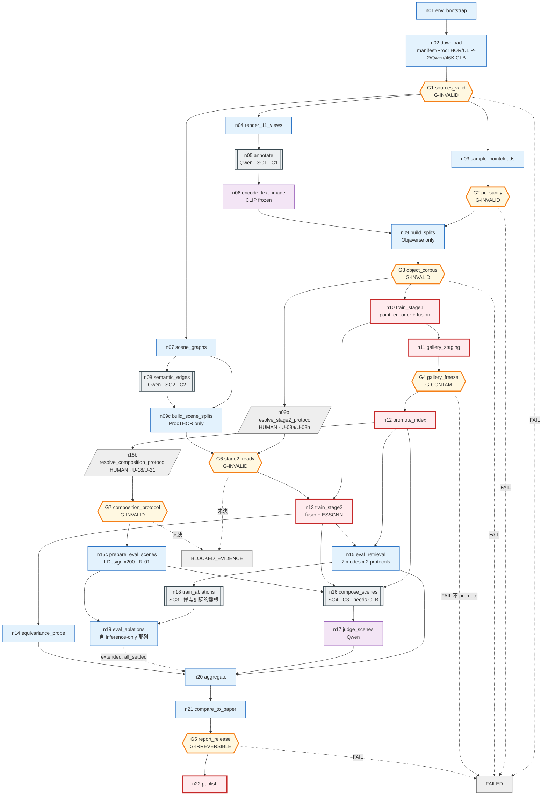

# MetaFind 復現 — Graph Specification

> **2026-08-15 全面改寫。** 先前的草稿有六個會實際改變實驗結果的錯誤，逐條見 §16。
> 每一項都用論文原文核對過，不依記憶。
>
> **三類內容全程分開標示，不得混淆：**
> **[論文]** 原文明確規定 ｜ **[未定]** 論文沒說、我們選了一個並記錄 ｜ **[偏離]** 與論文不同、須在報告聲明
>
> 逐步執行見 [`02_BUILD_STEPS.md`](02_BUILD_STEPS.md)。前置事實見 [`00_FINDINGS.md`](00_FINDINGS.md)。

---

## 1. Graph type classification

**Shapes**：`hierarchical` + `dag`（主線）+ `stateful` + `parallel` + `conditional`，
cycle 僅存在於 subgraph 內。

| 欄位 | 值 | 判定理由 |
|---|---|---|
| `control_authority` | **A1** | 全圖沒有任何決策點由模型決定去向。Qwen 出現三次（資產標註、語意邊、場景評分），三次都只產生 payload 寫進 state；路由一律由 state 上的確定性 predicate 決定 |
| `execution_mode` | **probabilistic** | ≤A1 但節點輸出不可重現：Qwen 取樣、GPU atomics（`scatter_add_`）、訓練隨機性 |
| `topology_class` | **workflow** | 所有 fan-out 的 destination 集合都是靜態列舉（11 視角、7 模態組合、2 gallery 協定、Table 3 的 10 列中 8 個需訓練的變體） |

### 不可重現來源與凍結方式

| 來源 | 凍結方式 |
|---|---|
| Qwen 資產標註 | 寫成 `write_once` 的版本化 artifact，下游只讀這份 |
| Qwen 語意邊 | 同上，另以描述雜湊為 key 快取 |
| Qwen 場景評分 | 貪婪解碼 + 固定 prompt 版本 + 記錄模型 revision |
| GPU atomics | 固定 seed；等變性測試用數值容差 |
| ANN 近似 | **消除** —— 46,052 × 1280 × 4B ≈ 236 MB，用精確內積 |

---

## 2. Goal / Boundary

### Goal

> 在單張 RTX 4090 上復現 MetaFind，產出可與論文 Table 1／2／3 逐格對照的結果，
> 每一格給出「復現 / 未復現 / 證據不足」三者之一。

### Success criteria

| id | 判準 | 量測者 |
|---|---|---|
| SC-1 | Table 1 的 14 個格子全部產出（**兩種 gallery 協定各一組**）；與論文的差距**如實報告，不設門檻**（見 D-2） | `n21` |
| SC-2 | Table 1 的 PC-Only **反向**現象重現：MetaFind 低於 baseline 公佈值 | `n21` |
| SC-3 | Table 2 四維度上 `w/ESSGNN` > `w/o ESSGNN`（**僅方向性**，見偏離 D-2） | `n21` |
| SC-4 | **層內座標等變**：`‖x^{l+1}(Rx+T) − (R·x^{l+1}(x)+T)‖∞ < 1e-4` | `n14` |
| SC-5 | **層內特徵不變**：`h^{l+1}(Rx+T) = h^{l+1}(x)` | `n14` |
| SC-6 | **layout 輸出不變**：`e_layout(Rx+T) = e_layout(x)` | `n14` |
| SC-7 | Table 3 四個 takeaway 方向重現 | `n21` |
| SC-8 | Resume 等價性：中斷重跑產物一致 | L2-RESUME |

> **SC-4/5/6 是先前草稿的錯誤所在。** 先前寫成 `‖ESSGNN(Rx+T) − (R·ESSGNN(x)+T)‖`，
> 但 `e_layout = Pooling({h_i^(L)})` 是從 `h` 來的、是**不變量**，
> 對它做 `R·(...)+T` 沒有幾何意義。必須拆成三個層級分別斷言。

### Boundary

**In scope**：ULIP-2 接入、雙塔 + fusion、ESSGNN、兩階段訓練、
Objaverse-LVIS 與 ProcTHOR 資料管線、Table 1/2/3、SE(3) 驗證、復現報告。

**Out of scope**：
- ULIP-2 本身的預訓練（用官方 checkpoint）
- **6 個 baseline 的重跑** —— 只復現 MetaFind，baseline 引用論文公佈值並註明協定不同
- **人工評分** —— Table 2 人工欄判 `INSUFFICIENT_EVIDENCE`
- I-Design 本身的復現（外部呼叫）

### 偏離清單

| id | 偏離 | 理由 | 影響 |
|---|---|---|---|
| **D-1** | ViT-bigG-14 保持凍結 | 2.5B 參數在 24GB 上無法訓練 | 「entire encoder」在我們的設定下指 3D encoder + fusion |
| **D-2** | Qwen2.5-VL 取代 GPT-4o | 專案決定 | **Table 1 與 Table 2 都受影響** —— Qwen 不只換掉裁判，也換掉 46,052 筆資產標註（文字塔的訓練資料）。所以 SC-1 只報告差距、不設門檻 |
| **D-3** | 不重跑 baseline | 只復現 MetaFind | SC-2 只能與論文公佈值比較 |
| **D-4** | 不做人工評分 | 無標註人力 | Table 2 人工欄 `INSUFFICIENT_EVIDENCE` |

---

## 3. State schema

完整 42 個 state channel 見 [`graph_spec.yaml`](graph_spec.yaml)。關鍵者：

| channel | merge | 為什麼 |
|---|---|---|
| `asset_manifest` | `write_once` | 論文說「約 48,000」，實際 46,052。**一律 `len(manifest)`，不得寫死** |
| `splits` / `split_seed` | `write_once` | **物件級**。洩漏是 G-INVALID，定案後不得改 |
| `scene_splits` | `write_once` | **新增**。ProcTHOR 房屋 split 從 `splits` 拆出來，讓 Stage 1 不再等 ProcTHOR 分支 |
| `composition_protocol` | `replace` | **新增**。U-18／U-21，未決前保持可改 |
| `idesign_scenes` | `write_once` | **新增**。Table 2 的 200 個評估場景（`G_0` + query list），先前根本沒有這條 channel |
| `eval_protocols` | `write_once` | **取代先前的 `gallery_size_locked` 單一整數**，見 §7 |
| `asset_glb` | `upsert_by_key` | **保留不刪** —— Algorithm 1 需要真實幾何 |
| `pointclouds` | `upsert_by_key` | 從 mesh 取樣；`G2_pc_sanity` 檢查結構有效性，U-02 降為診斷 |
| `renders` | `upsert_by_key` | 11 視角 × 46,052 |
| `objaverse_annotations` | `upsert_by_key` | **以 Objaverse uid 為 key**。ProcTHOR 物件屬於另一個命名空間，不得讀這條 |
| `procthor_object_text` | `upsert_by_key` | **新增**。ProcTHOR 場景圖的 `t_i` 與語意邊的輸入，來自 ProcTHOR 自己的 metadata |
| `procthor_dataset` | `write_once` | **新增**。先前 ProcTHOR 根本沒進 graph state，導致 G1 無從檢查它 |
| `stage2_protocol` | `replace` | **新增**。決定本身，未決前保持可改 |
| `stage2_pairing` | `write_once` | **U-08a**。只有在協定 `resolved` 之後才寫入，避免用空值把 channel 鎖死 |
| `sem_edge_cache` | `upsert_by_key` | **key = `sha256(desc_i, desc_j, prompt_ver, llm, encoder_ver)`**，非 category pair |
| `text_image_embeddings` | `upsert_by_key` | CLIP 凍結 → 可快取 |
| `pc_embeddings` | **不存在** | **point encoder 可訓練 → 不可預先快取**，見 §4 |
| `cost_ledger` | `numeric_add` | 唯一的多 writer 數值歸約 |
| `run_progress` | `upsert_by_key` | durable，stdout 只是鏡像 |
| `degraded_flags` | `set_union` | 任何降級都必須對下游可見 |

### 刻意不放進 state

組好的 prompt 字串（可重算）、渲染圖與 mesh 本體（只存 `{uri, sha256, bytes}`）、
SG4 每輪的 scene graph（可由初始圖 + placed_assets 重建）、model client（不可序列化）。

---

## 4. Node registry（摘要）

完整見 [`node_registry.yaml`](node_registry.yaml)。

### Phase 0 — 環境與取得

| id | role | 說明 |
|---|---|---|
| `n01_env_bootstrap` | compute | 修 `torch._six`、stub 兩個 CUDA extension、純 torch FPS、驗 ULIP-2 建模 |
| `n02_download` | retrieve | manifest / **`procthor_dataset`** / ULIP-2 / ViT-bigG-14 / Qwen / **46,052 個 GLB（保留）** |
| **`G1_sources_valid`** | evaluate | **G-INVALID**。manifest 完整、GLB 覆蓋率、checkpoint 行為驗證、**ProcTHOR 三個 split 齊全** |

### Phase 1 — 資料處理

| id | role | 說明 |
|---|---|---|
| `n03_sample_pointclouds` | compute | 從 mesh 取樣 10,000 點 xyz+rgb，複製 ULIP 的 `pc_norm` |
| **`G2_pc_sanity`** | evaluate | **G-INVALID**。形狀／有限／`pc_norm`／非退化／自我可辨識。**與 ULIP 官方點雲的比較降為 L2 診斷** |
| `n04_render_views` | compute | 11 個視角、224px；**投影方式為設定值，預設正交（U-03a，不是論文明文）** |
| `n05_annotate` | model | Qwen2.5-VL → category / dimensions / materials / placement_constraints |
| `n06_encode_text_image` | model | CLIP 凍結 → 可快取；**PC 不在此列** |
| `n07_scene_graphs` | compute | ProcTHOR → 節點（位置 + `t_i`）、物理邊（support 讀自 children 樹）。**`t_i` 來自 ProcTHOR metadata，不是 Objaverse 標註** |
| `n08_semantic_edges` | model | Qwen 對 **ProcTHOR 物件描述**產生關係句 → frozen text encoder → `e_ij` |
| `n09_build_splits` | compute | **物件 80/20，只讀 Objaverse** |
| `n09c_build_scene_splits` | compute | **新增**。房屋 80/20，只讀 ProcTHOR |
| `n09b_resolve_stage2_protocol` | **human** | **決定 U-08a／U-08b** —— 正樣本對應與模態來源。論文沒說，只能由人決定 |
| **`G6_stage2_ready`** | evaluate | **G-INVALID**。協定未決 → `BLOCKED_EVIDENCE`(rc=3)；`scene_splits` 洩漏 → `FAIL`(rc=2) |
| **`G3_object_corpus`** | evaluate | **G-INVALID**。**物件語料**零洩漏、集合完整性、協定已定義 |

### Phase 2 — 訓練

| id | role | 說明 |
|---|---|---|
| `n10_train_stage1` | mutate | **訓練 point encoder + fusion**（Eq.5，單向），30% 模態遮罩 |
| `n11_gallery_index_staging` | mutate | 凍結 gallery 塔，編碼全部 admitted 資產 → staging |
| **`G4_gallery_freeze`** | evaluate | **G-CONTAM**。維度、數量、無 NaN、**目標相似度 == 最大相似度且在 argmax tie set 內** |
| `n12_promote_index` | mutate | late commit，`write_once` |
| `n13_train_stage2` | mutate | 訓練 fuser + ESSGNN，gallery 凍結；Eq.6 殘差、30% scene dropout、Eq.7/8 雙向 |
| `n14_equivariance_probe` | evaluate | SC-4/5/6 三層級 + RA-1/RA-2 |

### Phase 3 — 評估與報告

| id | role | 說明 |
|---|---|---|
| `n15_eval_retrieval` | evaluate | 7 模態組合 × **2 gallery 協定** × 2 變體 |
| `n15b_resolve_composition_protocol` | **human** | **決定 U-18／U-21** —— `G_0` 來源與放置後的圖更新規則 |
| **`G7_composition_protocol`** | evaluate | **G-INVALID**。未決 → `BLOCKED_EVIDENCE`(rc=3)。Table 1 不經過它 |
| `n15c_prepare_eval_scenes` | compute | **新增**。I-Design → 200 個評估場景（R-01 未驗證） |
| `n16_compose_scenes` | subgraph | Algorithm 1，讀 `idesign_scenes`（**不是** ProcTHOR 房屋）+ 真實 GLB 幾何 |
| `n17_judge_scenes` | model | Qwen2.5-VL 四維度評分 |
| `n18_train_ablations` | subgraph | Table 3 中**真的是不同模型**的變體。`w/o iterative retrieval` 不在此列 |
| `n19_eval_ablations` | evaluate | Table 3 指標，**含 inference-only 那列**（Full checkpoint + `composition_mode: parallel`） |
| `n20_aggregate` | compute | 組 Table 1/2/3 |
| `n21_compare_to_paper` | evaluate | 逐格三選一判定 |
| **`G5_report_release`** | evaluate | **G-IRREVERSIBLE** |
| `n22_publish_report` | mutate | 唯一對外動作 |

**5 個 `mutate`**：n10、n11、n12、n13、n22。全部有 idempotency 機制與 rollback，且排在相關 gate 之後。

### Subgraph

| id | 內容 | cycle |
|---|---|---|
| **SG1** `annotate_asset` | Qwen 標註 + schema 驗證 + 修復迴圈 | **C1**（bound 2） |
| **SG2** `semantic_edge` | 快取查詢 → LLM → 驗證 → 編碼 | **C2**（bound 2） |
| **SG3** `train_variant` | 一個變體的訓練（依 `train_scope` 決定訓練範圍） | 無 |
| **SG4** `iterative_composition` | Algorithm 1 | **C3**（bound 25） |

---

## 5. Dependency DAG

```
n01_env_bootstrap → n02_download → G1_sources_valid
                                        │
        ┌───────────── Objaverse 分支 ──┴── ProcTHOR 分支 ─────────────┐
        │                                                              │
  n03_sample_pointclouds → G2_pc_sanity ─┐                  n07_scene_graphs
  n04_render_views → n05_annotate ───────┤                        ↓
                          ↓              │                  n08_semantic_edges
              n06_encode_text_image ─────┤                        ↓
                                         ↓                  n09c_build_scene_splits
                              n09_build_splits                    │
                                         ↓                        │
                              G3_object_corpus                    │
                          ┌──────────────┴───────┐                │
                          ↓                      ↓                │
                 n10_train_stage1    n09b_resolve_stage2_protocol │
                          │                      ↓                │
                          │              G6_stage2_ready ←─────────┘
              ┌───────────┴───────────┐          │
    n11_gallery_staging        n13_train_stage2 ←┘
              ↓                       ↓
      G4_gallery_freeze      n14_equivariance_probe
              ↓                       │
      n12_promote_index               │
              ├───────────────────────┼──────────────┐
              ↓                       │              ↓
    n15_eval_retrieval                │   n15b_resolve_composition_protocol
              │                       │              ↓
              │                       │   G7_composition_protocol
              │                       │              ↓
              │                       │   n15c_prepare_eval_scenes
              │                       ↓              │
              │              n16_compose_scenes ←────┤
              │                       ↓              │
              │              n17_judge_scenes        │
              │                                      │
              └──→ n18_train_ablations → n19_eval_ablations
                                        ↓
                                  n20_aggregate
                                        ↓
                              n21_compare_to_paper
                                        ↓
                               G5_report_release
                                        ↓
                              n22_publish_report
```

**主線零回邊。** Cycle 全在 subgraph 內（C1 標註修復、C2 語意邊修復、C3 Algorithm 1）。

> **先前草稿的 dependency bug（一）**：baseline 節點被排成與資料準備平行。
> 即使保留 baseline，它仍依賴 admitted 資產、前處理、split 與 gallery 協定，
> 只能與 `n10` 平行、不能與 `n03` 平行。本版已移除該節點（D-3）。
>
> **先前草稿的 dependency bug（二）**：`n09_build_splits` 同時讀 Objaverse 與
> ProcTHOR，於是 `n08`（Qwen 對 ProcTHOR 產語意邊）進了 Stage 1 的關鍵路徑。
> §2.6 的 Stage 1 是 Objaverse-LVIS 上的物件級預訓練，**完全不需要 ProcTHOR**，
> 卻會因為 ProcTHOR 分支的任何故障而停擺。兩條分支現在直到 `G6` 才匯流。

---

## 6. Join policy（全部顯式宣告）

| 節點 | group | policy | 理由 |
|---|---|---|---|
| `n09_build_splits` | default | **`all`** | 點雲與 embedding 都要齊，否則算出的 split 是錯的 |
| `n09c_build_scene_splits` | default | **`all`** | 場景圖與語意邊都要齊，理由同上 |
| `SG1/SG2 reduce` | default | **`all_settled`** | 必須知道**誰**失敗 —— gallery 分母改變會使 R@k 失去意義 |
| `G3_object_corpus` | default | **`all`** | gate 需要完整證據 |
| `G6_stage2_ready` | `default {n09b}` | **`all`** | 協定決定 |
| | `corpus {n09c}` | **`all`** | 場景語料 |
| | trigger | `all_groups_satisfied` | 分成兩組，才分得出 `BLOCKED_EVIDENCE` 與 `FAIL` |
| `n16_compose_scenes` | `default` / `protocol` | 各 **`all`** | 協定與 200 個場景是硬前置，不是 SG4 跑到一半才發現缺 |
| `n19_eval_ablations` | `default` | **`all`** | R@1 欄只需要 checkpoint |
| | `protocol {n15c}` | **`all_settled`** | I-Design 不可用時（R-01），R@1 欄照出，場景欄記 `INSUFFICIENT_EVIDENCE` |
| `n15_eval_retrieval` | default | **`all`** | 需要索引 + 兩個變體 |
| `n20_aggregate` | `core {n15, n17}` | **`all`** | Table 1 與 Table 2 的模型評分欄必要 |
| | `extended {n19}` | **`all_settled`** | Table 3 可部分缺，缺了只縮小 claim |
| | trigger | `all_groups_satisfied` | |
| `SG4 s4_fuse` | default | **`all`** | 融合需要 layout 與 query 兩邊 |
| `SG4 s4_encode` | `init` / **`loop_back`** | 各 `any`，`any_group_satisfied` | **E4：回邊自成 group，否則 deadlock** |

---

## 7. Routing rules

全部 A0 / A1，無 >A1 決策點。

| 決策點 | 輸入 | destinations | 預設 |
|---|---|---|---|
| `G1/G2/G3/G4/G5` | 各自判準 | `{下一階段, HALT_FAILED}` | **`HALT_FAILED`**（fail closed） |
| `G6/G7` | 協定 `status` + 語料 | `{下一階段, HALT_BLOCKED}` | **`HALT_BLOCKED`** —— 未決是**等決定**，不是失敗 |
| `SG1 admit_or_repair` | schema 結果、attempt | `{admit, repair, quarantine}` | `quarantine` |
| `SG2 cache_lookup` | `sem_edge_cache.contains(hash)` | `{use_cache, call_llm}` | `call_llm` |
| `SG3 train_scope` | `variant.train_scope` | `{fuser_only, point_encoder+fuser, full}` | `point_encoder+fuser` |
| `SG4 advance` | `placed_count`, `N`, wallclock | `{loop_back, DONE, EXHAUSTED}` | `EXHAUSTED` |
| `SG4 mode` | `variant.composition_mode` | `{iterative, parallel, region}` | `iterative` |

### 評估協定 —— 先前草稿這裡錯了

**[論文 §2.1]** > retrieves the asset from a **pre-encoded asset database** $\mathcal{A}$
**[論文 §3.1]** > 80% training / 20% testing

論文沒說檢索時 gallery 是全部 46,052 還是只有 20% 測試集，差別是隨機命中率 5 倍。

**先前草稿打算「用 baseline PC-Only ≈98–99% 反推分母」—— 那不可能成立。**
PC-Only 的 query embedding 就等於它自己的 gallery 條目，
**無論分母是 46,052 還是 9,210，自我檢索都趨近 100%**，完全無法區分。

**改為兩個協定都跑、都報**：

```yaml
eval_protocols:
  A_test_gallery:  {query: test, gallery: test}    # ~9,210
  B_full_gallery:  {query: test, gallery: full}    # 46,052
```

產出 `R@1_A / R@5_A / R@1_B / R@5_B`。**[未定 U-09]**

---

## 8. Loop / termination

| cycle | progress measure | semantic exit | hard bound | **exhaustion outcome** |
|---|---|---|---|---|
| **C1** 標註修復 | `attempt` | schema 通過 | 2 次 | **quarantine**，帶 `terminated_by: repair_budget`，不得當成標註成功 |
| **C2** 語意邊修復 | `attempt` | 關係句可編碼 | 2 次 | 該邊標 `semantic_edge_missing` 退化為純幾何邊，**不得補零** |
| **C3** Algorithm 1 | `placed_count`（merge=`max`，重試不重複計數） | `placed_count == N` | 25 物件 / 600s | 場景標 `incomplete`，**排除在 Table 2 平均外並另行報告** |

`iteration` lifetime channel 每輪清空：`layout_embedding`、`query_modality_embeds`（SG4）；
`item_attempt`、`annotation_error_feedback`（SG1）。

**全圖終止**：`SUCCESS`（SC 全達成且 G5 PASS）／`FAILED`（gate FAIL 且確認不可恢復）／
`EXHAUSTED`（預算用盡，帶 `terminated_by: budget`）／`BLOCKED`（等外部輸入，**可恢復，非失敗**）。

---

## 9. Failure policy

| 節點 | failure class | policy |
|---|---|---|
| `n01_env_bootstrap` | `DETERMINISTIC_INPUT` | **不重試** —— 版本衝突重試一萬次還是同一個錯 |
| `n02_download` | `TRANSIENT`, `CONTRACT_VIOLATION` | 指數退避 + jitter，5 次；sha256 不符 → fail closed |
| `n03/n04` | `DETERMINISTIC_INPUT`, `RESOURCE` | 壞 mesh 直接 quarantine 不重試；OOM 降 batch 並**記錄** |
| `n05/n08` Qwen | `MODEL_RECOVERABLE`, `TRANSIENT` | schema 錯 → 修復迴圈（錯誤訊息餵回）；限流 → 退避 |
| `n10/n13/n18` 訓練 | `RESOURCE`, `CATASTROPHIC` | OOM 降 batch 並寫 `degraded_flags`（**batch size 直接影響 Eq.5 的 in-batch negatives**）；NaN → fail closed |
| 所有 gate | `CONTRACT_VIOLATION` | fail closed；**缺 record 一律視為未通過** |

### 部分失敗語意（寫死，不臨場決定）

| 情境 | 語意 |
|---|---|
| 46,052 資產中 M 個失敗 | `proceed_with_admitted`；gallery 分母改為 `len(manifest) − M`；`M/len > 2%` → G3 FAIL |
| ablation 某個變體失敗 | `proceed_with_admitted`；該列標 `N/A (reproduction failed)`，縮小 SC-7 |
| SG4 某場景 EXHAUSTED | 排除在平均外並報告 incomplete 率；>10% → **`n16` 失敗並記 `degraded_flags`，Table 2 判 `INSUFFICIENT_EVIDENCE`**（先前寫「G4 FAIL」是錯的 —— G4 是 gallery 凍結，在 `n16` 上游且早已通過，不可能因場景合成而失敗） |

### Rollback

| 節點 | 方式 |
|---|---|
| `n10/n13/n18` 訓練 | `checkpoint_restore`（內容定址路徑，天然不覆蓋） |
| `n11 → n12` 索引 | `quarantine_forward` —— 已 promote 的索引**不刪**，標 `INVALIDATED`；刪掉會讓引用它的紀錄變孤兒 |
| `n22_publish` | `compensating_action`（發勘誤 + 標記 tag）。**已被讀取的內容撤不回**，這是 G5 存在的理由 |

---

## 10. Validation plan

完整見 [`validation_plan.yaml`](validation_plan.yaml)。

### 關鍵 L1

| id | 斷言 |
|---|---|
| L1-MANIFEST | 任何模組都不得出現字面值 `48000`；資產數一律取自 `len(manifest)` |
| L1-EGNN-FX-SCALAR | `f_x` 輸出為純量；改成 ℝ³ 必須被擋（RA-2） |
| L1-EGNN-H0 | `h⁰ = t_i`，不含座標；`Concat(x,t)` 版另行 audit（RA-1） |
| L1-SEMEDGE-KEY | cache key 含兩個**描述**與版本；同類別但不同描述**不得**命中同一筆 |
| L1-MASK-NOTZERO | 缺席模態的融合輸出**必須與 zero-padding 不同**。論文只排除 zero-padding，沒說用什麼取代（U-11）—— learned mask token 是**我們的選擇**，不是斷言 |
| L1-PC-NORM | 複製 ULIP 的 `pc_norm`：質心置中、最大半徑為 1 |
| L1-ITER-RESET | `iteration` channel 每輪清空 |
| L1-EXHAUST-MARK | hard bound 觸發後狀態為 `EXHAUSTED`，被標成成功則測試失敗 |
| L1-GATE-NORECORD | **缺 gate record 必須視為未通過**，不得 pass-by-default |

### 關鍵 L2

| id | 斷言 |
|---|---|
| **L2-PC-SELF-CONSISTENT** | 同一 mesh 兩次獨立取樣的 embedding，須顯著近於「不同資產」的基準線。**不需要外部參考，所以它能當 gate 證據** |
| **L2-PC-ULIP-REF** | **U-02**：與 ULIP 官方點雲比較。**診斷，不擋** |
| **L2-EQUIVAR-COORD** | 層內座標等變（SC-4） |
| **L2-EQUIVAR-FEAT** | 層內特徵不變（SC-5） |
| **L2-EQUIVAR-LAYOUT** | `e_layout` 不變（SC-6） |
| L2-LEAK-OBJECT | `train_ids ∩ test_ids = ∅`，**G3 引用** |
| L2-LEAK-SCENE | `train_houses ∩ test_houses = ∅`，**G6 引用**。分支拆開後兩者由不同 gate 守，合成一條會讓房屋洩漏無人擋 |
| L2-RESUME | 中途 `kill -9` 重跑：**前處理產物**逐位元組相同且外部呼叫次數不增加；**訓練**改為 optimizer／RNG 狀態續跑（NS-4／NS-5 已聲明不宣稱精確重現） |
| L2-COMPLETE | `admitted + quarantined == len(manifest)`，無重複、無非預期成員 |
| L2-GALLERY-SELF | 抽 1000 筆自我檢索，**目標相似度 == 最大相似度且目標在 argmax tie set 內**（`recall@1 = 1.0` 不是 tie-safe） |
| L2-DUAL-PROTOCOL | 兩種 gallery 協定各自產出完整的 R@1/R@5，且分母正確 |

**每條檢查都有負向注入**，`verified_blocks` 預設 `false`，
**只有實際觀察到注入導致失敗後才可改為 `true`**。

---

## 11. Promotion gates（7 個）

| gate | class | 判準 | on_fail |
|---|---|---|---|
| **G1_sources_valid** | G-INVALID | manifest 完整；GLB 覆蓋率 ≥98%；ULIP-2 checkpoint 行為驗證通過（非僅 sha256）；**`procthor_dataset` 三個 split 齊全** | 停，補下載 |
| **G2_pc_sanity** | G-INVALID | 每朵雲 `(10000, 6)`、有限、`pc_norm` 後質心≈0 半徑≈1、非退化；且自取樣雲能在 1,000 資產的探針集中檢索回自己 | 停，修取樣器。**不得放寬門檻** |
| **G3_object_corpus** | G-INVALID | **物件語料**零洩漏；集合完整性等式；兩個評估協定已定義；quarantine 率 ≤2% | 停，修資料管線 |
| **G6_stage2_ready** | G-INVALID | `stage2_protocol.status == resolved`（U-08a／U-08b）**且** `scene_splits` 房屋不重疊 | 未決 → `BLOCKED_EVIDENCE`；洩漏 → `FAIL` |
| **G4_gallery_freeze** | G-CONTAM | 索引維度／數量正確、無 NaN、**目標相似度 == 最大相似度且在 argmax tie set 內** | **不 promote**，staging 作廢重建 |
| **G7_composition_protocol** | G-INVALID | `composition_protocol.status == resolved`（U-18／U-21）：`G_0` 來源、query list 來源、放置規則、新節點的 `t_i`／物理邊／語意邊 | 未決 → `BLOCKED_EVIDENCE`。Table 1 不受影響 |
| **G5_report_release** | G-IRREVERSIBLE | 每格有明確判定；gate record 齊全且 `is_terminal`；RA-1/2/3 紀錄齊全；D-1~D-4 已在報告聲明；**`risks_unknowns` 逐項有處置（逐項列舉，不得用區間）** | 停，補齊 |

**G2 為什麼縮小判準。** 舊判準要求自取樣點雲必須與 **ULIP 官方釋出的點雲**一致，
否則整條線停掉。那在檢驗一個論文從未主張的命題 —— MetaFind 沒說它沿用 ULIP 預取樣的點雲，
而且 §2.6 的 Stage 1 會 fine-tune point encoder，encoder 本來就能適應我們的取樣。
「和官方雲不一樣」推不出「復現無效」。這項比較仍有價值，降為 `L2-PC-ULIP-REF` 診斷。
**它不是因為過不了才被降級 —— 它從來沒跑過**，參考點雲也不在磁碟上；它是因為測錯命題才被降級。
若日後找到作者明確說 MetaFind 沿用 ULIP 的前處理，它就變回 gate。

**Exit code**：`0` PASS｜`2` FAIL｜`3` BLOCKED_EVIDENCE｜`4` INVALIDATED｜`1` 保留給「檢查腳本自己壞了」

### Required Audit（必跑、必留紀錄、**永不阻斷**）

| id | 判準 | 界定哪個 claim | 失敗時 |
|---|---|---|---|
| **RA-1** | `h⁰ = Concat(x,t)` 版本的等變性 | 「我們復現了 §2.5 的字面寫法」 | **預期失敗**。四條獨立證據：Appendix C 的前提、**Eq.(2) 自己的型別**（`f_h → ℝ^d` 但 `Concat ∈ ℝ^{d+3}`，殘差加不起來）、Introduction 說「separating spatial and semantic channels」、官方 EGNN 把 `h` 與 `coord` 分開兩個參數 |
| **RA-2** | `f_x → ℝ³` 版本的等變性 | 同上 | **預期失敗** —— 證明要求 `φ_x` 為純量才能提出 `Q` |
| **RA-3** | `train_scope=full`（含 CLIP）的可行性 | 「我們驗證了論文關於訓練範圍的結論」 | 單卡不可行 → claim 縮小為「3D encoder + fusion 範圍內」 |
| **RA-4** | **全域縮放**下 `e_layout` 的變化量 | 「ESSGNN 解決 §2.5 所述的 scaling 敏感」 | **預期失敗** —— §2.5／§3.4 宣稱處理 translation **與 scaling**，但論文證的是 SE(3)，**不含縮放**；`x → s·x` 時 `‖x_i−x_j‖² → s²‖x_i−x_j‖²`，每條訊息都變。claim 縮小為「僅 translation／rotation」 |

---

## 12. Observability

| Layer | 措施 |
|---|---|
| **O1 Structural** | build 時檢查無孤立/不可達節點、主線無 cycle、**每個 fan-in 的 join policy 已顯式宣告**、回邊自成 group |
| **O2 Execution** | 逐節點 start/end/duration/attempt/rc/failure_class → `run_progress`（**durable**） |
| **O3 State diff** | 每步改動的 channel；大 artifact 只記 sha256 |
| **O4 Decision log** | 每個 gate 的 `observed`；SG1 逐資產 admit/quarantine 理由；**SG4 每步的 top-5 候選、分數、`λ·‖e_layout‖`** |
| **O5 Cost** | 逐節點 GPU 秒 / wallclock / Qwen token / 外部呼叫 |

**B1**：進度真相是原子寫入的 checkpoint，stdout 只是鏡像；stdout 失效不得讓工作失敗。
**B2**：46,052 資產與 12,000 房屋逐項 sidecar（含來源 sha256、seed、失敗原因）。

---

## 13. Diagram



**兩條分支從 G1 之後就分開，直到 Stage 2 才匯流。** Objaverse 分支
（`n03`/`n04`/`n05`/`n06` → `n09` → `G3` → `n10`）餵 Stage 1；ProcTHOR 分支
（`n07` → `n08` → `n09c`）餵 Stage 2。先前 `n09` 同時讀兩邊，等於把
**Qwen 對 ProcTHOR 產語意邊**放進了 Stage 1 的關鍵路徑 —— 而 §2.6 的 Stage 1
是 Objaverse-LVIS 上的物件級預訓練，完全不需要 ProcTHOR。

---

## 14. Execution order

| Layer | 節點 | Gate | 估時 |
|---|---|---|---|
| 1 | `n01` | | 2–4 h |
| 2 | `n02`（46K GLB 為主導） | | **1–2 天** |
| 3 | | **G1** | — |
| 4 | `n03` ∥ `n04` ∥ `n07` | | 1–3 h |
| 5 | | **G2** | — |
| 6 | `n05` ∥ `n08`（Qwen 推論） | | 1–2 天 |
| 7 | `n06` | | 2–4 h |
| 8 | `n09` ∥ **`n09c`** | | <1 h |
| 9 | | **G3** | — |
| 10 | `n10_train_stage1` | | **數小時–1 天**（比先前的草稿久，因為要訓 point encoder） |
| 10b | `n09b`（人決定） | **G6** | 未決則 Stage 2 停在這裡 |
| 11 | `n11` ∥ `n13` | | 3–8 h |
| 12 | | **G4** | — |
| 13 | `n12` ∥ `n14` | | <1 h |
| 13b | `n15b`（人決定） | **G7** | 未決則 Table 2 停在這裡 |
| 13c | `n15c`（I-Design ×200） | | 1–3 h，**R-01 未驗證** |
| 14 | `n15` ∥ `n16` | | 6–17 h |
| 15 | `n17` | | 2–4 h |
| 16 | `n18` | | 6–12 h |
| 17 | `n19` | | 3–8 h |
| 18 | `n20` | | <1 h |
| 19 | `n21` | | <1 h |
| 20 | | **G5** | — |
| 21 | `n22` | | <1 h |

**關鍵路徑**：Layer 2（GLB 下載）與 Layer 6（Qwen 標註 46,052 資產）。

> **先前的草稿把 `n20` 與 `n21` 排在同一層平行執行**，但 dependency 明寫
> `n21 depends_on n20` —— 不可能平行。`tools/check_graph.py` 現在會用
> execution order 對照 dependency DAG，這類錯誤不再靠讀。

---

## 15. Risks / Unknowns

> 這張表是 **UNKNOWN 登記表**，`G5_report_release` 逐項檢查是否都有處置。
> **不得用區間表示**（先前寫成 `U-01..U-10`，於是 U-11 之後全部可以漏掉而 G5 照樣過）。
> 機器可讀版本在 `graph_spec.yaml` 的 `risks_unknowns`，兩者由 `tools/check_graph.py` 對齊。

| id | 標記 | 內容 | 如何解除 |
|---|---|---|---|
| **U-01** | UNKNOWN | 資產數：論文「約 48,000」vs manifest 46,052 | 用 `len(manifest)`，報告記錄 sha256 |
| **U-02** | UNKNOWN | 自行取樣點雲與 ULIP 官方點雲是否一致 | **降為 L2-PC-ULIP-REF 診斷**（見 §11 G2） |
| **U-03** | UNKNOWN | 11 視角的相機擺位 | 預設 Fibonacci，記錄選擇 |
| **U-03a** | UNKNOWN | 11 視角用正交投影還是透視投影。論文只寫 "orthogonal viewpoints"，而 ℝ³ 裡不存在 11 個互相正交的方向 | 兩種都保留，記錄選擇 |
| **U-04** | UNKNOWN | 渲染解析度 | 224px 對齊 ULIP-2 慣例 |
| **U-05** | UNKNOWN | adjacency 判準 | 預設 kNN k=8，參數記入產物 |
| **U-06** | UNKNOWN | 語意邊要對哪些物件對；`e_ij` 的寬度 | 選一個並記錄；列入報告未定項 |
| **U-07** | UNKNOWN | ProcTHOR 官方 split vs 論文 80/20 | 主線用論文 80/20，兩者都記錄 |
| **U-08** | UNKNOWN | **Stage 2 訓練樣本如何建構** | 論文完全未定義；明列我們採用的協定 |
| **U-08a** | **UNKNOWN・阻斷** | **Stage 2 的正樣本是哪一個 gallery 條目**。實測 ProcTHOR assetId 與 Objaverse uid **交集為 0**（995 vs 46,052） | `n09b` 決定，`G6` 強制 |
| **U-08b** | **UNKNOWN・阻斷** | ProcTHOR 目標物件的 text / image / point cloud 從哪來 | 同上，Eq.6 的三個模態沒有來源 |
| **U-09** | UNKNOWN | Table 1 的 gallery 範圍**以及 query 範圍**。§3.1 只寫 80/20，從未說 query 就是那 20% | gallery 兩個協定都跑；query=test **列為假設** |
| **U-10** | UNKNOWN | Table 2 的 Scene Coherence 對應 IDesign 哪個面向 | 記錄對應假設 |
| **U-11** | UNKNOWN | 缺席模態怎麼表示。論文只排除 zero-padding | 記錄我們的選擇 |
| **U-12** | UNKNOWN | ProcTHOR metadata 怎麼變成 `t_i` 的句子 | 記錄我們的做法 |
| **U-13** | UNKNOWN | **Full model 用哪一種 fusion**。論文給了**兩份不同的候選清單** —— §2.2 三種（mean pooling / MLP / Transformer）、§2.4 五種（多了 masked MLP 與 gated）—— 都沒說是哪個。Table 3 排除 Mean(9.4) 與 MLPs(9.9)；`Padding with 0`(10.5) 與 §3.4「Masked modality fusion outperformed zero-padding」顯示 Full 會遮罩 → 剩 masked MLP / gated / Transformer | 主線 `masked_mlp`（程式現行預設），另兩種可選並列為對照 |
| **U-14** | UNKNOWN | **11 張渲染圖怎麼變成一個 `e_image`**。§2.3 只說 render 11 views | 記錄選擇；影響 Table 1 七個條件中的四個 |
| **U-15** | UNKNOWN | **結構化標註怎麼序列化成 text encoder 的輸入字串**。§2.3 只給欄位，沒給格式 | 釘住模板，加 golden-string 測試 |
| **U-16** | UNKNOWN | **query / gallery 兩塔是否共享權重**。§2.4 說 "a dedicated query encoder"、§2.6 說兩者都訓練，但沒說共享關係 | 記錄選擇 |
| **U-17** | UNKNOWN | **`d_ij` 還是 `d_ij²`**。§2.5 寫 `d_ij = ‖x_i − x_j‖₂`，Appendix C (10)–(12) 用 `‖·‖²`，原始 EGNN 也是平方 | 實作用平方（`essgnn.py` 的 `radial`）；兩者都 SE(3) 不變，不破壞證明，記錄為選擇 |
| **U-18** | **UNKNOWN・阻斷** | **Algorithm 1 第 7 行「放進場景、更新圖」到底產生什麼**。下一輪就要 `ESSGNN(G)`，需要新節點的 `t_i`、位置、朝向、尺度、物理邊、語意邊 —— 全部未定義 | `n15b` 決定，`G7` 強制 |
| **U-19** | UNKNOWN | **邊的方向性**。§2.3 只說有 physical / semantic 兩種邊，沒說有向或無向，也沒說 relation(A,B) 是否等於 relation(B,A) | 記錄慣例；`L1-SCENE-SUPPORT` 的雙向是**我們的**慣例 |
| **U-20** | UNKNOWN | **`t_i` 由哪個 encoder 產生**。§2.5 只寫 `t_i ∈ ℝ^d`。「frozen text encoder (e.g. CLIP or BERT)」講的是**語意邊**，不是 `t_i`，也沒說兩者同一個 | 記錄選擇與 `d` |
| **U-21** | **UNKNOWN・阻斷** | **Algorithm 1 的 `G_0` 與 `{Q_1..Q_N}` 從哪來**。§3.3 說 200 個場景來自 I-Design，但 graph 原本沒有這條 channel，`n16` 讀的是 ProcTHOR 房屋 | `n15b` → `G7` → `n15c` |
| **U-22** | UNKNOWN | **訓練超參數論文一個都沒給** | 見下方「未公佈的訓練超參數」表 |
| **U-23** | UNKNOWN | 三個模態同時被遮罩時代表什麼。§2.6 是**獨立** 30%，所以 2.7% 的 query 完全沒有資訊，Eq.5 仍要它去對上 gallery 條目 | 實作照字面（`allow_empty=True`），另有旗標可強制至少留一個模態 |
| **U-24** | UNKNOWN | `sim(·,·)` 的定義。Eq.5 與 Eq.7a/7b 都只寫 `sim`，從未定義 | 用 cosine（CLIP／ULIP 慣例），記錄為選擇 |
| **U-25** | UNKNOWN | **「adaptive freezing strategies」**。§2.2 說 Stage 2「with adaptive freezing strategies」，但 §2.6 給的是**固定**凍結。什麼東西是 adaptive、隨什麼變，全文沒有 | 實作 §2.6 的固定凍結，並記錄 §2.2 的 adaptive 因未定義而未實作 |
| **U-26** | UNKNOWN | **`f_h` 與 `f_x` 是否共用一條訊息**。§2.5 是兩個獨立 MLP 吃同樣的輸入；Appendix C (10)(13)(14) 是先算一條 `m_ij = φ_e(...)`，再由 `φ_h`／`φ_x` 各自吃它。**這是不同的參數化，不只是輸入不同**，原始 EGNN 走 Appendix C 那種 | 實作依 §2.5（兩個獨立 MLP），記錄為選擇 |
| **R-01** | RISK | **I-Design 尚未驗證能否執行** | Table 2/3 全靠它，**查它很便宜，應盡早做** |
| **R-02** | RISK | 單卡 24GB 限制訓練範圍 | D-1 已聲明 |
| **R-03** | RISK | Qwen 標註品質未知 | pilot 後人工抽查 |

### 未公佈的訓練超參數（U-22）

論文**一個數字都沒給**。以下每一項都是我們的選擇，報告中必須如此陳述 ——
否則最後對不上時，無法分辨是模型沒復現，還是 recipe 不同。

| 項目 | 論文 | 我們 |
|---|---|---|
| optimizer / learning rate / scheduler / weight decay | 未提 | 待定，記錄實際值 |
| batch size | 未提 | 受 24GB 限制；**直接影響 Eq.5 的 in-batch negatives**，必須報告 |
| epochs / gradient accumulation | 未提 | 待定 |
| `τ`（Eq.5、Eq.7a/7b）初值與是否可學 | 只說 "a temperature hyperparameter" | 待定 |
| `λ`（Eq.6）初值 | 只說 learnable scalar | 待定 |
| ESSGNN 層數 `L` | 只寫 "After $L$ layers" | 超參數，不是論文真值 |
| ESSGNN hidden 寬度、pooling 種類 | 未提 | 同上 |
| embedding 寬度 | **全文無任何維度數字** | 由 checkpoint 推導 |

---

## 16. 修正紀錄

| # | 先前的草稿 | 現在 | 嚴重度 |
|---|---|---|---|
| 1 | Stage 1 凍結 backbone、只訓 head 當**主線** | 主線訓 point encoder + fusion；凍結版降為 Table 3 的 `fuser_only` ablation | 🔴 **跑錯實驗** |
| 2 | `gallery_size_locked` 單一整數，用 PC-Only 反推 | 雙協定並行；PC-Only **無法**反推分母 | 🔴 |
| 3 | `e_layout` 寫成等變、可加 `R·(...)+T` | 拆成層內座標等變 / 層內特徵不變 / `e_layout` 不變三個斷言 | 🔴 **數學錯誤** |
| 4 | 語意邊 cache key = category pair | key = 兩個 object **description** 的 hash | 🔴 |
| 5 | baseline 與資料準備平行 | 移除 baseline 節點（D-3）；即使保留也只能與 `n10` 平行 | 🔴 **dependency 錯** |
| 6 | Stage 2 訓練樣本建構**完全未提** | U-08，並明列採用的協定 | 🔴 **最大缺口** |
| 7 | 強制 train/test 房屋不共用 asset | 移除 —— 論文沒這要求，且會改變 ProcTHOR 分布 | 🟠 |
| 8 | 渲染後**刪除 GLB** | 保留 —— Algorithm 1 需要真實幾何 | 🟠 |
| 9 | GPT-4o 可 fallback 成 ULIP captions（且為預設） | 移除 fallback；真要用整份標 `DEGRADED` | 🟠 |
| 10 | 多處寫死 `48000` | `len(manifest)`，並加 L1 測試禁止字面值 | 🟠 |
| 11 | `1280/128/64` 當論文真值並設 L1 | **論文全文無任何維度數字**；改為 checkpoint 推導值與超參數 | 🟠 |
| 12 | 語意邊強制投影到 64 維 | 論文無此層，預設不投影；投影保留為可量測的對照 | 🟠 |

### 2026-08-15 第二輪（外部審查後）

| # | 問題 | 現在 | 嚴重度 |
|---|---|---|---|
| 13 | `00_FINDINGS` 的 D1/D2 還是舊的凍結+全快取設計，而 README 叫人先讀它、稱它「硬事實」 | D1/D2 重寫；文件頂端加上**權威順序**，並註明 D 系列是決策、會改變 | 🔴 **會讓 agent 寫回舊版** |
| 14 | `n07`/`n08` 讀 `annotations`（Objaverse 標註），但 `n07` 不是它的 writer，且 ProcTHOR assetId 與 Objaverse uid **交集為 0** | 拆成 `objaverse_annotations` 與 `procthor_object_text` 兩條 channel | 🔴 **provenance 與概念雙重錯誤** |
| 15 | Stage 2 的**正樣本身分沒有閉合** —— 目標是 ProcTHOR 物件、gallery 是 Objaverse，沒有對應關係；`n13` 的 reads 甚至湊不出 Eq.6 的輸入 | 新增 `stage2_pairing` channel、U-08a／U-08b 標為**阻斷級**、補齊 `n13` 的 reads | 🔴 **Stage 2 建不起來** |
| 16 | `learned mask token` 被寫成論文要求 | 論文只排除 zero-padding → U-11，斷言改成「必須與 zero-padding 不同」 | 🔴 |
| 17 | 「orthogonal = 正交投影」標成已解決 | 降為 U-03a，兩種投影都保留 | 🟠 |
| 18 | 「size dimensions 只能是類別先驗」當成論文性質 | 那是**我們**加了 unit-sphere 正規化的後果，改成描述本實作 | 🟠 |
| 19 | 「正規化座標會破壞等變性」 | 數學上不對。改成：**為忠實保留論文的 unnormalized 設定**而不做置中 | 🟠 |
| 20 | SC-1 用 ±3pp 當門檻 | Qwen 也換掉了 46,052 筆標註（文字塔的訓練資料），Table 1 同樣受影響 → 改為如實報告差距 | 🟠 |
| 21 | `00_FINDINGS` 寫「以論文的 L=4」 | 論文只寫 "After $L$ layers"，沒給值 | 🟠 |

### 2026-08-15 第三輪（外部審查後）

| # | 問題 | 現在 | 嚴重度 |
|---|---|---|---|
| 22 | **ProcTHOR 沒有進 graph state** —— G1 的判準文字說要檢查 ProcTHOR，但它的 `reads` 裡沒有任何 ProcTHOR channel。Objaverse 齊全、ProcTHOR 完全不存在時 G1 會 **PASS** | 新增 `procthor_dataset` channel，接上 `n02 → G1 → n07 → n09c` | 🔴 **假 gate** |
| 23 | `stage2_pairing` 由 `n09` 以 `write_once` 寫入，但 U-08a 還沒答案 —— 寫空值會把 channel 永遠鎖死 | 拆成可改的 `stage2_protocol` 與定案後的 `stage2_pairing`；移到 `n09b` + `G6` | 🔴 **自我鎖死** |

### 2026-08-15 第四輪（外部審查後，逐項重讀論文）

前三輪處理的是「寫錯」與「內部不一致」；這一輪處理的是
**「論文其實沒說、但我們已經默默選了」** —— 這類問題不會讓任何檢查變紅。

| # | 問題 | 現在 | 嚴重度 |
|---|---|---|---|
| 24 | **Full model 用哪一種 fusion 從未登記** —— §2.4 列五種、沒說是哪個，而程式已預設 `masked_mlp` | 新增 **U-13**，附 Table 3 能排除到什麼程度（剩 masked MLP / gated / Transformer） | 🔴 **改變 Table 1 全部** |
| 25 | **11 張渲染圖怎麼變成一個 `e_image` 完全沒定義**，但 state schema 已直接假設 `image: 1280-d` | 新增 **U-14** 與 `L1-IMAGE-AGGREGATION`（訓練與評估必須用同一規則） | 🔴 **改變 Table 1 四欄** |
| 26 | **結構化標註怎麼序列化成字串沒定義** | 新增 **U-15** 與 `L1-TEXT-SERIALIZATION`（golden-string） | 🔴 **改變 Table 1 四欄** |
| 27 | 標註 schema 的「四欄必填 / 封閉詞彙表 / 公尺」被寫成論文要求，但原文是 "attributes **such as**" | 改標為**實作契約**，保留規定但不再宣稱是論文要求 | 🟠 |
| 28 | **query / gallery 兩塔是否共享權重沒鎖** | 新增 **U-16** | 🔴 |
| 29 | **`d_ij` vs `d_ij²`**：§2.5 寫 `‖·‖₂`，Appendix C (10)–(12) 用 `‖·‖²` | 新增 **U-17**。**不設 RA** —— 兩者都不變、都不破壞證明，但數值不同 | 🟠 |
| 30 | **Table 2 的資料流從未閉合** —— §3.3 說 200 個場景來自 I-Design，`n16` 卻讀 ProcTHOR 房屋（房屋是完成的佈局，不是生成請求），graph 裡沒有 I-Design 的 channel | 新增 `composition_protocol` / `idesign_scenes` channel、`n15b`（human）、**`G7`**、`n15c` | 🔴 **Table 2 建不起來** |
| 31 | **Algorithm 1 第 7 行「放進場景、更新圖」沒有定義**，但下一輪立刻要 `ESSGNN(G)`，需要新節點的 `t_i`／位置／朝向／尺度／物理邊／語意邊 | 新增 **U-18**（阻斷），由 `G7` 擋 | 🔴 |
| 32 | U-09 只涵蓋 gallery 範圍，但 §3.1 也沒說 **query 就是那 20%** | U-09 擴大涵蓋 query set，`query=test` 明列為假設 | 🟠 |
| 33 | `n18_train_ablations` 宣稱訓練「八個變體」，但 `w/o iterative retrieval` 是**推論期**策略（§2.7），不是另一個模型 | `variant_registry` 新增 `requires_training` / `reuses_ckpt`；由 `n19` 直接評估；`L1-ABLATION-INFERENCE-ONLY` 釘住 | 🔴 **會比較到兩個不同的 checkpoint** |
| 34 | `n18` 只讀四條 channel，但 `n13` 做同一件事要十一條 —— 這份 dependency contract **不可能被滿足** | 補齊 reads | 🔴 |
| 35 | §2.6 的「Only the query-side fuser and the ESSGNN module are updated」只驗了 gallery 側；**query 的 PointBERT 在 Stage 1 被訓練過，進 Stage 2 時 `requires_grad` 本來就是 True** | 新增 `L1-STAGE2-QUERY-ENCODERS-FROZEN` | 🔴 |
| 36 | `00_FINDINGS` 有**自己的一套 `U-01`…`U-05`／`U-06`／`U-15`**，與 §15 登記表**同編號不同意義**；還保留已知錯誤的「用 PC-Only 反推分母」與已不存在的 `G2_corpus_validity` | 整節標為 `SUPERSEDED` 並刪除編號；`tools/check_graph.py` 現在檢查沒有任何文件引用登記表以外的 `U-nn` | 🔴 **搜尋關鍵字會撈到相反的答案** |
| 37 | §11 仍寫「5 個 gate」，mermaid 與執行順序表都沒有 `n09b`／`G6` —— 同一份文件自相矛盾 | 全部同步；`check_graph.py` 檢查 gate 數與 gate 名稱的一致性 | 🟠 |
| 38 | `02_BUILD_STEPS` 把「GLB 不刪」編成 D-1、把 ViT-bigG 凍結編成 D-3，與 README／`graph_spec.yaml` **錯位** | 統一為 D-1…D-4；「保留 GLB」與「不 fallback caption」**不是偏離**，移出清單 | 🟠 **deviation traceability** |
| 39 | `execution_order` 把 `n20` 與 `n21` 排在同一層平行，但 dependency 明寫 `n21 depends_on n20` | 拆層；`check_graph.py` 用 dependency DAG 對照 execution order | 🟠 |
| 40 | **Stage 1 被 ProcTHOR 不必要地阻塞** —— `n09` 同時讀兩邊，於是 Qwen 對 ProcTHOR 產語意邊進了 Stage 1 的關鍵路徑，而 §2.6 的 Stage 1 完全不需要 ProcTHOR | 拆成 `n09`（Objaverse）與 `n09c`（ProcTHOR）；`G3` 縮成 `G3_object_corpus`；場景語料併入 `G6_stage2_ready` | 🟠 **不必要的耦合** |
| 41 | `G5` 的判準寫成 `U-01..U-10` —— **區間**表示法讓 U-11 之後可以漏掉而 G5 照樣過 | 改為逐項列舉 `risks_unknowns` | 🟠 |
| 42 | `G2` 把「與 ULIP 官方點雲一致」當成 **G-INVALID**，但論文從未說 MetaFind 沿用 ULIP 的點雲，而 Stage 1 會 fine-tune point encoder | 縮為 `G2_pc_sanity`（結構有效性）；ULIP 比較降為 `L2-PC-ULIP-REF` 診斷。**它從來沒跑過，不是因為過不了才降級** | 🟠 |
| 43 | `recall@1 == 1.0` 不是 tie-safe —— 兩個相同 embedding 會讓 argmax 回傳另一個 id | 改為「目標相似度 == 最大相似度，且目標在 argmax tie set 內」 | 🟠 |
| 44 | SC-8 要求中斷重跑產物 **byte-identical**，但 NS-4／NS-5 已聲明 GPU atomics 與訓練隨機性不可移除、不宣稱精確重現 | byte-identical 只適用**前處理產物**；訓練改為 optimizer／RNG 狀態續跑 | 🟠 **自相矛盾** |
| 45 | **邊的方向性從未登記**，但 `L1-SCENE-SUPPORT` 已斷言「雙向 support 邊」 | 新增 **U-19**；測試保留但改標為我們的慣例 | 🟠 |
| 46 | **`t_i` 由哪個 encoder 產生沒鎖** —— 論文那句 "frozen text encoder (e.g. CLIP or BERT)" 講的是**語意邊**，不是 `t_i` | 新增 **U-20** | 🟠 |
| 47 | **訓練超參數論文一個都沒給**，但只有零星記在各處 | 新增 **U-22** 與 §15 的超參數表 | 🟠 **對不上時分不出原因** |
| 48 | 文件之間的數字（channel／node／edge／L1／L2／gate）靠人工同步 | 新增 [`tools/check_graph.py`](../../tools/check_graph.py)，含 gate 判準與 `reads` 的一致性、UNKNOWN 編號跨文件唯一性、execution order 對照 dependency | — |

### 2026-08-15 第五輪（不用腳本，逐字重讀論文與六份文件）

前四輪都靠結構檢查找問題。這一輪**關掉腳本、逐行讀**，
找到的兩類東西是腳本**原理上抓不到**的：論文自己的內容，以及被 YAML 靜默吞掉的字。

#### 我上一輪只修了三分之二

| # | 問題 | 現在 | 嚴重度 |
|---|---|---|---|
| 49 | **Stage 1 與 ProcTHOR 的解耦沒做完。** 第四輪改了 edges、也改了 `n09` 的 `reads`，但 `dependencies.dag` 裡的 `n09_build_splits depends_on [..., n08_semantic_edges]` **原封不動** —— 機器可讀的相依性仍然說 Stage 1 要等 Qwen 對 ProcTHOR 產語意邊。三處寫法，只改了兩處 | 移除；新增 **dependency DAG 必須與 edge list 一致**的檢查 | 🔴 **宣稱修好但沒修好** |
| 50 | `L2-PC-ULIP-REF` 有**兩個 `note:` 鍵**。YAML 靜默保留最後一個，整段降級理由**在解析時就被丟掉**了 —— 所有讀「解析後文件」的檢查都看不到。同一條目的 `cited_by_gate` 還指向已不存在的 `G2_pc_distribution`，而條目本身寫著「已從 gate 降級」 | 合併；新增**重複鍵偵測** | 🔴 **檢查器原理上看不到** |
| 51 | `learned mask token` 被當成論文要求 —— 第二輪宣稱修掉了，但 `01_GRAPH_SPEC` 的 L1 摘要與 `node_registry` 的 `n10` postcondition **各留了一份** | 兩處都改成「必須與 zero-padding 不同」（U-11） | 🔴 |

#### 逐字讀論文才看得到的

| # | 發現 | 處理 |
|---|---|---|
| 52 | **§2.2 與 §2.4 給了兩份不同的 fusion 候選清單** —— §2.2 三種、§2.4 五種 | 併入 U-13 |
| 53 | **Eq.(2) 自己的型別就否定了 `h⁰ = Concat(x,t)`**：`f_h → ℝ^d` 而殘差要求 `h^l ∈ ℝ^d`，但 `Concat ∈ ℝ^{d+3}` —— **第 0 層加不起來**。不必談等變性 | 併入 RA-1，成為第三條獨立證據 |
| 54 | **Introduction 說 ESSGNN 靠「separating spatial and semantic channels」** —— 與 `Concat` 相反 | 併入 RA-1，第四條證據 |
| 55 | **§2.5／§3.4 宣稱解決 GAT 對 translation 與 *scaling* 的敏感，但 SE(3) 不含縮放**，架構上也做不到（`x→s·x` 時 `‖x_i−x_j‖²→s²‖·‖²`）。解法只覆蓋了它自己陳述的動機的一半 | **新增 RA-4**（預期失敗） |
| 56 | **§2.2 的「adaptive freezing strategies」全文從未定義**，而 §2.6 給的是固定凍結 | 新增 **U-25** |
| 57 | **Appendix C 的架構與 §2.5 不同**：Appendix C 先算一條共用訊息 `m_ij = φ_e(...)` 再分給 `φ_h`／`φ_x`；§2.5 是兩個獨立 MLP。**這是不同的參數化，不只是輸入不同** | 新增 **U-26** |
| 58 | **§3.1 說場景級檢索在 ProcTHOR-10K 上做，§3.3 說在 I-Design 管線上做 200 個場景。** 第四輪我把後者當成事實寫死 —— **那是過度修正**，兩種讀法都還開著 | U-21 改為並列兩種讀法 |
| 59 | **§2.1 的 `q_img` 是複數 "images"** —— 多視角聚合問題在 query 端同樣存在 | 併入 U-14 |
| 60 | **Table 1 與 Table 3 同一格對不上**：Table 3 Full = 11.4 vs Table 1 w/ESSGNN text = 11.3；Table 3 w/o Layout = 13.5 vs Table 1 w/o ESSGNN text = 13.8。兩張表不是同一次跑的 | 記入 U-09 與 SC-7 的比較說明 |
| 61 | **Abstract 說 ESSGNN 捕捉 "object appearance features"，§2.5 說 `t_i` 是 text-derived** | 併入 U-20 |

#### 其餘同步問題

| # | 問題 | 現在 |
|---|---|---|
| 62 | `00_FINDINGS` 用 `R-01` 指磁碟風險，登記表的 `R-01` 是 I-Design —— **與 U-id 同一類的編號衝突**，上一輪只清了 U | 清除，並在文件頂端聲明本文件不使用 `R-nn` |
| 63 | `00_FINDINGS` 寫「baseline 的 PC-Only 灌水要刻意重現 → RA-2」。**RA-2 是 `f_x→ℝ³`**（張冠李戴），而且 D-3 根本不重跑 baseline | 改為 SC-2：重現的是**方向**，不是對方的灌水 |
| 64 | `00_FINDINGS` 的「graph 形狀」表有三格已被後續決策推翻（等變性當 G-INVALID、人工評分是最貴尾巴、含不可逆刪檔） | 逐格標註推翻與理由 |
| 65 | `01_GRAPH_SPEC` 的 L2 摘要有三條 stale（`L2-PC-DISTRIBUTION`、byte-identical resume、`recall@1 = 1.0`）；routing 表沒有 G6／G7 且預設寫成 HALT | 全部同步；G6／G7 預設為 `HALT_BLOCKED` |
| 66 | 「SG4 某場景 EXHAUSTED >10% → **G4 FAIL**」—— G4 是 gallery 凍結，在 `n16` 上游且早已通過，**不可能因場景合成而失敗** | 改為 `n16` 失敗 + `degraded_flags` + Table 2 判 `INSUFFICIENT_EVIDENCE` |
| 67 | `L1-SPLIT-NO-ASSET-DISJOINTNESS` 斷言的是**房屋**，卻還指向 `n09_build_splits`；`L2-LEAK` 把物件與房屋洩漏合成一條、只引用 G3 | 前者改指 `n09c`；後者拆成 `L2-LEAK-OBJECT`(G3) 與 `L2-LEAK-SCENE`(G6)，否則房屋洩漏無人擋 |
| 68 | `e18` 宣告 carries `scene_graphs`／`sem_edge_cache`，但來源 `n10` 不寫這兩條 | 修正為只 carry `stage1_ckpt` |
| 69 | `02_BUILD_STEPS` 的 U-19／U-20 被插進 cache key 的「其一／其二」與結論之間，論證被切斷；`§15` 與未定項總表各有一個孤兒表頭 | 重排；刪除孤兒表頭 |
| 70 | `00_FINDINGS` 多處引用已刪除的檔案（`fetch_procthor.py`、`render.py`）、已改名的節點（`n02_acquire_sources`）、不存在的節點（`n03_preflight_budget`）與斷掉的交叉引用（「見 §三」）；儲存表用 48K；`F9` 排在 `F13` 之後 | 全部修正，`F9` 改編號為 `F14` |
