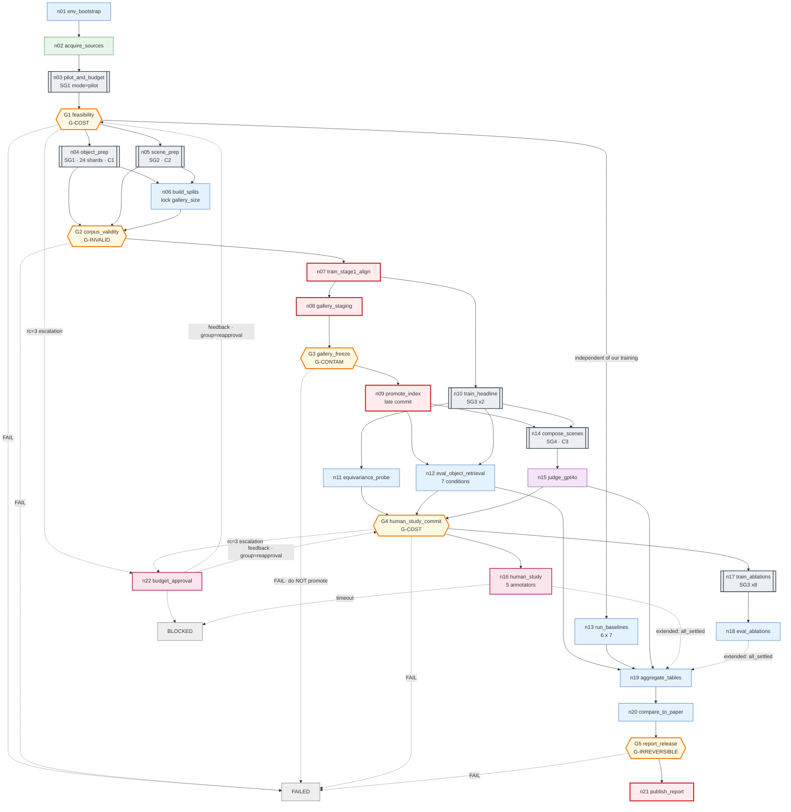

# MetaFind 復現 — Graph Specification

> 依 `graph-engineering` skill §5 的 15 步流程產出，對應 §15 的 15 項必要產出。
> 前置事實見 [`00_FINDINGS.md`](00_FINDINGS.md)。結構化檔案見
> [`graph_spec.yaml`](graph_spec.yaml) / [`node_registry.yaml`](node_registry.yaml) / [`validation_plan.yaml`](validation_plan.yaml)。
> 逐步執行順序見 [`02_BUILD_STEPS.md`](02_BUILD_STEPS.md)。

---

## 1. Graph type classification

**Shapes**：`hierarchical` + `dag`（主線）+ `stateful` + `parallel` + `conditional`
＋ **cyclic（僅在 subgraph 內）**

主線是 DAG，**沒有任何回邊**。三個 cycle 全部封在 subgraph 裡：
GPT-4o 標註修復迴圈（SG1）、語意邊修復迴圈（SG2）、Algorithm 1 迭代組合迴圈（SG4）。
第四個 cycle 是預算重審（human → gate），屬 escalation。

### §4.2 三欄 operational taxonomy

| 欄位 | 值 | 判定理由 |
|---|---|---|
| `control_authority` | **A1**（全圖最高） | 全圖**沒有任何一個決策點由模型決定去向**。GPT-4o 出現三次（資產標註、語意邊生成、場景評分），但三次都只是**產生 payload 寫進 state**，路由一律由 state 上的確定性 predicate 決定（schema 是否通過、分數是否達標、i < N）。這正是 terminology.md 說的「用了 LLM ≠ agentic；agentic 講的是控制權」。 |
| `execution_mode` | **probabilistic** | ≤A1 但**節點輸出不可重現**：GPT-4o 取樣、5 位人工標註者的主觀評分、`scatter_add_` 的 GPU atomics（F9）、ANN 近似檢索。故不符 `deterministic` 的第二個條件。 |
| `topology_class` | **workflow** | 全圖 ≤ A2、無 A4 自主 loop、所有 fan-out 的 destination 集合都是**靜態列舉**（7 種模態組合、6 個 baseline、10 個 ablation 變體、11 個視角）。連 48K 資產的 fan-out 都是對既有清單的 map，不是模型動態切分 → 不是 A3。 |

**三欄同調**，這在本任務是合理的：復現一篇論文的核心要求就是可審核、可重跑，
任何把控制權交給模型的設計都會直接傷害這個目標。

### `execution_mode = probabilistic` 的工程後果

不可重現的來源必須被「凍結成產物」，否則下游沒有一個數字站得住：

| 不確定性來源 | 凍結方式 |
|---|---|
| GPT-4o 資產標註 | 標註結果寫成 **`write_once` 的版本化 artifact**，之後所有訓練/評估只讀這份，不重新呼叫 |
| GPT-4o 語意邊 | 同上，另以 `(category_a, category_b)` 為 key 快取 |
| GPT-4o 場景評分 | `temperature=0` + 固定 prompt 版本 + 記錄 model snapshot id；分數落 state |
| 人工評分 | 逐 annotator 逐場景落檔，保留原始評分不做平均後丟棄 |
| GPU atomics | 固定 seed + 記錄 `torch.use_deterministic_algorithms` 狀態；等變性測試用**數值容差**而非 exact |
| ANN 近似 | **48K × 1280 用精確內積即可（~250MB，完全可行）→ 直接禁用 ANN**，消除這個來源 |

---

## 2. Goal / Boundary

### Goal

> 在單張 RTX 4090 上，從零建置 MetaFind，並產出可與論文 Table 1 / 2 / 3 逐格對照的復現結果；
> 對每一格明確給出「復現成功 / 復現失敗 / 證據不足」三種判定之一。

**Consumers**：復現報告讀者、後續要改進 MetaFind 的人、審稿人。

### Success criteria（可測量）

| id | 判準 | 由誰量測 | 容差 |
|---|---|---|---|
| SC-1 | Table 1 的 14 個 MetaFind 格子全部產出，且 R@1 落在論文值 ±3.0 絕對百分點內 | `n20_compare_to_paper` | ±3.0 pp |
| SC-2 | Table 1 的**相對排序**成立：MetaFind 在 T/I/T+I/T+PC/I+PC/T+I+PC 六欄勝過所有 baseline | `n20` | 嚴格不等式 |
| SC-3 | Table 1 的 PC-Only **反向**現象重現：MetaFind (63–75) **低於** baseline (98–99) | `n20` | 方向正確即可 |
| SC-4 | Table 2 四個維度上 `w/ ESSGNN` > `w/o ESSGNN`，GPT-4o 與人工兩欄皆然 | `n20` | 方向 + 差距 ≥0.3 |
| SC-5 | **SE(3) 等變性成立**：隨機 (R,T) 下 `‖ESSGNN(Rx+T) − (R·ESSGNN(x)+T)‖∞ < 1e-4`（座標通道）且 `h` 完全不變 | `n11_equivariance_probe` | 1e-4 |
| SC-6 | Table 3 的四個 key takeaway 方向重現（ESSGNN>GAT、iterative>non-iterative、dropout 30% 最佳、masked>zero-pad） | `n20` | 方向正確 |
| SC-7 | **Resume 等價性**：任一階段中斷後重跑，最終產物與不中斷一致 | L2-RESUME | 見 §10 |
| SC-8 | 總花費不超過 G1 核准的預算上限 | `cost_ledger` | 硬上限 |

> SC-3 值得特別說明：論文的 PC-Only 是「MetaFind 比 baseline 差」。
> 一個天真的成功判準會把這格當成失敗。**復現的目標是重現論文的行為，包含它的退化。**
> 這也是 RA-2 存在的理由。

### Boundary

**In scope**：ULIP-2 backbone 接入、雙塔 + fusion、ESSGNN、兩階段訓練、
Objaverse-LVIS 與 ProcTHOR 資料管線、Table 1/2/3 三張表、SE(3) 等變性驗證、復現報告。

**Out of scope**：
- ULIP-2 本身的預訓練（用官方 checkpoint，見 D1）
- I-Design 場景生成器的復現（當成外部黑箱呼叫；若不可得則走 R-05 的降級方案）
- 論文 §4 Future Work（RL、open-world 動態目錄）
- 任何超越論文的改進

**External systems**

| 系統 | 類型 | Owner | 失敗語意 | 信任 |
|---|---|---|---|---|
| HuggingFace `SFXX/ulip` | 資料/權重來源 | Salesforce | 取不到 → 整個復現 `FAILED`，無替代 | trusted（驗 sha256） |
| Objaverse / Objaverse-LVIS | 資料集 | AI2 | 部分資產取不到 → `admitted_set` 縮小，須重算分母 | trusted |
| ProcTHOR-10K | 資料集 | AI2 | 取不到 → Table 2/3 全部 `BLOCKED_EVIDENCE` | trusted |
| OpenAI GPT-4o | 模型 API | OpenAI | 限流→重試；schema 錯→修復迴圈；漲價→ `BLOCKED` 等重新核准 | **untrusted 輸出**，一律過 schema 驗證 |
| 5 位人工標註者 | 人 | 我方 | 逾時→`BLOCKED`（**不是 FAILED**）；<4 人完成→Table 2 人工欄 `BLOCKED_EVIDENCE` | trusted |
| I-Design pipeline | 外部程式 | 第三方 | 不可得 → 走降級佈局器並標 `degraded` | untrusted |

**Trust boundary**：GPT-4o 與 I-Design 的輸出在進入 state 前必須通過 schema 驗證，
違反者走 `DETERMINISTIC_INPUT` → quarantine，不得直接寫入共用產物。

---

## 3. State schema

完整 45 個 channel 見 [`graph_spec.yaml`](graph_spec.yaml)。此處列出**設計上最關鍵的十個**。

| channel | type | writers | merge | lifetime | 為什麼這樣設計 |
|---|---|---|---|---|---|
| `gallery_size_locked` | int | n06 | **`write_once`** | persistent | U-04 是唯一「猜錯就整張 Table 1 失去意義」的未知。鎖成 write_once，二次寫不同值直接 error |
| `splits` / `split_seed` | dict / int | n06 | **`write_once`** | persistent | 洩漏是 G-INVALID。split 一旦定案不得改，否則所有數字失去可比性 |
| `asset_embeddings` | map[id→{uri,sha256}] | SG1 的 N 個平行 worker | **`upsert_by_key`** | persistent | 多 writer 必須非 `replace`（S4）。key = asset_id，天然可交換 |
| `asset_admitted` | set[id] | SG1 reduce | **`set_union`** | persistent | 決定 gallery 分母。與 `asset_quarantine` 的聯集必須 == 輸入全集（L2 完整性等式） |
| `asset_quarantine` | list[record] | SG1 workers | **`append`** | persistent | F3/B2：每筆記 exception type + message + asset_id + sha256 + 時間 + code_rev。沒有它，48K 裡少了 300 個永遠查不出為什麼 |
| `sem_edge_cache` | map[(cat_a,cat_b)→{sentence,emb_uri}] | SG2 workers | **`upsert_by_key`** | **persistent（跨 run）** | 成本槓桿：無快取 ~1.9M 次 LLM 呼叫，有快取 ~50K 次，**約 40×** |
| `layout_embedding` | tensor[1280] | SG4 `s4b` | `replace` | **`iteration`** | **`reset_on: loop_entry`**。忘了清 = 上一個物件的 layout 污染這一輪（anti-pattern #22） |
| `placed_count` | int | SG4 `s4e` | **`max`** | run | cycle 的 progress measure。用 `max` 而非 `numeric_add`，重試時不會重複計數 |
| `cost_ledger` | dict[str→float] | **幾乎所有節點** | **`numeric_add`** | persistent | O5。唯一的多 writer 數值歸約 channel；可交換可結合 |
| `run_progress` | map[stage→record] | 所有節點 | `upsert_by_key` | **persistent** | **B1：canonical progress 必須 durable。** stdout 只是鏡像；SSH 斷線不得讓 worker 失敗 |

### 刻意**不**放進 state 的東西（S1/S2/S7）

| 不放 | 理由 |
|---|---|
| 組好的 GPT-4o prompt 字串 | 可從 `annotation_prompt_version` + canonical 資料重算（S2）。存了就改模板要改 schema |
| 渲染出來的 11 張圖本體 | 大 blob。state 只存 `{uri, sha256, bytes, content_type}`（S7）；檔案本身落在 `./data/artifacts/renders/` |
| SG4 每輪的 scene graph `G` | 可由 `initial_scene_graph` + `placed_assets`(append) 重建（S1(b)）。存了會讓 checkpoint 爆掉 |
| model client / CUDA stream | 不可序列化（S9），走 runtime context |

---

## 4. Node registry（摘要）

完整 27 個節點見 [`node_registry.yaml`](node_registry.yaml)。

### 主圖節點

| id | role | 切分理由(§7) | 說明 |
|---|---|---|---|
| `n01_env_bootstrap` | compute | N1, N4 | 修 `torch._six`、鎖依賴、驗 ULIP-2 ckpt 載入 + EGNN forward shape（F4） |
| `n02_acquire_sources` | retrieve | N1, N3 | HF ckpt、Objaverse-LVIS 清單、ProcTHOR-10K；逐檔驗 sha256 |
| `n03_pilot_and_budget` | subgraph(SG1, mode=pilot) | **N8 複用** | 500 資產試跑 → 實測單價、schema 通過率、磁碟增速 → 外推全量 |
| **`G1_feasibility`** | evaluate | N5 | **G-COST**。磁碟 headroom、預算、GPU-h 三項全過才准往下 |
| `n04_object_prep` | subgraph(SG1, mode=full) | N2, N3, N7 | 48K shard 串流；D3 |
| `n05_scene_prep` | subgraph(SG2) | N1, N7 | ProcTHOR → scene graph；與 n04 **平行**（假設 A-02） |
| `n06_build_splits` | compute | N5 | 物件 80/20、房屋級 80/20、鎖 `gallery_size_locked` |
| **`G2_corpus_validity`** | evaluate | N5 | **G-INVALID**。零洩漏、admitted 集合等式、gallery 大小已鎖 |
| `n07_train_stage1_align` | **mutate** | N3, N6 | 雙塔對齊（Eq.5）+ 30% modality masking。**在快取 embedding 上訓練**（D2） |
| `n08_build_gallery_staging` | **mutate** | N6 | 寫 **staging** 索引，不直接寫正式位置 |
| **`G3_gallery_freeze`** | evaluate | N5 | **G-CONTAM**。gallery 索引是所有下游共用的不可變產物 |
| `n09_promote_gallery_index` | **mutate** | N6 | **late commit**：驗證通過才 promote，`write_once` |
| `n10_train_headline` | subgraph(SG3 ×2) | N7, N8 | `w/ ESSGNN`、`w/o ESSGNN` 兩個 headline 變體 |
| `n11_equivariance_probe` | evaluate | N4, N5 | **SC-5**。SE(3) 等變性數值驗證 |
| `n12_eval_object_retrieval` | evaluate | N4, N7 | 7 模態條件 × 2 變體 → Table 1 |
| `n13_run_baselines` | evaluate | N1, N7 | 6 baseline × 7 條件。**與 n07 平行**（不依賴我們的訓練） |
| `n14_compose_scenes` | subgraph(SG4) | N7, N8 | Algorithm 1 |
| `n15_judge_gpt4o` | model | N1, N6 | 四維度評分 |
| **`G4_human_study_commit`** | evaluate | N5 | **G-COST**。承諾 5 人 × 200 場景（~67 人時）前的最後關卡 |
| `n16_human_study` | **human** | N5 | 5 位標註者；`BLOCKED` 非 `FAILED` |
| `n17_train_ablations` | subgraph(SG3 ×8) | N7 | Table 3 的 8 個額外變體 |
| `n18_eval_ablations` | evaluate | N4 | Table 3 指標 |
| `n19_aggregate_tables` | compute | N4 | 組 Table 1/2/3 |
| `n20_compare_to_paper` | evaluate | N4, N5 | 逐格判定 復現/失敗/證據不足 |
| **`G5_report_release`** | evaluate | N5 | **G-IRREVERSIBLE** |
| `n21_publish_report` | **mutate** | N6 | 唯一的對外發布動作 |
| `n22_budget_approval` | **human** | N5 | G1/G4 的 `rc=3` escalation 目的地 |

**5 個 `mutate` 節點**（n07, n08, n09, n21，加上 SG1 內的刪檔節點），全部：
- 有 idempotency 機制（內容定址路徑 + read-before-write）
- 有 rollback 策略
- **排在所有相關 gate 之後**

### Subgraph

| id | 內容 | cycle | state contract |
|---|---|---|---|
| **SG1** `object_prep_stream` | 驗 mesh → 取樣點雲 ∥ 渲染 11 視角 → GPT-4o 標註 → 驗 schema → 編碼 1280-d → 寫向量+sidecar → **刪原始檔** | **C1** 標註修復（bound 2） | 讀 `asset_catalog`；寫 `asset_embeddings/admitted/quarantine`。內部 gate **不**阻斷 parent（單一資產失敗只縮小 admitted 集合） |
| **SG2** `scene_graph_prep` | 解析房屋 → 物理邊(幾何規則) ∥ 語意邊(LLM+快取) → 編碼邊文字 → 組圖 | **C2** 語意邊修復（bound 2） | 讀 `procthor_raw`；寫 `scene_store/sem_edge_cache/scene_admitted` |
| **SG3** `train_variant` | (可選)重訓 Stage-1 head → 訓 Stage-2 fuser+ESSGNN → 寫變體 ckpt | 無 | 讀 `variant_registry[i]` + 快取 embedding；寫 `variant_ckpts/variant_status`。**A1 分支**：`requires_stage1_retrain` |
| **SG4** `iterative_composition` | Algorithm 1：ESSGNN(G) ∥ 編碼查詢 → 融合檢索 → 放置 → 更新 G → 下一個 | **C3** 主迴圈（bound 25） | 讀 `gallery_index` + `variant_ckpts`；寫 `composed_scenes/retrieval_trace` |

---

## 5. Edge registry（關鍵部分）

完整見 [`graph_spec.yaml`](graph_spec.yaml) 的 `edges:`。此處只列**需要解釋的**。

| edge | kind | guard | join_group | 說明 |
|---|---|---|---|---|
| `G1 → n13_run_baselines` | data | `G1.verdict == PASS` | default | **baseline 不依賴我們的訓練**。把它從關鍵路徑移開是 §14 優化的一項 |
| `n07 → n10` | data | — | default | Stage-2 需要 frozen gallery encoder，**不需要** gallery 索引 → n10 與 n08 可平行 |
| `G4 → n16` / `G4 → n17` | data | `PASS` | default | 昂貴尾巴 |
| `G4 → n22_budget_approval` | **escalation** | `rc == 3` | — | 證據不足（例如成本外推缺失）→ 找人，不是判 FAIL |
| `n22 → G4` | **feedback** | — | **`reapproval`** | **E4：回邊自成 join_group**。否則 G4 會等一條永遠不會再來的 `n03→G4` 初始邊而 deadlock |
| `SG4: s4f → s4b` | **feedback** | `i < N` | **`loop_back`** | 同上。初始邊 `s4a→s4b` 在 `init` 群 |
| `SG1: s1e → s1d` | **feedback** | `MODEL_RECOVERABLE ∧ attempt<2` | **`repair`** | 把 schema 錯誤寫進 state 再讓模型看到 |
| `G1/G2/G3/G5 → HALT` | **error** | `verdict == FAIL` | — | **E9：失敗路徑要畫在圖上** |
| `n04 → quarantine_report` | **error** | — | — | 同上 |

### Join policy（**全部顯式宣告，不繼承任何 runtime 預設**，J1）

| 節點 | group | policy | 為什麼是這個 |
|---|---|---|---|
| `n06_build_splits` | default `{n04, n05}` | **`all`** | 兩邊目錄都要齊才能算出一致的 split。少一邊算出來的 split 是錯的 |
| `G2` | default `{n04, n05, n06}` | **`all`** | gate 需要完整證據 |
| `SG1 reduce` | default `{N 個 worker}` | **`all_settled`** | **必須知道誰失敗**。48K 裡失敗 300 個 → gallery 分母從 48000 變 47700，R@1 的意義就變了。用 `all` 會被單一壞 mesh 卡死；用 `any` 會丟失完整性 |
| `SG2 reduce` | default | **`all_settled`** | 同上 |
| `n12` | default `{n09, n10}` | **`all`** | 需要索引 + 兩個變體 |
| `n13_run_baselines` | default `{6 baselines}` | **`all_settled`** | Table 1 本來就有 `–`（SCA3D/Uni3DL 不支援 image）。**預期的缺格**要能表達 |
| `SG4 s4d` | default `{s4b, s4c}` | **`all`** | 融合需要 layout 與 query 兩邊 |
| `SG4 s4b` | `init {s4a}` / **`loop_back {s4f}`** | 各 `any`，trigger `any_group_satisfied` | E4 |
| **`n19_aggregate_tables`** | **`core {n12,n13,n15}`** | **`all`** | Table 1 與 Table 2 的 GPT-4o 欄是**必要**的 |
| | **`extended {n16,n18}`** | **`all_settled`** | 人工欄與 Table 3 **可以部分缺**，缺了只縮小 claim |
| | trigger | **`all_groups_satisfied`** | |
| `G4` | `default {n11,n12,n15}` / **`reapproval {n22}`** | `all` / `any`，trigger `any_group_satisfied` | |

> `n19` 的雙 group 設計是本圖最值得注意的一處：
> 它用 §4.6 允許的「一個節點多個 join_group、各組政策不同」，
> 精確表達了「核心結果不得缺、延伸結果可以缺」這個真實需求。
> 若統一用 `all`，一個標註者請假就會擋掉整份報告；
> 若統一用 `all_settled`，Table 1 缺格也會被默默放行。

---

## 6. Dependency DAG

```
n01_env_bootstrap
  └→ n02_acquire_sources
       └→ n03_pilot_and_budget
            └→ G1_feasibility ────────────────────────┬→ n13_run_baselines ─────────────┐
                 ├→ n04_object_prep ──┐                │  (不依賴我方訓練，可全程平行)      │
                 └→ n05_scene_prep ───┴→ n06_build_splits                                │
                                            └→ G2_corpus_validity                        │
                                                 └→ n07_train_stage1_align               │
                                                      ├→ n08_gallery_staging             │
                                                      │    └→ G3_gallery_freeze          │
                                                      │         └→ n09_promote_index ─┐  │
                                                      └→ n10_train_headline ──────────┤  │
                                                           ├→ n11_equivariance_probe   │  │
                                                           └───────────────────────────┤  │
                                                                 ├→ n12_eval_retrieval ┤  │
                                                                 └→ n14_compose_scenes │  │
                                                                      └→ n15_judge     │  │
                                                                           └→ G4_human_study_commit
                                                                                ├→ n16_human_study (BLOCKED)
                                                                                └→ n17_train_ablations
                                                                                     └→ n18_eval_ablations
                                                                                          └→ n19_aggregate ←┘
                                                                                               └→ n20_compare_to_paper
                                                                                                    └→ G5_report_release
                                                                                                         └→ n21_publish_report
```

**Feedback edges（另列，主線仍為 DAG）**

| id | from → to | 所在 | join_group |
|---|---|---|---|
| `fb_budget` | `n22_budget_approval → G1 / G4` | 主圖（escalation 回程） | `reapproval` |
| `fb_annot` | `s1e → s1d` | SG1 | `repair` |
| `fb_semedge` | `s2e → s2d` | SG2 | `repair` |
| `fb_compose` | `s4f → {s4b, s4c}` | SG4 | `loop_back` |

---

## 7. Routing rules

**全圖 12 個決策點，全部 A0 或 A1。沒有任何一個 >A1，因此沒有任何升級理由需要書寫。**

| 決策點 | authority | owner | 輸入 | destinations | 預設分支 |
|---|---|---|---|---|---|
| `G1_feasibility` | A1 | edge | `disk_free`, `cost_projection`, `gpu_hours_est`, `budget_cap` | `{n04+n05, n22, HALT}` | `HALT` |
| `n03` 標註路線選擇 | **A1** | edge | `pilot_cost_per_asset`, `budget_cap`, `pilot_schema_pass_rate` | `{gpt4o_annotate, reuse_ulip2_captions}` | `reuse_ulip2_captions`（便宜的那邊當預設） |
| `G2_corpus_validity` | A1 | edge | `leakage_count`, `admitted_size`, `gallery_size_locked`, `schema_pass_rate` | `{n07, HALT}` | `HALT` |
| `G3_gallery_freeze` | A1 | edge | `index_dim`, `index_count`, `norm_stats`, `probe_recall` | `{n09, HALT}` | `HALT` |
| `G4_human_study_commit` | A1 | edge | `equivariance_max_err`, `table1_deltas`, `scene_complete_rate`, `annotator_staffing` | `{n16+n17, n22, HALT}` | `HALT` |
| `G5_report_release` | A1 | edge | `table_completeness`, `gate_records`, `audit_records` | `{n21, HALT}` | `HALT` |
| `SG1 s1f` 收錄判定 | A1 | edge | `schema_valid`, `attempt`, `failure_class` | `{admit, repair, quarantine}` | `quarantine` |
| `SG1` shard 背壓 | A1 | edge | `disk_free`, `shard_bytes` | `{proceed, shrink_shard, pause_BLOCKED}` | `pause_BLOCKED` |
| `SG2 s2d` 快取 | A1 | edge | `cache_hit(cat_a,cat_b)` | `{use_cache, call_llm}` | `call_llm` |
| `SG3` 是否重訓 Stage-1 | A1 | edge | `variant.requires_stage1_retrain` | `{full, stage2_only}` | `stage2_only` |
| `SG4 s4f` 迴圈控制 | A1 | edge | `placed_count`, `N`, `wallclock`, `retrieval_calls` | `{loop_back, DONE, EXHAUSTED}` | `EXHAUSTED` |
| `SG4` 組合模式 | A1 | edge | `variant.composition_mode` | `{iterative, parallel, region}` | `iterative` |

**每個決策點都有預設分支**（Conditional Branch pattern 的必要宣告）。
注意四個 gate 的預設分支都是 `HALT` —— **fail closed**。

### 靜態 fan-out 的 cardinality（全部封閉，無 A3）

| fan-out | 數量 | 來源 |
|---|---|---|
| 資產 shard | `ceil(48000/2000) = 24` | `asset_catalog` 長度，確定 |
| 每資產視角 | `11` | 論文 §2.3 |
| 模態條件 | `7` | 論文 Table 1 欄位 |
| Baselines | `6` | 論文 §3.1 |
| Headline 變體 | `2` | Table 1 最後兩列 |
| Ablation 變體 | `8` | Table 3 扣掉 2 個可複用的 |
| 標註者 | `5` | 論文 §3.3 |
| 評估場景 | `200`（Table 2）/ `50`（Table 3, U-02） | 論文 §3.3 |

**上限與超限處置**：資產 fan-out 宣告 `cardinality_bound: 60000`，
超出（例如清單被換成別的資料集）→ `truncate_and_record`，並讓 G2 判 `FAIL`。

---

## 8. Loop / termination rules

### 四個 cycle，四件套逐一確認

| cycle | progress measure | semantic exit | hard bound | **exhaustion outcome** |
|---|---|---|---|---|
| **C1** SG1 標註修復 | `attempt`（單調遞增，落 `item_attempt`） | schema 驗證通過 | `attempt ≤ 2` | → **quarantine**，寫 `terminated_by: repair_budget` + 完整 exception。**不得當成標註成功** |
| **C2** SG2 語意邊修復 | `attempt` | 關係句非空且可編碼 | `attempt ≤ 2` | → 該邊標 `semantic_edge_missing`，退化成純幾何邊，並寫 `degraded_flags`。**不得靜默補零** |
| **C3** SG4 迭代組合 | **`placed_count`**（merge=`max`，單調） | `placed_count == N` | `N ≤ 25` ∧ `wallclock ≤ 600s` ∧ `retrieval_calls ≤ 30` | → 場景標 `incomplete: true` 進 `composition_incomplete`，**該場景排除在 Table 2 平均之外並另行報告**。這是 L3 規則「EXHAUSTED 不是成功」的直接落實 |
| **C4** 預算重審 | `approval_round` | 人核准或明確否決 | `approval_round ≤ 2` | → 全圖 `BLOCKED`（**不是 FAILED**），保留 checkpoint 等人 |

### `iteration` lifetime channel 的清空規則（L5）

| channel | 所在 | `reset_on` |
|---|---|---|
| `layout_embedding` | SG4 | `loop_entry` —— 每輪重算，禁止沿用上一物件的 layout |
| `query_modality_embeds` | SG4 | `loop_entry` |
| `item_attempt` | SG1 | `item_entry` |
| `annotation_error_feedback` | SG1 | `item_entry` —— 上一個資產的錯誤訊息絕不能餵給下一個資產 |

### 巢狀 loop 預算（L7，相乘估算）

```
最壞情況（Table 2 主評估）：
  4 種方法 × 200 場景 × 25 物件 × (1 次 ESSGNN + 1 次精確檢索)
    = 20,000 次迭代 ≈ 20,000 次 ESSGNN forward + 20,000 次 48K×1280 內積

  單次內積：48000 × 1280 × 4B = 246 MB，4090 上 ~3ms
  單次 ESSGNN forward（~20 節點小圖）：~2ms
  → 20,000 × 5ms ≈ 100 s（純計算）
  → 加上 I-Design 佈局呼叫（外部，估 1–3 s/物件）→ 主導項，約 6–17 小時

Table 3（U-02 假設 50 場景）：
  8 變體 × 50 場景 × 25 物件 = 10,000 次迭代 → 約 3–8 小時

SG1 最壞：24 shard × 2000 資產 × 3 次標註嘗試 = 144,000 次 API 呼叫上限
  → 但 `cost_ledger` 的硬上限會在遠早於此觸發 BLOCKED
```

**成本上界**已寫進 `graph_spec.yaml: nested_loop_budget`，並由 G1 核准。

### 全圖終止狀態（L6）

| 狀態 | 條件 |
|---|---|
| `SUCCESS` | SC-1…SC-8 全部達成，且 G5 判 `PASS`，報告已發布 |
| `FAILED` | 任一 gate 判 `FAIL` 且經診斷確認不可恢復（例如 ULIP-2 權重取不到、等變性在正確實作下仍不成立） |
| `EXHAUSTED` | `cost_ledger` 觸及 G1 核准上限而核心表格未完成 → 帶 `terminated_by: budget` |
| `BLOCKED` | 等預算重審、等標註者、等磁碟空間、等 I-Design 授權。**可恢復，不重跑已完成階段** |

---

## 9. Failure policy

### 逐節點 failure class → policy（摘要，完整見 `node_registry.yaml`）

| 節點 | failure classes | policy |
|---|---|---|
| `n01_env_bootstrap` | `DETERMINISTIC_INPUT`, `RESOURCE` | **不重試**。版本衝突重試一萬次還是同一個錯（anti-pattern #8）。直接 `fail_closed` 並印出衝突矩陣 |
| `n02_acquire_sources` | `TRANSIENT`, `DETERMINISTIC_INPUT` | 網路錯 → 指數退避 + jitter，5 次；sha256 不符 → **`CONTRACT_VIOLATION` fail closed**（絕不接受來源不明的權重） |
| `SG1 s1b` 渲染 | `TRANSIENT`, `DETERMINISTIC_INPUT`, `RESOURCE` | GPU 佔用 → 退避重試 3 次；壞 mesh（非流形、空幾何）→ **直接 quarantine 不重試**；磁碟滿 → 縮 shard 並記錄，**不得靜默降級** |
| `SG1 s1d` GPT-4o 標註 | `TRANSIENT`, `MODEL_RECOVERABLE`, `RESOURCE` | 429 → 退避重試 4 次；schema 錯 → **C1 修復迴圈**（錯誤訊息進 state 再生成），bound 2；配額耗盡 → `BLOCKED` |
| `SG1 s1g` **刪原始檔** | `CONTRACT_VIOLATION` | **只有在該 shard 的 embedding 與 sidecar 都已 fsync 且 sha256 已驗證後才執行**。這是 D3 唯一的不可逆動作，late commit |
| `n07 / n10 / n17` 訓練 | `TRANSIENT`, `RESOURCE`, `CATASTROPHIC` | OOM → 降 batch 並**記錄降級**（影響對比學習品質，必須對下游可見）；NaN loss → `fail_closed` 保留現場 |
| `n15_judge_gpt4o` | `TRANSIENT`, `MODEL_RECOVERABLE` | 同 s1d；分數超出 1–5 範圍 → schema 錯，修復 |
| `n16_human_study` | `HUMAN_RECOVERABLE` | 逾時 → 提醒 → `BLOCKED`；<4 人完成 → Table 2 人工欄判 `BLOCKED_EVIDENCE`（rc=3），**不是 FAIL** |
| 所有 gate | `CONTRACT_VIOLATION` | **fail closed**。缺 record 一律視為未通過（GD） |

### 部分失敗語意（F4，寫死不得臨場決定）

| 情境 | 語意 |
|---|---|
| 48K 資產中 M 個失敗 | `proceed_with_admitted`。gallery 分母改為 `48000 − M` 並**寫進 `gallery_size_locked`**；若 `M/48000 > 2%` → G2 判 `FAIL`（分母偏移過大，Table 1 失去可比性） |
| 10K 房屋中 K 個失敗 | `proceed_with_admitted`，`K/10000 > 5%` → G2 `FAIL` |
| 6 個 baseline 中有的跑不起來 | `proceed_with_admitted` + 該格標 `–`，並在報告中明列原因。**不得留白讓讀者以為是論文原本的 `–`** |
| 8 個 ablation 中有的失敗 | `proceed_with_admitted`，Table 3 對應列標 `N/A (reproduction failed)`，縮小 SC-6 的 claim |
| 5 位標註者中有人未完成 | ≥4 完成 → 用完成者計算並記錄 n；<4 → `BLOCKED_EVIDENCE` |
| SG4 某場景 `EXHAUSTED` | 排除在平均外 + 另行報告 incomplete 率；若 incomplete 率 >10% → G4 判 `FAIL` |

### Rollback（三選一，只有 `mutate` 需要）

| 節點 | rollback | 說明 |
|---|---|---|
| `n07 / n10 / n17` 訓練 | `checkpoint_restore` | ckpt 路徑內容定址 `{config_hash}_{data_hash}_{seed}_{code_rev}`，天然不覆蓋 |
| `n08 → n09` gallery 索引 | **`quarantine_forward`** | 已 promote 的索引**不刪**，改標 `INVALIDATED`（rc=4），下游只讀 `admitted` 的那一版。理由：可能已有實驗引用它，刪掉會讓那些紀錄變成孤兒 |
| `SG1 s1g` 刪原始檔 | **`compensating_action`** | 補償節點 `s1h_refetch`：憑 sidecar 的 `source_uri + sha256` 重新下載。**這是刪檔前必須先寫 sidecar 的唯一理由** |
| `n21_publish_report` | `compensating_action` | 發布前建 git tag；撤稿 = 發布勘誤 + 標記該 tag `INVALIDATED`。**注意：已被讀取的內容撤不回**（§11.2 的誠實界線） |

---

## 10. Validation plan（L1 / L2）

完整清單見 [`validation_plan.yaml`](validation_plan.yaml)：**L1 = 47 項、L2 = 15 項**。
此處列出最關鍵的。

### L1 亮點

| id | 對象 | 斷言（對**內容**，非存在性） |
|---|---|---|
| L1-EGNN-DIM | ESSGNN | pooling 輸出 shape == `(1280,)`；接錯維度必須 raise（F2） |
| L1-EGNN-AGG | ESSGNN | `coords_agg == 'sum'`（論文 Eq.3），改成 `'mean'` 測試必須失敗（F9） |
| L1-EGNN-EDGEPROJ | ESSGNN | 語意邊經 `Linear(1280→64)` 後 `edge_mlp` 輸入維度 == `2×128+1+64 = 321`；直接餵 1280 必須被擋（F8） |
| L1-SEMEDGE-ZERO | ESSGNN | **語意邊全置零時，兩個幾何不同的 layout 仍產生不同 embedding**。這是 F8 退化的偵測器 |
| L1-WRITEONCE | `gallery_size_locked` | 二次寫入不同值必須 raise；寫入相同值為 no-op |
| L1-MERGE-COMM | `asset_embeddings` | 打亂 worker 完成順序，`upsert_by_key` 結果逐位元組相同 |
| L1-ITER-RESET | `layout_embedding` | 第 2 輪進入時該 channel 為空；注入殘留值必須被偵測（L5） |
| L1-PROGRESS-MAX | `placed_count` | 重試同一輪，`max` 合併後計數**不增加** |
| L1-EXHAUST-MARK | SG4 | 觸發 hard bound 後狀態為 `EXHAUSTED` 且帶 `terminated_by`；若被標成成功，測試必須失敗（anti-pattern #6） |
| L1-QUAR-REASON | SG1 | quarantine 記錄含**真實 exception type + message**；只寫「失敗」的版本必須被擋（F3） |
| L1-DELETE-ORDER | SG1 `s1g` | sidecar 未 fsync 時呼叫刪檔必須 raise（D3 的 late commit） |
| L1-IDEMPOTENT | 每個 `mutate` | 連跑兩次，外部效果與輸出相同 |
| L1-GATE-NORECORD | 每個 gate | **刪掉 record 後判定必須是「未通過」**，不得因為「沒看到失敗」就放行（GD + V2） |

### L2 亮點

| id | kind | 斷言 |
|---|---|---|
| **L2-RESUME** | resume_equivalence | **在 SG1 第 13 個 shard 中途 `kill -9`，重跑後 `asset_embeddings` 與不中斷版本逐位元組相同，且 GPT-4o 呼叫次數不增加**（已完成項目依 **sha256 內容判定**跳過，不是依檔案存在） |
| **L2-EQUIVAR** | scientific | 對 100 個隨機場景施加 100 組隨機 (R,T)：座標通道誤差 `<1e-4`，`h` 通道**完全不變**。這是 SC-5，也是 G4 的證據 |
| **L2-LEAK** | scientific | `train_ids ∩ test_ids == ∅`（物件級）且 `train_houses ∩ test_houses == ∅`（房屋級）；**且同一資產不得同時出現在 train 房屋與 test 房屋的節點裡**（這是最容易漏的一種洩漏） |
| **L2-COMPLETE** | structural | `len(admitted) + len(quarantine) == len(asset_catalog)`，無重複、無非預期成員；**刪掉一筆結果測試必須失敗** |
| L2-JOIN-SETTLED | structural | SG1 reduce 在有 worker 失敗時仍觸發，且 admitted 集合正確排除失敗者 |
| L2-JOIN-GROUPS | structural | `n19` 的 `core` 缺一個 → 不觸發；`extended` 缺一個 → 正常觸發並標記 claim 縮小 |
| L2-DEADLOCK | structural | SG4 的回邊在 `loop_back` 群；**故意把它併回 `init` 群，測試必須偵測到 deadlock**（E4 的負向證明） |
| L2-ROUTING-COV | routing_coverage | 12 個決策點的**每一個 destination 至少被走到一次**（含 `EXHAUSTED`、`BLOCKED`、`HALT`） |
| L2-COST-BOUND | cost | 一次完整執行的 token / GPU-h / 金額不超過 G1 核准值；巢狀乘積 bound 成立 |
| L2-PCONLY | scientific | 重現 F3 的灌水現象：baseline 的 PC-Only query embedding 與 gallery embedding **逐位元組相同** |

### 負向注入（V1，每個檢查都要有「它真的會擋」的證明）

`validation_plan.yaml` 中每一條 L1/L2 都有 `negative_injection` 與 `expected_on_injection`
兩個必填欄位，且 `verified_blocks` 預設 `false` —— **只有實際觀察到注入導致失敗後才可改成 `true`**。
這條規則直接對應 V4：「當一個檢查突然全綠時，第一個懷疑對象是檢查本身」。

---

## 11. Promotion gates（5 個）

**Many Tests, Few Gates：62 個 test（L1 47 + L2 15）對 5 個 gate。**

| gate | class | 判準（對內容） | on_fail |
|---|---|---|---|
| **G1_feasibility** | **G-COST** | `disk_free ≥ peak_shard_bytes × 3` ∧ `projected_cost ≤ budget_cap` ∧ `projected_gpu_hours ≤ gpu_cap` ∧ `pilot_schema_pass_rate ≥ 0.95` | 停。縮小規模或改走 ULIP-2 現成 captions（重跑 n03），**不得調高 budget_cap 讓它變綠**（GE） |
| **G2_corpus_validity** | **G-INVALID** | `leakage_count == 0` ∧ `len(admitted)+len(quarantine) == len(catalog)` ∧ `gallery_size_locked` 已寫入 ∧ `quarantine_rate ≤ 0.02` | 停。修資料管線後重跑 n04/n05/n06。**帶著洩漏往下訓練，得到的 R@1 不算數** |
| **G3_gallery_freeze** | **G-CONTAM** | staging 索引 `dim == 1280` ∧ `count == gallery_size_locked` ∧ 無 NaN/零向量 ∧ 抽 1000 筆自我檢索 `recall@1 == 1.0` | 停。**不 promote**。staging 索引作廢重建。壞索引一旦 promote，Table 1/2/3 全部被污染且事後分不出來 |
| **G4_human_study_commit** | **G-COST** | `equivariance_max_err < 1e-4` ∧ `table1_R@1_deltas` 全部 `≤3.0pp` ∧ `scene_complete_rate ≥ 0.90` ∧ `annotator_staffing == 5` | 停。**5 人 × 200 場景 × 4 方法 ≈ 67 人時，錯了無法退款。** 修好再承諾 |
| **G5_report_release** | **G-IRREVERSIBLE** | Table 1/2/3 每一格都有 `復現/失敗/證據不足` 三選一的明確判定 ∧ 所有 gate record 齊全且 `is_terminal == true` ∧ 三個 Required Audit 的紀錄都在 ∧ 所有偏離（D1/D2/D3）已在報告中明列 | 停。補齊後重跑。**發布是不可逆的** |

### Gate record 欄位（GC，含 `is_terminal`）

```yaml
gate_id, gate_class, scope, record_kind: gate, criterion,
inputs: [{uri, sha256}], observed, verdict, rc, timestamp,
code_revision, is_terminal
```

`observed` 必須是**數字/集合/差異**，不是「通過」。
`is_terminal: false` 用於中途的觀測紀錄，避免幾週後被誤讀成正式通過證明（anti-pattern #14）。

### Exit code contract

`0`=PASS｜`2`=FAIL｜`3`=BLOCKED_EVIDENCE｜`4`=INVALIDATED｜**`1` 保留給「檢查腳本自己壞了」**

`rc=1` 與 `rc=2` 的區分很重要：否則你會把自己的 bug 讀成資料的問題。

### 被降級的 gate 候選（展示紀律）

| 候選 | 為什麼不是 gate | 降為 |
|---|---|---|
| 「7 種模態條件都產出了」 | 失敗不會使結論無效、不污染、不昂貴、可逆 —— 重跑即可 | L2 |
| 「標註 schema 通過率 ≥95%」 | 它是 G1/G2 的**判準之一**，不需要獨立成關 | G1/G2 criterion |
| 「GPU 利用率 >80%」 | 純運維指標，四判準一條都不符 | O5 指標 |
| 「resume 等價性」 | 失敗要修 bug，不是停止推進 | L2-RESUME |
| 「baseline 數字對得上已發表值」 | **失敗不代表我們錯**，可能是原作者協定不同 → 只能縮小 claim | **Required Audit RA-2** |

### Required Audit（**必跑、必留紀錄、永不阻斷**，不進 gate registry）

| id | 判準 | 它界定哪個 claim | 失敗時 claim 縮小為 |
|---|---|---|---|
| **RA-1** | `h^(0)=Concat(x,t)` 版本的 SE(3) 等變性誤差 `<1e-4` | 「我們復現了論文 §2.5 的**字面**寫法」 | 「§2.5 的 `Concat(x,t)` 與 Appendix C 的證明前提互相矛盾；我們的等變性結果建立在 `h^(0)=t` 上」（**預期失敗**，見 F1） |
| **RA-2** | 6 個 baseline 的 R@1 與各自論文公佈值差距 `≤2pp` | 「我們的 baseline 對照是忠實復現的」 | 「baseline 依我方協定重跑，數值與原文有差異，Table 1 的比較僅在本協定內成立」 |
| **RA-3** | 「Fine-tuning entire encoder > train fuser only」（Table 3 第 9 列方向） | 「我們驗證了論文關於訓練範圍的結論」 | 「因 D2 凍結 backbone，此結論未能完整驗證」（**預期部分失敗**） |

**RA-1 是本設計最重要的一項。** 一個天真的做法會把「等變性成立」設成 gate，
然後發現 `Concat(x,t)` 版本過不了，於是**放寬容差讓它變綠**（anti-pattern #13）。
正確做法是：主線用正確實作並設 gate（G4），字面實作走 Required Audit 並**允許它失敗**，
失敗的唯一後果是縮小 claim 的範圍，不傳染給任何其他分支的 rc。

---

## 12. Observability plan

| Layer | 具體措施 |
|---|---|
| **O1 Structural** | build 時檢查：無孤立/不可達節點、主線無 cycle、**每個 fan-in 的 join policy 都已顯式宣告**（掃 `graph_spec.yaml`，未宣告即 build 失敗）、每個回邊自成 join_group、每個節點只用一種出邊機制 |
| **O2 Execution trace** | 逐節點 `start/end/duration/attempt/rc/failure_class`，寫入 `run_progress`（**durable**） |
| **O3 State diff** | 每個 super-step 記錄被改動的 channel 與前後值；大 artifact 只記 sha256 |
| **O4 Decision log** | 雖然全圖 ≤A1 仍**必記**：① 每個 gate 的 `observed` 與被淘汰的分支；② SG1 每個資產的 admit/repair/quarantine 判定與理由；③ **SG4 每一步檢索的 top-5 候選、分數、被選中者、以及 `e_layout` 的貢獻量 `λ·‖e_layout‖`** —— 沒有 ③ 就無法解釋「為什麼這個場景不協調」 |
| **O5 Cost** | `cost_ledger`（`numeric_add`）逐節點累計 GPT-4o tokens / 金額 / GPU 秒 / wallclock / 外部呼叫 / **人工分鐘**；每個 shard 結束後對照 G1 的上限，逼近時主動 `BLOCKED` |

### B1 — canonical progress 必須 durable

```
進度真相 = checkpoint 檔（原子寫入：tmp → fsync → rename）
stdout   = 鏡像
```

**stdout 失效不得讓工作失敗**，且要記下 `stdout_broken: true`。
理由很實際：48K 資產的標註跑好幾天，SSH 一定會斷。
若進度只在 stdout，斷線後你會看到「好像停了」但 worker 其實還在寫檔 —— 或者反過來。

### B2 — per-item sidecar

48K 資產與 10K 房屋**逐項落檔**（不是最後統一收集）：

```json
{"asset_id":"...", "source_uri":"...", "source_sha256":"...",
 "render_sha256":"...", "pc_sha256":"...", "annotation_sha256":"...",
 "embed_sha256":"...", "seed":..., "attempt":2,
 "status":"admitted|quarantined", "failure_class":null,
 "exception_type":null, "exception_msg":null,
 "code_revision":"...", "timestamp":"..."}
```

收集端一死，所有原因一起消失 —— 這正是 sidecar 要存在的理由。
而且 `source_uri + source_sha256` 是 D3 刪原始檔後唯一的補償路徑。

### B5 — 敏感 channel

`human_scores` 的 annotator 身分以 `annotator_hash` 取代，原始對照表不入 log、不進報告。

---

## 13. Graph diagram



虛線 = error / escalation / feedback / 可缺的匯流。粗框紅 = `mutate`（不可逆風險）。粗框黃 = gate。

---

## 14. Execution order（拓樸分層）

| Layer | 可平行節點 | Gate | 人工停等 | 預估 wallclock |
|---|---|---|---|---|
| 1 | `n01_env_bootstrap` | | | 2–4 h |
| 2 | `n02_acquire_sources` | | | 4–12 h（下載） |
| 3 | `n03_pilot_and_budget` | | | 1–2 h |
| 4 | | **G1** | 可能 `BLOCKED`→`n22` | — |
| 5 | **`n04_object_prep` ∥ `n05_scene_prep` ∥ `n13_run_baselines`** | | | **2–5 天**（主導項） |
| 6 | `n06_build_splits` | | | <1 h |
| 7 | | **G2** | | — |
| 8 | `n07_train_stage1_align` | | | 2–6 h（D2 後大幅縮短） |
| 9 | **`n08_gallery_staging` ∥ `n10_train_headline`** | | | 1–3 h |
| 10 | | **G3** | | — |
| 11 | **`n09_promote_index` ∥ `n11_equivariance_probe`** | | | <1 h |
| 12 | **`n12_eval_object_retrieval` ∥ `n14_compose_scenes`** | | | 6–17 h |
| 13 | `n15_judge_gpt4o` | | | 2–4 h |
| 14 | | **G4** | 可能 `BLOCKED`→`n22` | — |
| 15 | **`n16_human_study` ∥ `n17_train_ablations`** | | **是（`BLOCKED`，可能數天）** | 3–7 天 |
| 16 | `n18_eval_ablations` | | | 3–8 h |
| 17 | `n19_aggregate_tables` | | | <1 h |
| 18 | `n20_compare_to_paper` | | | <1 h |
| 19 | | **G5** | | — |
| 20 | `n21_publish_report` | | | <1 h |

**關鍵路徑**：Layer 5（資料準備）與 Layer 15（人工研究）。兩者合計佔總時程 ~80%。
`n13_run_baselines` 被刻意移到 Layer 5 與資料準備平行 —— 它不依賴我方訓練，
留在後面只會延長關鍵路徑（§14 優化）。

---

## 15. Risks / Unknowns

| id | 標記 | 項目 | 影響哪個決策 | 如何解除 | 未解除時的 fallback |
|---|---|---|---|---|---|
| **R-01** | ~~RISK~~ **已解除** | ~~磁碟只剩 108GB~~ → 改用 `/mnt/data1`（**779GB**），總需求 ~90GB（F6） | D3 降級為可選；G1 磁碟判準輕鬆通過 | 已解除 2026-08-14 | — |
| **R-02** | **RISK** | 單卡 24GB vs 論文 8 卡（F5） | D1 + D2 | 無法解除（硬體） | D2 快取架構；若對比 batch 仍不足，改用 gradient cache 並在報告標明 |
| **R-03** | **ASSUMPTION** | 用官方 ULIP-2 ckpt 而非自行預訓練（D1） | Table 1 絕對數值 | 取得 8×A100 才能解除 | 明列為偏離；SC-1 的 ±3pp 容差已考慮此因素 |
| **R-04** | **ASSUMPTION** | 凍結 backbone 使 Table 3 第 9 列無法完整驗證（D2） | SC-6 | 同上 | **RA-3** 縮小 claim |
| **R-05** | **RISK** | I-Design pipeline 可能不可得或無法執行 | Table 2 / 3 的整個場景級評估 | 先試跑 I-Design | 改用 ProcTHOR 原生佈局器 + 標 `degraded`；若仍不行，Table 2/3 判 `BLOCKED_EVIDENCE`（rc=3），**不判 FAIL** |
| **R-06** | **RISK** | GPT-4o 標註成本外推可能低估（F7） | G1 判準 | n03 pilot 實測 | 改走 ULIP-2 現成 captions（A1 決策點已內建此分支） |
| **U-01** | **UNKNOWN** | 場景級 gallery 是 48K 還是 3K？ | Table 2 評估協定 | 雙版本小規模試跑比對；或問作者 | 主線走 48K 全量並記錄；另跑 3K 版本當對照 |
| **U-02** | **UNKNOWN** | Table 3 的場景數 | Table 3 成本與可比性 | 問作者 | 用 50 場景 + 加寬容差，並在報告明說 |
| **U-03** | **UNKNOWN** | zero-padding ablation 作用在哪一階段 | 該 ablation 的實作 | 讀作者 code（若釋出） | D2 之後成本可忍受 → **兩版都跑** |
| **U-04** | **UNKNOWN** | **Table 1 的 gallery 分母** | **所有 Table 1 數字的可比性** | 用 baseline PC-Only ≈98–99% 反推分母驗證 | 鎖成 `write_once` 並在報告明列；G2 強制它已被寫入 |
| **U-05** | **ASSUMPTION** | ProcTHOR 的 `t_i` 用自帶 metadata（A-02） | SG1/SG2 能否平行 | 檢查 ProcTHOR metadata 欄位完整性 | 若不足，SG2 改為相依於 SG1，Layer 5 失去平行性（+1–2 天） |
| **R-07** | **RISK** | `scatter_add_` 非確定性（F9） | 等變性測試容差 | 設 `torch.use_deterministic_algorithms(True)` 試是否可行 | 容差設 1e-4 而非 exact；重跑 3 次取最大誤差 |
| **R-08** | **RISK** | 語意邊 1280 維壓垮幾何訊號（F8） | ESSGNN 能否歸因 | L1-SEMEDGE-ZERO 測試 | 投影到 64 維；把投影維度列入必掃超參數 |

---

## 16. Quality checklist 自檢

全部 36 項逐條確認結果見 [`validation_plan.yaml: coverage_check`](validation_plan.yaml)。
以下是**未完全通過**的項目，依 skill 要求明確列出而非靜默省略：

| 項目 | 狀態 | 處置 |
|---|---|---|
| 每個檢查都有負向測試 | **設計完成，尚未執行** | 62 條全部填了 `negative_injection`，但 `verified_blocks` 全為 `false`。**實作階段必須逐條翻成 `true`**，否則等於沒有檢查（V4） |
| 有 resume 等價性測試 | 設計完成 | L2-RESUME，實作階段驗證 |
| 巢狀 loop 乘積 bound 已估算 | **部分 UNKNOWN** | I-Design 的單次佈局耗時未實測（R-05），故 Layer 12 的 6–17h 是區間估計而非上界 |
| 產出的 topology 不是上一個任務的複製 | **通過** | 見下 |

### 最後一問：這張圖的形狀是從哪來的？

| 這張圖的特徵 | 從哪個相依關係長出來 |
|---|---|
| **Stage 0 可行性段落自成一段並有 gate** | F4/F5/F6：環境壞的、單卡、磁碟快滿。不先擋，後面每個節點都會以偽裝成資料問題的形式失敗 |
| **G-COST gate 在資料階段而非訓練階段** | D2：快取 frozen embedding 後，訓練變便宜，**標註與編碼才是昂貴且不可退款的部分** |
| **SG1 是 shard 串流（backpressure 保留，刪檔改為可選）** | 原本由 F6 的 108GB 逼出來；改用 779GB 的 `/mnt/data1` 後，串流保留（續跑粒度 + 保留渲染圖可換標註模型），強制刪檔取消 |
| **`n19` 用兩個不同政策的 join_group** | Table 1/2-GPT4o 是必要的、Table 2-人工 與 Table 3 可以缺 —— 這是論文表格結構直接決定的 |
| **`all_settled` 用在資產與 baseline 匯流** | R@1 的分母必須精確 → 必須知道**誰**失敗，不只知道**幾個**失敗 |
| **RA-1 是一個「預期會失敗」的 audit** | F1：論文 §2.5 與 Appendix C 自相矛盾。這不是我們的 bug，不該用 gate 去擋，也不該放寬容差去掩蓋 |
| **全圖 A1、三欄同調** | 復現任務的本質要求可審核可重跑；GPT-4o 只產 payload 不決定路由 |

若把這張圖套到別的任務（例如一個線上 RAG 服務），
上面七條沒有一條會成立 —— 這是「流程固定、拓樸不固定」的證據。
